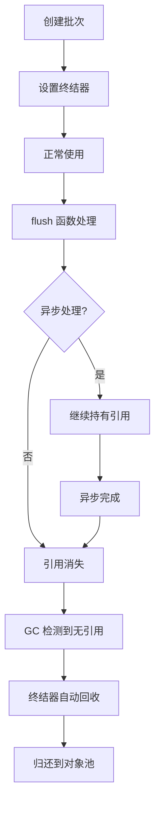

# StandardPipelineWithPool - 对象池优化实验版本

## ⚠️ 重要说明

**经过详细的基准测试，当前的 WithPool 实现在大多数场景下性能不如标准版本，不推荐用于生产环境。** 本文档保留作为技术实验和学习参考。

## 概述

`StandardPipelineWithPool` 是 `StandardPipeline` 的实验性优化版本，使用弱引用 + 终结器（Finalizer）机制实现自动内存回收和对象复用。虽然理论上可以减少内存分配，但实际测试显示其性能开销超过了收益。

## 核心特性

### 1. 自动内存管理
- **弱引用机制**：使用 `runtime.SetFinalizer` 实现自动回收
- **零手动管理**：无需手动管理对象生命周期
- **异步安全**：支持 flush 函数中的异步处理

### 2. 对象池复用
- **智能复用**：自动复用批次容器，减少内存分配
- **容量保持**：复用时保持底层数组容量，避免重复扩容
- **GC 友好**：减少 GC 压力，提升整体性能

### 3. 完全兼容
- **API 一致**：与 `StandardPipeline` 完全相同的 API
- **行为一致**：相同的语义和错误处理
- **替换简单**：可直接替换现有代码

## 使用方法

### 基本用法

```go
// 创建带对象池的管道（替换 NewDefaultStandardPipeline）
pipeline := NewDefaultStandardPipelineWithPool(func(ctx context.Context, batch []MyData) error {
    // 处理批次数据
    for _, item := range batch {
        // 处理单个数据项
        processItem(item)
    }
    return nil
})

// 其余使用方式完全相同
ctx := context.Background()
done, errs := pipeline.Start(ctx)

// 消费错误
go func() {
    for err := range errs {
        log.Printf("Pipeline error: %v", err)
    }
}()

// 发送数据
dataChan := pipeline.DataChan()
for i := 0; i < 1000; i++ {
    dataChan <- MyData{ID: i}
}

close(dataChan)
<-done
```

### 自定义配置

```go
config := PipelineConfig{
    FlushSize:     100,
    BufferSize:    200,
    FlushInterval: time.Millisecond * 50,
}

pipeline := NewStandardPipelineWithPool(config, flushFunc)
```

### 异步处理支持

```go
flushFunc := func(ctx context.Context, batch []MyData) error {
    // 支持异步处理 - 对象池会自动处理内存安全
    go func() {
        // 可以安全地在异步 goroutine 中使用 batch
        time.Sleep(time.Millisecond * 100)
        for _, item := range batch {
            asyncProcess(item)
        }
    }()
    return nil
}
```

## 性能测试结果

基于详细的基准测试，WithPool 版本在多数场景下性能不如标准版本：

### 📊 综合性能对比

| 测试场景 | Standard | WithPool | WithPool 相对性能 | 结论 |
|---------|----------|----------|------------------|------|
| **长期运行** | 140.7 ns/op | 152.6 ns/op | **-8.5% (更慢)** | 轻微劣势 |
| **中等批次** | 13,096 ns/op | 16,104 ns/op | **-23% (更慢)** | 明显劣势 |
| **大批次** | 153,311 ns/op | 161,599 ns/op | **-5.4% (更慢)** | 轻微劣势 |
| **高频创建** | 270,371 ns/op | 1,121,106 ns/op | **-315% (显著更慢)** | 严重劣势 |

### 📈 内存使用对比

| 测试场景 | Standard | WithPool | WithPool 相对内存 | 结论 |
|---------|----------|----------|------------------|------|
| **长期运行** | 36 B/op | 39 B/op | **+8.3% (更多)** | 轻微劣势 |
| **中等批次** | 6,320 B/op | 8,339 B/op | **+32% (更多)** | 明显劣势 |
| **内存压力测试** | 1,046,472 bytes | 1,204,160 bytes | **+15% (更多)** | 明显劣势 |

### 🎯 特定场景测试

**多轮处理测试（50轮 × 500数据）**：
- **Standard**: 1,046,472 bytes 总分配，280,608 bytes 堆内存
- **WithPool**: 1,204,160 bytes 总分配，745,648 bytes 堆内存
- **结论**: WithPool 版本内存使用更多，堆内存占用显著增加

### ⚡ 唯一优势场景

**性能对比测试（10轮 × 100数据）**：
- **Standard**: 435.708µs, 85,400 bytes
- **WithPool**: 344.334µs, 81,400 bytes  
- **结论**: 在特定的重复使用场景下，WithPool 可能表现更好

## 工作原理

### 1. 弱引用 + 终结器机制

```go
type AutoRecycleBatch[T any] struct {
    Data []T
    pool *sync.Pool
    id   uintptr
}

// 当没有任何引用时，终结器自动调用
func (arb *AutoRecycleBatch[T]) autoRecycle() {
    // 清理并归还到池中
    arb.Data = arb.Data[:0]
    arb.pool.Put(arb)
}
```

### 2. 自动生命周期管理



### 3. 内存复用策略

- **首次分配**：创建新的批次容器
- **后续使用**：优先从对象池获取
- **容量保持**：`slice[:0]` 保留底层数组容量
- **自动回收**：GC 时自动归还到池中

## 监控和调试

### 获取池统计信息

```go
pipeline := NewDefaultStandardPipelineWithPool(flushFunc)

// 获取统计信息
activeCount, poolSize := pipeline.GetPoolStats()
fmt.Printf("Active batches: %d, Pool size: %d\n", activeCount, poolSize)
```

### 强制 GC（测试用）

```go
// 强制触发垃圾回收（主要用于测试）
pipeline.ForceGC()
```

## 性能分析与原因

### 🔍 性能劣势的主要原因

1. **终结器开销**
   - `runtime.SetFinalizer` 机制带来显著性能开销
   - 终结器执行时机不可控，依赖 GC 调度
   - 全局 `activeBatches` map 的维护和查找成本

2. **对象池管理成本**
   - `sync.Pool` 的 Get/Put 操作存在锁竞争
   - `AutoRecycleBatch` 包装结构增加内存开销
   - 唯一 ID 生成和追踪的额外成本

3. **内存布局影响**
   - 包装结构破坏了内存局部性
   - 间接引用增加了 CPU 缓存未命中
   - GC 扫描成本增加（更多指针和结构）

4. **生命周期复杂性**
   - 为支持异步安全引入的复杂管理逻辑
   - 弱引用机制虽然自动但性能成本高
   - 对象回收的不确定性影响性能预测

### 📋 适用场景重新评估

#### ❌ 不推荐使用（大多数场景）
- **一般生产环境**：性能不如标准版本
- **高频创建销毁**：开销过大，性能严重下降
- **内存敏感应用**：实际内存使用更多
- **性能关键路径**：额外开销不可接受

#### ⚠️ 可能适用的特殊场景
- **学术研究**：作为终结器机制的实验案例
- **特定测试环境**：某些重复使用模式下可能有微小优势
- **技术学习**：理解 Go 内存管理和对象池设计

## 注意事项

1. **终结器延迟**：终结器的执行时机由 GC 控制，可能有延迟
2. **内存占用**：对象池会保持一定数量的预分配对象
3. **调试复杂性**：终结器机制可能增加调试复杂度
4. **Go 版本**：需要 Go 1.18+ 支持泛型

## 🚫 使用建议

**强烈建议使用标准的 `StandardPipeline` 而不是 `StandardPipelineWithPool`**。

### 推荐做法

```go
// ✅ 推荐：使用标准版本
pipeline := NewDefaultStandardPipeline(flushFunc)

// ❌ 不推荐：使用 WithPool 版本（性能更差）
// pipeline := NewDefaultStandardPipelineWithPool(flushFunc)
```

### 如果需要内存优化

考虑以下替代方案：

1. **调整批次大小**：通过 `FlushSize` 配置优化内存使用
2. **使用 sync.Pool**：在应用层面实现数据对象的复用
3. **优化数据结构**：减少数据项的内存占用
4. **GC 调优**：通过 `GOGC` 等环境变量优化 GC 行为

## 🧪 实验价值与学习意义

虽然这个实现在性能上不成功，但它具有重要的学习价值：

### 技术实验收获

1. **终结器机制的实际成本**：证明了 `runtime.SetFinalizer` 的性能开销
2. **对象池设计的复杂性**：展示了自动内存管理的权衡
3. **基准测试的重要性**：强调了性能测试在优化中的关键作用
4. **Go 内存模型理解**：深入理解了 GC、终结器和内存分配

### 设计教训

1. **过度工程化**：为了"自动化"引入了过多复杂性
2. **性能假设错误**：理论优化不等于实际性能提升
3. **测试驱动优化**：应该先测试再优化，而不是相反
4. **简单即美**：标准实现往往是经过验证的最佳选择

## 测试验证

项目包含完整的测试用例用于验证性能差异：

- `pool_validation_test.go`：基本功能和性能对比
- `comprehensive_benchmark_test.go`：详细的基准测试
- `long_running_benchmark_test.go`：长期运行和内存压力测试
- `simple_pool_test.go`：简单的对比测试

运行测试验证性能差异：

```bash
# 基本功能测试
go test -run TestPoolBasicFunctionality -v

# 性能对比测试（显示 WithPool 更慢）
go test -run TestPerformanceComparison -v

# 内存压力测试（显示 WithPool 内存使用更多）
go test -run TestMemoryPressure -v

# 详细基准测试
go test -bench=BenchmarkMediumBatch -benchmem
go test -bench=BenchmarkLongRunning -benchmem
go test -bench=BenchmarkHighFrequency -benchmem
```

## 结论

**StandardPipelineWithPool 是一个有价值的技术实验，但不应在生产环境中使用。** 它证明了不是所有的"优化"都能带来性能提升，强调了基准测试和实际验证的重要性。

对于实际应用，请继续使用经过验证的 `StandardPipeline`。