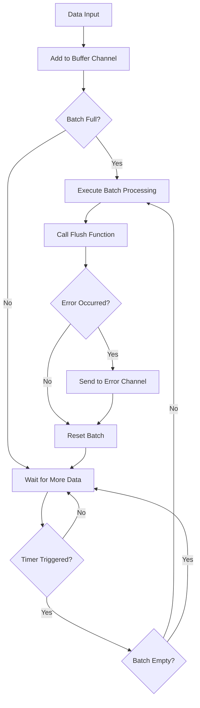
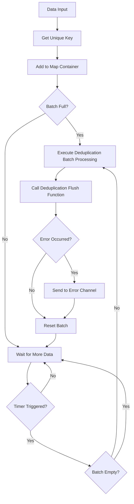

# Go Pipeline v2

[English](README.md) | [中文](README_cn.md) | [📖 Documentation](https://rushairer.github.io/go-pipeline-homepage/)

[](https://github.com/rushairer/go-pipeline/actions/workflows/test.yml)
[](https://goreportcard.com/report/github.com/rushairer/go-pipeline/v2)
[](https://godoc.org/github.com/rushairer/go-pipeline/v2)
[](https://github.com/rushairer/go-pipeline/releases)
[](https://github.com/rushairer/go-pipeline/blob/main/LICENSE)

A high-performance Go batch processing pipeline framework with generics support, concurrency safety, providing both standard batch processing and deduplication batch processing modes.

## 📋 System Requirements

- Go 1.18+ (with generics support)
- Supports Linux, macOS, Windows

## 📦 Installation

```bash
go get github.com/rushairer/go-pipeline/v2@latest
```

## 🚀 Features

- **Generics Support**: Type-safe implementation based on Go 1.18+ generics
- **Batch Processing**: Automatic batching by size and time intervals
- **Concurrency Safety**: Built-in goroutine safety mechanisms
- **Flexible Configuration**: Customizable buffer size, batch size, and flush intervals
- **Error Handling**: Comprehensive error handling and propagation mechanisms
- **Two Modes**: Standard batch processing and deduplication batch processing
- **Sync/Async**: Support for both synchronous and asynchronous execution modes
- **Go Conventions**: Follows "writer closes" channel management principle

## 📁 Project Structure

```
v2/
├── config.go                           # Configuration definitions
├── errors.go                           # Error definitions
├── interface.go                        # Interface definitions
├── pipeline_impl.go                    # Common pipeline implementation
├── pipeline_standard.go                # Standard pipeline implementation
├── pipeline_deduplication.go           # Deduplication pipeline implementation
├── pipeline_standard_test.go           # Standard pipeline unit tests
├── pipeline_standard_benchmark_test.go # Standard pipeline benchmark tests
├── pipeline_deduplication_test.go      # Deduplication pipeline unit tests
├── pipeline_deduplication_benchmark_test.go # Deduplication pipeline benchmark tests
└── pipeline_performance_benchmark_test.go # Performance benchmark tests
```

## 📦 Core Components

### Interface Definitions

- **`PipelineChannel[T]`**: Defines pipeline channel access interface
- **`Performer`**: Defines pipeline execution interface
- **`DataProcessor[T]`**: Defines core batch data processing interface
- **`Pipeline[T]`**: Combines all pipeline functionality into a universal interface

### Implementation Types

- **`StandardPipeline[T]`**: Standard batch processing pipeline, processes data sequentially in batches
- **`DeduplicationPipeline[T]`**: Deduplication batch processing pipeline, deduplicates based on unique keys
- **`PipelineImpl[T]`**: Common pipeline implementation providing basic functionality

## 🏗️ Architecture Design

```
┌─────────────────┐    ┌──────────────────┐    ┌─────────────────┐
│   Data Input    │───▶│   Buffer Channel │───▶│  Batch Processor│
└─────────────────┘    └──────────────────┘    └─────────────────┘
                                │                        │
                                ▼                        ▼
                       ┌──────────────────┐    ┌─────────────────┐
                       │   Timer Ticker   │    │   Flush Handler │
                       └──────────────────┘    └─────────────────┘
                                │                        │
                                └────────┬───────────────┘
                                         ▼
                                ┌─────────────────┐
                                │  Error Channel  │
                                └─────────────────┘
```

## 🔄 Data Flow Diagrams

### Standard Pipeline Flow



### Test File Descriptions

The project includes a complete test suite to ensure code quality and performance:

- **`pipeline_standard_test.go`**: Unit tests for standard pipeline, verifying basic functionality
- **`pipeline_deduplication_test.go`**: Unit tests for deduplication pipeline, verifying deduplication logic
- **`pipeline_standard_benchmark_test.go`**: Performance benchmark tests for standard pipeline
- **`pipeline_deduplication_benchmark_test.go`**: Performance benchmark tests for deduplication pipeline
- **`pipeline_performance_benchmark_test.go`**: Comprehensive performance benchmark tests

### Deduplication Pipeline Flow



## 📋 Configuration Parameters

```go
type PipelineConfig struct {
    BufferSize    uint32        // Buffer channel capacity (default: 100)
    FlushSize     uint32        // Maximum batch data capacity (default: 50)
    FlushInterval time.Duration // Timed flush interval (default: 50ms)
}
```

### 🎯 Performance-Optimized Default Values

Based on performance benchmark tests, v2 version adopts optimized default configuration:

- **BufferSize: 100** - Buffer size, should be >= FlushSize * 2 to avoid blocking
- **FlushSize: 50** - Batch size, performance tests show around 50 is optimal
- **FlushInterval: 50ms** - Flush interval, balances latency and throughput

### Configuration with Default Values

You can use the `NewPipelineConfig()` function to create a configuration with default values, then customize specific parameters:

```go
// Create configuration with default values
config := gopipeline.NewPipelineConfig()

// Use default values directly
pipeline := gopipeline.NewStandardPipeline(config, flushFunc)

// Or customize specific parameters using chain methods
config = gopipeline.NewPipelineConfig().
    WithFlushInterval(time.Millisecond * 10).
    WithBufferSize(200)

pipeline = gopipeline.NewStandardPipeline(config, flushFunc)
```

Available configuration methods:
- `NewPipelineConfig()` - Create configuration with default values
- `WithBufferSize(size uint32)` - Set buffer size
- `WithFlushSize(size uint32)` - Set batch size
- `WithFlushInterval(interval time.Duration)` - Set flush interval

## 💡 Usage Examples

### Standard Pipeline Example

```go
package main

import (
    "context"
    "fmt"
    "log"
    "time"
    
    gopipeline "github.com/rushairer/go-pipeline/v2"
)

func main() {
    // Create standard pipeline
    pipeline := gopipeline.NewDefaultStandardPipeline(
        func(ctx context.Context, batchData []int) error {
            fmt.Printf("Processing batch data: %v\n", batchData)
            // Here you can perform database writes, API calls, etc.
            return nil
        },
    )
    
    ctx, cancel := context.WithTimeout(context.Background(), time.Second*10)
    defer cancel()
    
    // Start async processing
    go func() {
        if err := pipeline.AsyncPerform(ctx); err != nil {
            log.Printf("Pipeline execution error: %v", err)
        }
    }()
    
    // Listen for errors (must consume error channel)
    errorChan := pipeline.ErrorChan(10) // Specify error channel buffer size
    go func() {
        for {
            select {
            case err, ok := <-errorChan:
                if !ok {
                    return
                }
                log.Printf("Batch processing error: %v", err)
            case <-ctx.Done():
                return
            }
        }
    }()
    
    // Use new DataChan API to send data
    dataChan := pipeline.DataChan()
    go func() {
        defer close(dataChan) // User controls channel closure
        for i := 0; i < 100; i++ {
            select {
            case dataChan <- i:
            case <-ctx.Done():
                return
            }
        }
    }()
    
    time.Sleep(time.Second * 2) // Wait for processing to complete
}
```

### Deduplication Pipeline Example

```go
package main

import (
    "context"
    "fmt"
    "log"
    "time"
    
    gopipeline "github.com/rushairer/go-pipeline/v2"
)

// Data structure implementing UniqueKeyData interface
type User struct {
    ID   string
    Name string
}

func (u User) GetKey() string {
    return u.ID
}

func main() {
    // Create deduplication pipeline
    pipeline := gopipeline.NewDefaultDeduplicationPipeline(
        func(ctx context.Context, batchData map[string]User) error {
            fmt.Printf("Processing deduplicated user data: %d users\n", len(batchData))
            for key, user := range batchData {
                fmt.Printf("  %s: %s\n", key, user.Name)
            }
            return nil
        },
    )
    
    ctx, cancel := context.WithTimeout(context.Background(), time.Second*10)
    defer cancel()
    
    // Start async processing
    go func() {
        if err := pipeline.AsyncPerform(ctx); err != nil {
            log.Printf("Pipeline execution error: %v", err)
        }
    }()
    
    // Listen for errors
    errorChan := pipeline.ErrorChan(10)
    go func() {
        for {
            select {
            case err, ok := <-errorChan:
                if !ok {
                    return
                }
                log.Printf("Batch processing error: %v", err)
            case <-ctx.Done():
                return
            }
        }
    }()
    
    // Use new DataChan API to send data
    dataChan := pipeline.DataChan()
    go func() {
        defer close(dataChan)
        
        users := []User{
            {ID: "1", Name: "Alice"},
            {ID: "2", Name: "Bob"},
            {ID: "1", Name: "Alice Updated"}, // Will overwrite the first Alice
            {ID: "3", Name: "Charlie"},
            {ID: "2", Name: "Bob Updated"},   // Will overwrite the first Bob
        }
        
        for _, user := range users {
            select {
            case dataChan <- user:
            case <-ctx.Done():
                return
            }
        }
    }()
    
    time.Sleep(time.Second * 2) // Wait for processing to complete
}
```

### Custom Configuration Example

```go
// Create pipeline with custom configuration
config := gopipeline.PipelineConfig{
    BufferSize:    200,                    // Buffer size of 200
    FlushSize:     100,                    // Batch size of 100
    FlushInterval: time.Millisecond * 100, // 100ms timed flush
}

pipeline := gopipeline.NewStandardPipeline(config, 
    func(ctx context.Context, batchData []string) error {
        // Custom processing logic
        return nil
    },
)
```

## 🎯 Use Cases

### 1. Database Batch Inserts
```go
// Batch insert database records
pipeline := gopipeline.NewDefaultStandardPipeline(
    func(ctx context.Context, records []DatabaseRecord) error {
        return db.BatchInsert(ctx, records)
    },
)
```

### 2. Log Batch Processing
```go
// Batch write log files
pipeline := gopipeline.NewDefaultStandardPipeline(
    func(ctx context.Context, logs []LogEntry) error {
        return logWriter.WriteBatch(logs)
    },
)
```

### 3. API Batch Calls
```go
// Batch call third-party APIs
pipeline := gopipeline.NewDefaultStandardPipeline(
    func(ctx context.Context, requests []APIRequest) error {
        return apiClient.BatchCall(ctx, requests)
    },
)
```

### 4. User Data Deduplication
```go
// User data deduplication processing
pipeline := gopipeline.NewDefaultDeduplicationPipeline(
    func(ctx context.Context, users map[string]User) error {
        return userService.BatchUpdate(ctx, users)
    },
)
```

### 5. Message Queue Batch Consumption
```go
// Batch process message queue data
pipeline := gopipeline.NewDefaultStandardPipeline(
    func(ctx context.Context, messages []Message) error {
        return messageProcessor.ProcessBatch(ctx, messages)
    },
)
```

## 🔥 Advanced Usage

### Dynamic Configuration Adjustment

```go
// Dynamically adjust configuration based on system load
func createAdaptivePipeline() *gopipeline.StandardPipeline[Task] {
    config := gopipeline.PipelineConfig{
        BufferSize:    getOptimalBufferSize(),
        FlushSize:     getOptimalFlushSize(),
        FlushInterval: getOptimalInterval(),
    }
    
    return gopipeline.NewStandardPipeline(config, processTaskBatch)
}

func getOptimalBufferSize() uint32 {
    // Calculate based on system memory and CPU cores
    return uint32(runtime.NumCPU() * 50)
}

func getOptimalFlushSize() uint32 {
    // Based on performance tests, around 50 is optimal
    return 50
}
```

### Error Retry Mechanism

```go
pipeline := gopipeline.NewDefaultStandardPipeline(
    func(ctx context.Context, batchData []Task) error {
        return retryWithBackoff(ctx, func() error {
            return processBatch(batchData)
        }, 3, time.Second)
    },
)

func retryWithBackoff(ctx context.Context, fn func() error, maxRetries int, baseDelay time.Duration) error {
    for i := 0; i < maxRetries; i++ {
        if err := fn(); err == nil {
            return nil
        }
        
        select {
        case <-ctx.Done():
            return ctx.Err()
        case <-time.After(baseDelay * time.Duration(1<<i)):
            // Exponential backoff
        }
    }
    return fmt.Errorf("max retries exceeded")
}
```

### Monitoring and Metrics Collection

```go
type MetricsPipeline struct {
    *gopipeline.StandardPipeline[Event]
    processedCount int64
    errorCount     int64
}

func NewMetricsPipeline() *MetricsPipeline {
    mp := &MetricsPipeline{}
    
    mp.StandardPipeline = gopipeline.NewDefaultStandardPipeline(
        func(ctx context.Context, events []Event) error {
            err := processEvents(events)
            
            atomic.AddInt64(&mp.processedCount, int64(len(events)))
            if err != nil {
                atomic.AddInt64(&mp.errorCount, 1)
            }
            
            return err
        },
    )
    
    return mp
}

func (mp *MetricsPipeline) GetMetrics() (processed, errors int64) {
    return atomic.LoadInt64(&mp.processedCount), atomic.LoadInt64(&mp.errorCount)
}
```

### Graceful Shutdown

```go
func gracefulShutdown(pipeline *gopipeline.StandardPipeline[Task]) {
    // Create context with timeout
    ctx, cancel := context.WithTimeout(context.Background(), 30*time.Second)
    defer cancel()
    
    // Stop accepting new data
    // Close data channel
    dataChan := pipeline.DataChan()
    close(dataChan)
    
    // Wait for processing to complete
    done := make(chan struct{})
    go func() {
        defer close(done)
        // Wait for error channel to close, indicating all data has been processed
        errorChan := pipeline.ErrorChan(10)
        for {
            select {
            case err, ok := <-errorChan:
                if !ok {
                    return
                }
                log.Printf("Processing remaining error: %v", err)
            case <-ctx.Done():
                return
            }
        }
    }()
    
    // Wait for completion or timeout
    select {
    case <-done:
        log.Println("Pipeline graceful shutdown completed")
    case <-ctx.Done():
        log.Println("Pipeline shutdown timeout")
    }
}
```

## ⚡ Performance Characteristics

Based on the latest performance benchmark test results:

### 🚀 Core Performance Metrics

- **Data Processing Throughput**: ~248 nanoseconds/item (Apple M4)
- **Memory Efficiency**: 232 bytes/operation, 7 allocations/operation
- **Batch Processing Optimization**: 5x performance improvement from batch size 1 to 50
- **Pipeline Overhead**: About 38% slower than direct processing (225.4 vs 162.7 ns/op)

### 📊 Batch Size Performance Comparison

```
BatchSize1:   740.5 ns/op  (Slowest - frequent flushing)
BatchSize10:  251.5 ns/op  (Significant improvement)
BatchSize50:  146.5 ns/op  (Optimal performance) ⭐
BatchSize100: 163.4 ns/op  (Slight decline)
BatchSize500: 198.6 ns/op  (Batch too large)
```

### 💡 Performance Optimization Recommendations

1. **Optimal Batch Size**: Around 50
2. **Buffer Configuration**: BufferSize >= FlushSize * 2
3. **Flush Interval**: 50ms balances latency and throughput
4. **Async Mode**: Recommended for better performance

## ⚠️ Important Notes

> **Error Channel Behavior**: Lazily initialized via sync.Once. The first call to `ErrorChan(size int)` decides the buffer size; subsequent calls ignore size. Even if you don't explicitly call it, the pipeline will initialize it on first error send and write errors non-blockingly. If the channel isn't consumed and the buffer fills, subsequent errors are dropped (no blocking or panic).

> **Recommended to Listen to Error Channel**: If you call `ErrorChan(size int)`, it's recommended to listen to the error channel and use select statements to avoid infinite waiting.

> **Channel Management**: v2 version follows the "writer closes" principle, users need to control the closing timing of `DataChan()`.

> **⚠️ Pipeline Reuse Warning**: If you need to reuse the same pipeline instance for multiple runs (calling `SyncPerform()` or `AsyncPerform()` multiple times), **DO NOT close the DataChan** prematurely. `DataChan()` returns the same channel instance, and once closed, it cannot be reused. Use context cancellation or timeout to control pipeline lifecycle instead.

## 🔧 Best Practices

1. **Reasonable Batch Size**: Based on performance tests, recommend using batch size around 50
2. **⚠️ Must Listen to Error Channel**: Use select statements to avoid blocking, handle errors from batch processing promptly
3. **Proper Channel Closure**: Use defer close(dataChan) to ensure proper channel closure
4. **Context Management**: Use context to control pipeline lifecycle
5. **Deduplication Key Design**: Ensure uniqueness and stability of deduplication keys
6. **Performance Tuning**: Choose appropriate configuration parameters based on benchmark test results
7. **⚠️ Pipeline Reuse**: For repeated pipeline usage, avoid closing DataChan prematurely. Use context timeout/cancellation instead of channel closure to end processing

### Pipeline Reuse Pattern

When you need to run the same pipeline multiple times:

```go
// ✅ Correct: Use context to control lifecycle
pipeline := gopipeline.NewStandardPipeline(config, batchFunc)
dataChan := pipeline.DataChan() // Get channel once

// First run
ctx1, cancel1 := context.WithTimeout(context.Background(), time.Second*30)
go pipeline.SyncPerform(ctx1)
// Send data without closing channel
for _, data := range firstBatch {
    select {
    case dataChan <- data:
    case <-ctx1.Done():
        break
    }
}
cancel1() // End first run

// Second run - reuse same pipeline and channel
ctx2, cancel2 := context.WithTimeout(context.Background(), time.Second*30)
go pipeline.SyncPerform(ctx2)
// Send data again without closing channel
for _, data := range secondBatch {
    select {
    case dataChan <- data:
    case <-ctx2.Done():
        break
    }
}
cancel2() // End second run

// ❌ Wrong: Closing channel prevents reuse
// close(dataChan) // Don't do this if you plan to reuse!
```

## 📊 Error Handling

The framework provides comprehensive error handling mechanisms:

- `ErrContextIsClosed`: Context is closed
- `ErrPerformLoopError`: Execution loop error
- `ErrChannelIsClosed`: Channel is closed

### Error Channel Mechanism

v2 version provides a robust error handling mechanism with lazy initialization and non-blocking semantics:

#### 🛡️ Safety Mechanisms

- **First-call Decides Size**: `ErrorChan(size int)` uses sync.Once; the first call decides buffer size, later calls ignore size. If never called explicitly, a default buffer size is used on first internal send.
- **Optional Consumption**: Listening to the error channel is optional; if unconsumed and the buffer fills, subsequent errors are dropped to avoid blocking.
- **Non-blocking Send**: Errors are sent non-blockingly, ensuring the pipeline isn't blocked.
- **Buffer Full Handling**: When the buffer is full, new errors are discarded instead of blocking; no panic occurs.

#### 📋 Usage Methods

**Method 1: Listen to Errors (Recommended)**
```go
// Create error channel and listen
errorChan := pipeline.ErrorChan(10) // Specify buffer size
go func() {
    for {
        select {
        case err, ok := <-errorChan:
            if !ok {
                return // Channel closed
            }
            log.Printf("Processing error: %v", err)
            // Handle according to error type
        case <-ctx.Done():
            return // Context cancelled
        }
    }
}()
```

**Method 2: Run Without Consuming Errors (Simplified)**
```go
// You may choose not to consume the error channel.
// The pipeline initializes the error channel on demand and sends errors non-blockingly.
// If the buffer fills and nobody consumes, subsequent errors are dropped (no blocking/panic).
pipeline := gopipeline.NewStandardPipeline(config, flushFunc)
go pipeline.AsyncPerform(ctx)
```

#### ⚡ Error Handling Performance

- **Near-zero Overhead**: Error channel is initialized once on demand; sends are non-blocking and lightweight.
- **Async Processing**: Error sending runs independently, minimizing impact on the main flow.
- **Smart Discard**: When the buffer is full and unconsumed, subsequent errors are dropped, preventing blocking.

## 🧪 Testing

The project includes complete unit tests and benchmark tests:

```bash
# Run all tests
go test ./...

# Run unit tests
go test -v ./... -run Test

# Run benchmark tests
go test -bench=. ./...

# Run standard pipeline benchmark tests
go test -bench=BenchmarkStandardPipeline ./...

# Run deduplication pipeline benchmark tests
go test -bench=BenchmarkDeduplicationPipeline ./...

# Run performance benchmark tests
go test -bench=BenchmarkPipelineDataProcessing ./...

# Run batch efficiency tests
go test -bench=BenchmarkPipelineBatchSizes ./...

# Run memory usage tests
go test -bench=BenchmarkPipelineMemoryUsage ./...
```

## 📈 Performance Benchmarks

Latest benchmark test results on Apple M4 processor:

### Core Performance Tests

```
BenchmarkPipelineDataProcessing-10                1000    248.2 ns/op    232 B/op    7 allocs/op
BenchmarkPipelineVsDirectProcessing/Pipeline-10   1000    225.4 ns/op
BenchmarkPipelineVsDirectProcessing/Direct-10     1000    162.7 ns/op
BenchmarkPipelineMemoryUsage-10                   1000    232.2 ns/op    510 B/op    9 allocs/op
```

### Batch Size Efficiency Tests

```
BenchmarkPipelineBatchSizes/BatchSize1-10         500     740.5 ns/op    500.0 items_processed
BenchmarkPipelineBatchSizes/BatchSize10-10        500     251.5 ns/op    500.0 items_processed
BenchmarkPipelineBatchSizes/BatchSize50-10        500     146.5 ns/op    500.0 items_processed ⭐
BenchmarkPipelineBatchSizes/BatchSize100-10       500     163.4 ns/op    500.0 items_processed
BenchmarkPipelineBatchSizes/BatchSize500-10       500     198.6 ns/op    500.0 items_processed
```

### Performance Analysis

- **Optimal Batch Size**: Around 50, 5x performance improvement
- **Pipeline Overhead**: About 38%, in exchange for better architecture and maintainability
- **Memory Efficiency**: About 232-510 bytes memory usage per data item
- **Processing Capacity**: Can process millions of records per second

### Deduplication Pipeline Performance Characteristics

Deduplication pipeline adds the following performance characteristics on top of standard pipeline:

- **Memory Usage**: Uses map structure to store data, slightly higher memory usage than standard pipeline
- **Processing Latency**: Deduplication logic adds about 10-15% processing time
- **Key Generation Overhead**: Need to generate unique keys for each data item
- **Batch Efficiency**: Batch size after deduplication may be smaller than configured FlushSize

**Performance Comparison**:
- Standard Pipeline: ~225 ns/op
- Deduplication Pipeline: ~260 ns/op (about 15% overhead increase)

## ❓ Frequently Asked Questions (FAQ)

### Q: How to choose appropriate configuration parameters?

**A:** Configuration recommendations based on performance tests:

- **High Throughput Scenario**: FlushSize=50, BufferSize=100, FlushInterval=50ms
- **Low Latency Scenario**: FlushSize=10, BufferSize=50, FlushInterval=10ms
- **Memory Constrained Scenario**: FlushSize=20, BufferSize=40, FlushInterval=100ms
- **CPU Intensive Processing**: Use async mode, appropriately increase buffer size

### Q: What are the main differences between v2 and v1?

**A:** Important improvements in v2:

1. **Removed Add() Method**: Changed to DataChan() API, follows "writer closes" principle
2. **Error Channel Improvement**: `ErrorChan(size int)` uses lazy init; the first call decides the buffer size (later calls ignore size). If never called, a default size is used internally on first send.
3. **Performance Optimization**: Default configuration optimized based on benchmark tests
4. **Better Lifecycle Management**: Users control data channel closing timing

### Q: Why remove the Add() method?

**A:**

- **Violates Go Principles**: Add() method violates Go's "writer closes" principle
- **Better Control**: DataChan() gives users complete control over data sending and channel closing
- **More Conventional**: This is the standard Go channel usage pattern

### Q: How to migrate from v1 to v2?

**A:** Migration steps:

```go
// v1 approach
pipeline.Add(ctx, data)

// v2 approach
dataChan := pipeline.DataChan()
go func() {
    defer close(dataChan)
    for _, data := range dataList {
        select {
        case dataChan <- data:
        case <-ctx.Done():
            return
        }
    }
}()
```

### Q: How to handle panic in batch processing functions?

**A:** The framework internally handles panic, but it's recommended to add recover in batch processing functions:

```go
func(ctx context.Context, batchData []Task) error {
    defer func() {
        if r := recover(); r != nil {
            log.Printf("Batch processing panic: %v", r)
        }
    }()
    
    // Processing logic
    return nil
}
```

## 🔧 Troubleshooting

### Memory Leaks

**Symptoms**: Memory usage continuously growing
**Causes**:
- Error channel not being consumed
- Data channel not properly closed
- Memory leaks in batch processing functions

**Solutions**:
```go
// Ensure error channel is consumed
errorChan := pipeline.ErrorChan(10)
go func() {
    for {
        select {
        case err, ok := <-errorChan:
            if !ok {
                return
            }
            // Handle error
        case <-ctx.Done():
            return
        }
    }
}()

// Ensure data channel is closed
dataChan := pipeline.DataChan()
defer close(dataChan)
```

### Performance Issues

**Symptoms**: Processing speed slower than expected
**Troubleshooting Steps**:
1. Check if batch size is around 50
2. Ensure BufferSize >= FlushSize * 2
3. Use async mode
4. Check batch processing function execution time

**Optimization Recommendations**:
```go
// Use performance-optimized configuration
config := gopipeline.PipelineConfig{
    BufferSize:    100,                   // >= FlushSize * 2
    FlushSize:     50,                    // Optimal batch size
    FlushInterval: time.Millisecond * 50, // Balance latency and throughput
}
```

### Data Loss

**Symptoms**: Some data not being processed
**Causes**:
- Context cancelled too early
- Data channel closed too early
- Batch processing function returns error but not handled

**Solutions**:
```go
// Use sufficient timeout
ctx, cancel := context.WithTimeout(context.Background(), time.Minute*5)
defer cancel()

// Ensure all data is sent before closing channel
dataChan := pipeline.DataChan()
go func() {
    defer close(dataChan) // Close after all data is sent
    for _, data := range allData {
        select {
        case dataChan <- data:
        case <-ctx.Done():
            return
        }
    }
}()
```

## 📄 License

This project is licensed under the MIT License - see the LICENSE file for details.

## 🤝 Contributing

Welcome to submit Issues and Pull Requests to improve this project!