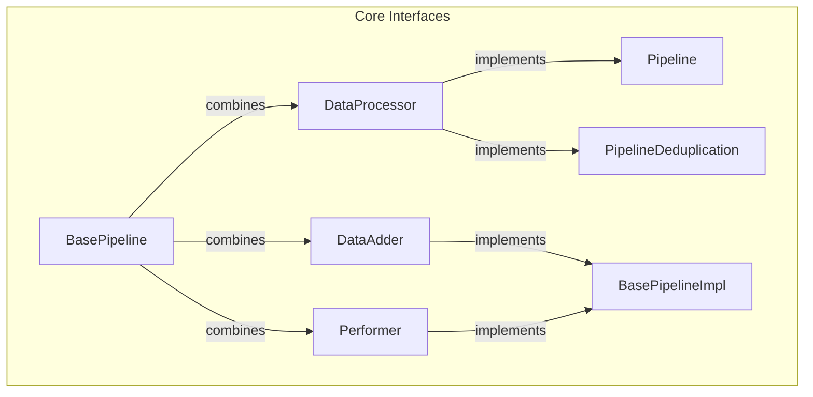
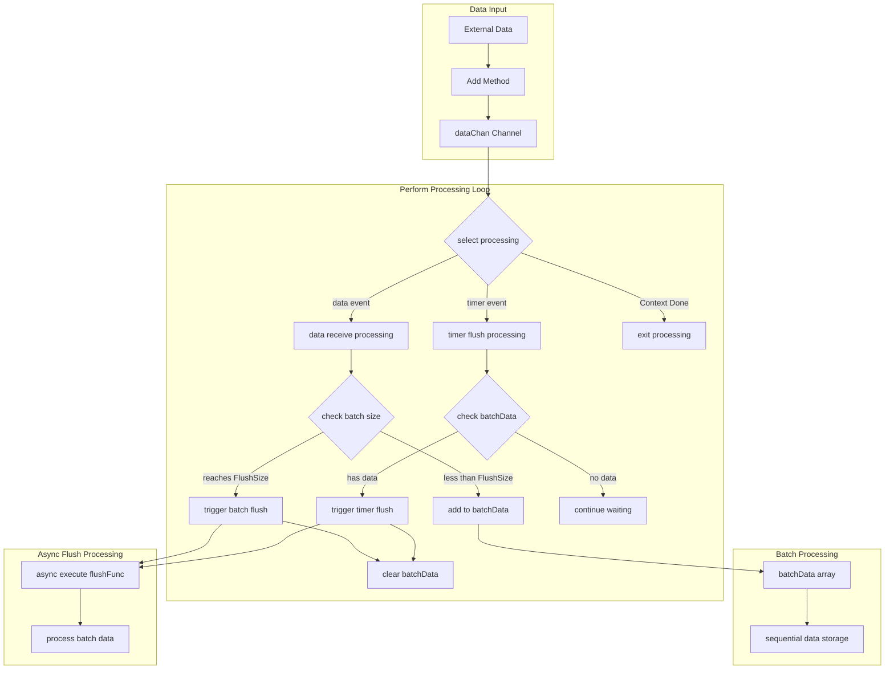
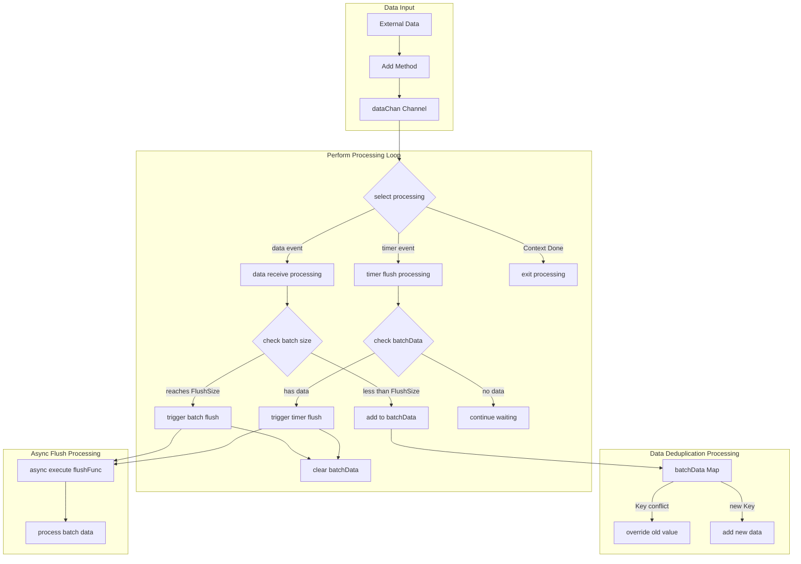

# Go Pipeline

[English](README.md) | [中文](README_cn.md)

[](https://github.com/rushairer/go-pipeline/actions/workflows/test.yml)
[](https://goreportcard.com/report/github.com/rushairer/go-pipeline)
[](https://godoc.org/github.com/rushairer/go-pipeline)
[](https://github.com/rushairer/go-pipeline/releases)
[](https://github.com/rushairer/go-pipeline/blob/main/LICENSE)

A high-performance, configurable Go data processing pipeline library with support for batch processing and data deduplication.

## 🚀 Performance Metrics

- ✅ Reliably processes tens of billions of data entries daily
- ⚡️ Handles hundreds of thousands of entries per second per instance
- 💾 Controlled memory usage, supports large-scale distributed deployment
- 🔥 Excellent performance in high-concurrency and big data scenarios

## ✨ Features

- 🎯 Generic support for processing any data type
- 🔄 Provides both synchronous and asynchronous processing modes
- 🎨 Data deduplication support
- ⚙️ Configurable batch size and flush intervals
- 🛡️ Built-in error handling and recovery mechanisms
- 🎊 Graceful shutdown and resource release

- Production Environment Validation:
  - Stable operation with tens of billions of daily data entries
  - Single instance processes hundreds of thousands of entries per second
  - Controlled memory usage, supports large-scale distributed deployment
  - Excellent performance in high-concurrency and big data scenarios

## Installation

```bash
go get github.com/rushairer/go-pipeline
```

## Quick Start

### Basic Pipeline Example

```go
package main

import (
    "context"
    "fmt"
    "time"
    "github.com/rushairer/go-pipeline"
)

func main() {
    // Create context
    ctx, cancel := context.WithTimeout(context.Background(), time.Second*10)
    defer cancel()

    // Create pipeline instance
    pipeline := gopipeline.NewPipeline[string](
        gopipeline.PipelineConfig{
            FlushSize:     1000,        // Batch size
            BufferSize:    2000,        // Buffer size
            FlushInterval: time.Second,  // Flush interval
        },
        func(ctx context.Context, batchData []string) error {
            // Process batch data
            fmt.Printf("Processing batch data, count: %d\n", len(batchData))
            return nil
        },
    )

    // Start async processing
    go pipeline.AsyncPerform(ctx)

    // Add data
    for i := 0; i < 5000; i++ {
        if err := pipeline.Add(ctx, fmt.Sprintf("item-%d", i)); err != nil {
            fmt.Printf("Failed to add data: %v\n", err)
            return
        }
    }
}
```

### Deduplication Pipeline Example

```go
package main

import (
    "context"
    "fmt"
    "time"
    "github.com/rushairer/go-pipeline"
)

// Define a deduplication-supported data structure
type Item struct {
    ID   string
    Data string
}

// Implement MapData interface
func (i Item) GetKey() string {
    return i.ID
}

func main() {
    ctx, cancel := context.WithTimeout(context.Background(), time.Second*10)
    defer cancel()

    // Create deduplication pipeline instance
    pipeline := gopipeline.NewPipelineDeduplication[Item](
        gopipeline.PipelineConfig{
            FlushSize:     1000,
            BufferSize:    2000,
            FlushInterval: time.Second,
        },
        func(ctx context.Context, batchData map[string]Item) error {
            fmt.Printf("Processing deduplicated batch data, count: %d\n", len(batchData))
            return nil
        },
    )

    go pipeline.AsyncPerform(ctx)

    // Add duplicate data
    items := []Item{
        {ID: "1", Data: "data1"},
        {ID: "2", Data: "data2"},
        {ID: "1", Data: "data1-new"}, // Will override old data with ID="1"
    }

    for _, item := range items {
        if err := pipeline.Add(ctx, item); err != nil {
            fmt.Printf("Failed to add data: %v\n", err)
            return
        }
    }
}
```

## Interface Design



## Pipeline Normal Processing Flow



## Pipeline Deduplication Processing Flow



## Key Features Explanation

1. Interface Design

    - DataProcessor: Core interface defining batch data processing, including initialization, addition, flushing, and status checking methods
    - DataAdder: Provides data addition capability
    - Performer: Provides synchronous and asynchronous execution capabilities
    - BasePipeline: Combines above interfaces, defines complete pipeline functionality
    - MapData: Provides GetKey interface for deduplication functionality

2. Data Storage Structure

    - Pipeline: Uses array ([]T) to store data, maintains data input order
    - PipelineDeduplication: Uses Map (map[string]T) to store data, implements deduplication based on Key

3. Error Handling Mechanism

    - Unified error type definitions (e.g., ErrContextIsClosed)
    - Panic recovery mechanism in Add method
    - Defer panic handling in performLoop
    - Graceful exit on Context cancellation

4. Performance Optimization Features
    - Configurable batch size (FlushSize)
    - Adjustable buffer size (BufferSize)
    - Flexible flush interval (FlushInterval)
    - Support for both synchronous and asynchronous processing modes

## Configuration Parameter Recommendations

1. FlushSize Configuration

    - Recommended range: 1000-100000
    - Considerations: Downstream processing capacity, memory usage
    - Default value: 100000

2. BufferSize Configuration

    - Recommended as 1.5-2 times FlushSize
    - Default value: 200000
    - Adjustment principles:
        - Production faster than consumption: Increase appropriately
        - Consumption faster than production: Can be reduced
        - Memory constrained: Reduce FlushSize and BufferSize proportionally

3. FlushInterval Configuration
    - Default value: 60 seconds
    - Adjust based on real-time requirements
    - Smaller intervals improve real-time performance but increase processing overhead

## TODO

1. Concurrency Control

    - Implement goroutine pool to control concurrency
    - Prevent goroutine leaks under high load

2. Enhanced Error Handling

    - Add error callback mechanism
    - Implement more comprehensive graceful shutdown
    - Provide batch processing status tracking

3. Performance Optimization

    - Implement memory pool for batchData reuse
    - Add configurable retry mechanism
    - Provide performance monitoring metrics
        - Processing latency
        - Success rate
        - Memory usage
        - Throughput

4. Observability Improvements
    - Add detailed logging
    - Integrate monitoring metrics export
    - Provide debugging interfaces
