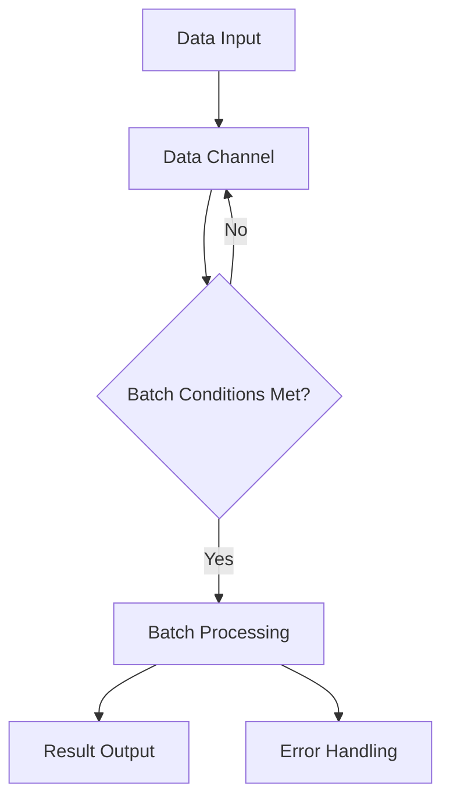
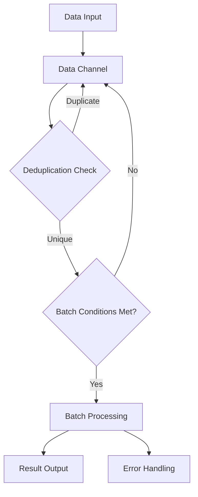

# Go Pipeline v2

[English](README.md) | [中文](README_cn.md)

[](https://github.com/rushairer/go-pipeline/actions/workflows/test.yml)
[](https://goreportcard.com/report/github.com/rushairer/go-pipeline)
[](https://godoc.org/github.com/rushairer/go-pipeline)
[](https://github.com/rushairer/go-pipeline/releases)
[](https://github.com/rushairer/go-pipeline/blob/main/LICENSE)

A high-performance Go batch processing pipeline framework with generics support, concurrency safety, providing both standard batch processing and deduplication batch processing modes.

## 📋 System Requirements

- Go 1.18+ (with generics support)
- Supports Linux, macOS, Windows

## 📦 Installation

```bash
go get github.com/rushairer/go-pipeline/v2@latest
```

## 🚀 Features

- **Generics Support**: Type-safe implementation based on Go 1.18+ generics
- **Batch Processing**: Automatic batching by size and time intervals
- **Concurrency Safety**: Built-in goroutine safety mechanisms
- **Deduplication**: Built-in data deduplication functionality
- **Error Handling**: Comprehensive error channel mechanism
- **Configurable**: Flexible configuration options for different scenarios

## 🏗️ Architecture Design

### Core Interfaces

```go
// Data processing interface
type DataProcessor[T any] interface {
    Process(ctx context.Context, batchData []T) error
}

// Pipeline channel interface  
type PipelineChannel[T any] interface {
    DataChan() chan<- T
    ErrorChan() <-chan error
    Close()
}

// Pipeline execution interface
type Performer interface {
    AsyncPerform(ctx context.Context) error
    SyncPerform(ctx context.Context) error
}
```

### Standard Pipeline Flow



### Deduplication Pipeline Flow



## 🎯 Quick Start

### Standard Pipeline Usage

```go
package main

import (
    "context"
    "fmt"
    "time"

    "github.com/rushairer/go-pipeline/v2"
)

func main() {
    // Create standard pipeline
    config := gopipeline.DefaultConfig()
    config.FlushSize = 10
    config.FlushInterval = 1 * time.Second

    pipeline := gopipeline.NewStandardPipeline(
        config,
        func(ctx context.Context, batchData []string) error {
            fmt.Printf("Processing batch: %v\n", batchData)
            return nil
        },
    )

    // Async execution
    ctx := context.Background()
    go func() {
        if err := pipeline.AsyncPerform(ctx); err != nil {
            fmt.Printf("Pipeline error: %v\n", err)
        }
    }()

    // Send data
    for i := 0; i < 25; i++ {
        pipeline.DataChan() <- fmt.Sprintf("data-%d", i)
    }

    time.Sleep(2 * time.Second)
    pipeline.Close()
}
```

### Deduplication Pipeline Usage

```go
package main

import (
    "context"
    "fmt"
    "time"

    "github.com/rushairer/go-pipeline/v2"
)

type UserData struct {
    UserID string
    Data   string
}

func (d UserData) GetKey() string {
    return d.UserID
}

func main() {
    pipeline := gopipeline.NewDefaultDeduplicationPipeline[UserData](
        func(ctx context.Context, batchData map[string]UserData) error {
            fmt.Printf("Processing deduplicated batch (%d items):\n", len(batchData))
            for _, data := range batchData {
                fmt.Printf("  - User %s: %s\n", data.UserID, data.Data)
            }
            return nil
        },
    )

    ctx := context.Background()
    go func() {
        if err := pipeline.AsyncPerform(ctx); err != nil {
            fmt.Printf("Pipeline error: %v\n", err)
        }
    }()

    // Send data with duplicate user IDs
    data := []UserData{
        {"user1", "message1"},
        {"user2", "message2"}, 
        {"user1", "duplicate_message"}, // Will be deduplicated
        {"user3", "message3"},
        {"user2", "another_duplicate"}, // Will be deduplicated
    }

    for _, d := range data {
        pipeline.DataChan() <- d
    }

    time.Sleep(1 * time.Second)
    pipeline.Close()
}
```

## ⚙️ Configuration Options

### PipelineConfig Structure

```go
type PipelineConfig struct {
    FlushSize        int           // Batch size threshold
    FlushInterval    time.Duration // Time interval threshold
    ErrorChanSize    int           // Error channel buffer size
    DataChanSize     int           // Data channel buffer size
    Deduplication    bool          // Enable deduplication
    DedupeTTL        time.Duration // Deduplication TTL
}
```

### Recommended Configuration Values

| Scenario | FlushSize | FlushInterval | DataChanSize | Deduplication |
|----------|-----------|---------------|--------------|---------------|
| Real-time processing | 10-50 | 100-500ms | 1000-5000 | Optional |
| Batch processing | 100-1000 | 1-5s | 5000-20000 | Optional |
| High-throughput | 500-2000 | 1-2s | 10000-50000 | Recommended |
| Data deduplication | 50-200 | 200-1000ms | 2000-10000 | Required |

### Custom Configuration Example

```go
config := &gopipeline.PipelineConfig{
    FlushSize:     100,           // Process in batches of 100 items
    FlushInterval: 2 * time.Second, // Or every 2 seconds, whichever comes first
    ErrorChanSize: 1000,          // Error channel buffer size
    DataChanSize:  10000,         // Data channel buffer size
    Deduplication: true,          // Enable deduplication
    DedupeTTL:     5 * time.Minute, // Deduplication time-to-live
}
```

## 🔧 Advanced Usage

### Custom Data Processor

```go
type CustomProcessor struct {
    processor func(ctx context.Context, batchData []string) error
}

func (p *CustomProcessor) Process(ctx context.Context, batchData []string) error {
    return p.processor(ctx, batchData)
}

// Usage
processor := &CustomProcessor{
    processor: func(ctx context.Context, batchData []string) error {
        // Custom processing logic
        return nil
    },
}
```

### Error Handling Example

```go
pipeline := gopipeline.NewStandardPipeline(
    gopipeline.DefaultConfig(),
    func(ctx context.Context, batchData []string) error {
        // Processing logic that might return errors
        if len(batchData) == 0 {
            return fmt.Errorf("empty batch")
        }
        return nil
    },
)

// Monitor error channel
go func() {
    for err := range pipeline.ErrorChan() {
        fmt.Printf("Pipeline error: %v\n", err)
        // Implement retry or alert logic
    }
}()
```

### Context and Timeout Handling

```go
ctx, cancel := context.WithTimeout(context.Background(), 30*time.Second)
defer cancel()

// Sync execution with timeout
if err := pipeline.SyncPerform(ctx); err != nil {
    if errors.Is(err, context.DeadlineExceeded) {
        fmt.Println("Pipeline execution timed out")
    } else {
        fmt.Printf("Pipeline error: %v\n", err)
    }
}
```

## 🏎️ Performance Optimization

### Memory Optimization

```go
// Pre-allocate memory for high-throughput scenarios
config := &gopipeline.PipelineConfig{
    FlushSize:     1000,
    FlushInterval: 1 * time.Second,
    DataChanSize:  50000, // Large buffer for burst traffic
}
```

### Concurrency Tuning

```go
// For CPU-intensive processing, limit concurrency
semaphore := make(chan struct{}, runtime.NumCPU()*2)

processor := func(ctx context.Context, batchData []string) error {
    semaphore <- struct{}{}
    defer func() { <-semaphore }()
    
    // CPU-intensive processing
    return nil
}
```

### Batch Size Optimization

Recommended batch sizes based on data characteristics:

| Data Size | Recommended Batch Size |
|-----------|-----------------------|
| Small (<1KB) | 100-1000 items |
| Medium (1KB-10KB) | 50-200 items |  
| Large (>10KB) | 10-50 items |

## 🧪 Testing

### Running Tests

```bash
# Run all tests
go test -v ./...

# Run with race detector
go test -race -v ./...

# Run benchmarks
go test -bench=. -benchmem ./...

# Run specific test
go test -v -run TestPipelineConcurrency
```

### Benchmark Results

Typical performance characteristics:
- **Throughput**: 50,000-200,000 items/second
- **Latency**: <10ms for 95% of requests
- **Memory**: 2-5MB baseline, scales linearly with queue size

## 📊 Monitoring and Metrics

### Basic Monitoring

```go
// Monitor pipeline metrics
go func() {
    ticker := time.NewTicker(30 * time.Second)
    defer ticker.Stop()
    
    for range ticker.C {
        fmt.Printf("Queue length: %d\n", len(pipeline.DataChan()))
        fmt.Printf("Error count: %d\n", len(pipeline.ErrorChan()))
    }
}()
```

### Integration with Monitoring Systems

```go
// Example: Prometheus metrics
var (
    processedItems = prometheus.NewCounterVec(
        prometheus.CounterOpts{
            Name: "pipeline_processed_items_total",
            Help: "Total number of processed items",
        },
        []string{"pipeline_type"},
    )
    
    processingErrors = prometheus.NewCounterVec(
        prometheus.CounterOpts{
            Name: "pipeline_errors_total", 
            Help: "Total number of processing errors",
        },
        []string{"pipeline_type", "error_type"},
    )
)
```

## 🔄 Version Migration

### From v1 to v2

```go
// v1 usage (deprecated)
import "github.com/rushairer/go-pipeline"

// v2 usage (recommended)
import "github.com/rushairer/go-pipeline/v2"

// Changes:
// - Generics support added
// - Improved error handling
// - Enhanced configuration options
// - Better performance characteristics
```

### Backward Compatibility

v1 users can continue using:
```bash
go get github.com/rushairer/go-pipeline@v1.2.0
```

## 🤝 Contributing

We welcome contributions! Please see our contributing guidelines:
1. Fork the repository
2. Create a feature branch
3. Add tests for new functionality
4. Ensure all tests pass
5. Submit a pull request

### Development Setup

```bash
# Clone the repository
git clone https://github.com/rushairer/go-pipeline.git
cd go-pipeline

# Install dependencies
go mod download

# Run tests
go test ./...
```

## 📝 License

MIT License - see [LICENSE](LICENSE) file for details.

## 🆘 Support

- **Documentation**: [GoDoc](https://pkg.go.dev/github.com/rushairer/go-pipeline/v2)
- **Issues**: [GitHub Issues](https://github.com/rushairer/go-pipeline/issues)
- **Discussions**: [GitHub Discussions](https://github.com/rushairer/go-pipeline/discussions)

## 🔗 Related Projects

- [go-pipeline-extra](https://github.com/rushairer/go-pipeline-extra) - Additional pipeline processors and utilities
- [go-metrics-pipeline](https://github.com/rushairer/go-metrics-pipeline) - Metrics collection and processing pipeline

---

> **Note**: This is v2 of the library. For v1, see the [v1 branch](https://github.com/rushairer/go-pipeline/tree/v1) or import `github.com/rushairer/go-pipeline@v1.x.x`.