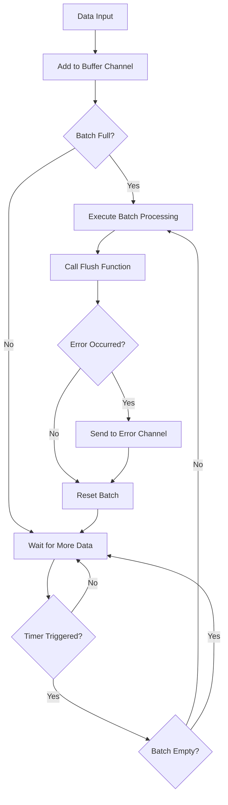
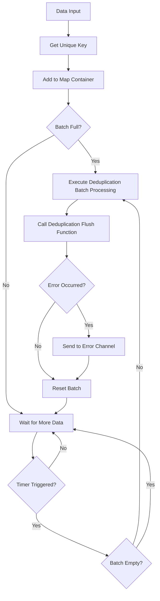

# Go Pipeline v2

[English](README.md) | [中文](README_cn.md) | [📖 Documentation](https://rushairer.github.io/go-pipeline-homepage/)

[](https://github.com/rushairer/go-pipeline/actions/workflows/test.yml)
[](https://goreportcard.com/report/github.com/rushairer/go-pipeline/v2)
[](https://godoc.org/github.com/rushairer/go-pipeline/v2)
[](https://github.com/rushairer/go-pipeline/releases)
[](https://github.com/rushairer/go-pipeline/blob/main/LICENSE)

A high-performance, concurrency-safe Go pipeline with generics, offering size/time-window batching, backpressure and graceful shutdown, error/metrics hooks, rate-limited async flush with dynamic tuning, in both standard and dedup modes.

## 📋 System Requirements

- Go 1.20+ (with generics support)
- Supports Linux, macOS, Windows

## 📦 Installation

```bash
go get github.com/rushairer/go-pipeline/v2@latest
```

## 🚀 Features

- **Generics Support**: Type-safe implementation based on Go 1.20+ generics
- **Batch Processing**: Automatic batching by size and time intervals
- **Concurrency Safety**: Built-in goroutine safety mechanisms
- **Flexible Configuration**: Customizable buffer size, batch size, and flush intervals
- **Error Handling**: Comprehensive error handling and propagation mechanisms
- **Two Modes**: Standard batch processing and deduplication batch processing
- **Sync/Async**: Support for both synchronous and asynchronous execution modes
- **Go Conventions**: Follows "writer closes" channel management principle


### Test File Descriptions

The project includes a complete test suite to ensure code quality and performance:

#### Core Functionality Tests
- **`pipeline_standard_test.go`**: Unit tests for standard pipeline, verifying basic functionality and data flow
- **`pipeline_deduplication_test.go`**: Unit tests for deduplication pipeline, verifying deduplication logic and unique key handling
- **`pipeline_helper_api_test.go`**: Unit tests for convenience APIs (Start/Run), verifying simplified interfaces

#### Advanced Feature Tests
- **`pipeline_cancel_drain_test.go`**: Cancellation drain mechanism tests, verifying DrainOnCancel and graceful shutdown
- **`pipeline_concurrency_test.go`**: Concurrency control tests, verifying MaxConcurrentFlushes limits
- **`pipeline_error_chan_test.go`**: Error channel mechanism tests, verifying lazy initialization and non-blocking sends
- **`pipeline_error_handling_test.go`**: Error handling flow tests, verifying error propagation and processing
- **`pipeline_final_flush_timeout_test.go`**: Final flush timeout tests, verifying timeout protection on channel close
- **`pipeline_max_concurrent_flushes_test.go`**: Maximum concurrent flushes tests, verifying async flush concurrency limits
- **`pipeline_hooks_test.go`**: Hook mechanism tests, verifying Logger and Metrics hook functionality

#### Performance and Stress Tests
- **`pipeline_standard_benchmark_test.go`**: Performance benchmark tests for standard pipeline
- **`pipeline_deduplication_benchmark_test.go`**: Performance benchmark tests for deduplication pipeline
- **`pipeline_performance_benchmark_test.go`**: Comprehensive performance benchmark tests comparing different batch sizes
- **`pipeline_memory_behavior_test.go`**: Memory semantics validation tests, verifying memory behavior of different data types
- **`pipeline_race_stress_test.go`**: Race condition stress tests, verifying concurrency safety (requires -race flag)


## 📦 Core Components

### Interface Definitions

- **`PipelineChannel[T]`**: Defines pipeline channel access interface
- **`Performer`**: Defines pipeline execution interface
- **`DataProcessor[T]`**: Defines core batch data processing interface
- **`Pipeline[T]`**: Combines all pipeline functionality into a universal interface

### Implementation Types

- **`StandardPipeline[T]`**: Standard batch processing pipeline, processes data sequentially in batches
- **`DeduplicationPipeline[T]`**: Deduplication batch processing pipeline, deduplicates based on unique keys
- **`PipelineImpl[T]`**: Common pipeline implementation providing basic functionality

## 🏗️ Architecture Design

```
┌─────────────────┐    ┌──────────────────┐    ┌─────────────────┐
│   Data Input    │───▶│   Buffer Channel │───▶│  Batch Processor│
└─────────────────┘    └──────────────────┘    └─────────────────┘
                                │                        │
                                ▼                        ▼
                       ┌──────────────────┐    ┌─────────────────┐
                       │   Timer Ticker   │    │   Flush Handler │
                       └──────────────────┘    └─────────────────┘
                                │                        │
                                └────────┬───────────────┘
                                         ▼
                                ┌─────────────────┐
                                │  Error Channel  │
                                └─────────────────┘
```

## 🔄 Data Flow Diagrams

### Standard Pipeline Flow



Notes:
- On channel-close path, a final synchronous flush is performed; if `FinalFlushOnCloseTimeout > 0`, it runs under a context with timeout. Your flush function must respect the provided context to exit timely.
- If configured, async flush concurrency is limited by `MaxConcurrentFlushes` (0 = unlimited).

### Deduplication Pipeline Flow



## 📋 Configuration Parameters

```go
type PipelineConfig struct {
    BufferSize                uint32        // Buffer channel capacity (default: 100)
    FlushSize                 uint32        // Maximum batch data capacity (default: 50)
    FlushInterval             time.Duration // Timed flush interval (default: 50ms)
    DrainOnCancel             bool          // Whether to best-effort flush on cancellation (default false)
    DrainGracePeriod          time.Duration // Max window for the final flush when DrainOnCancel is true
    FinalFlushOnCloseTimeout  time.Duration // Max window for the final flush on channel-close path (0 = disabled; use context.Background)
    MaxConcurrentFlushes      uint32        // Max concurrent async flushes (0 = unlimited)
}
```

### 🎯 Performance-Optimized Default Values

Based on performance benchmark tests, v2 version adopts optimized default configuration:

- **BufferSize: 100** - Buffer size, should be >= FlushSize * 2 to avoid blocking
- **FlushSize: 50** - Batch size, performance tests show around 50 is optimal
- **FlushInterval: 50ms** - Flush interval, balances latency and throughput

### FlushSize vs BufferSize: Relationship and Tuning

- Roles:
  - FlushSize: batch size threshold; reaching it triggers a flush (or by FlushInterval).
  - BufferSize: capacity of input channel; determines how much can be queued without blocking producers.
- Recommended relation: BufferSize ≥ k × FlushSize, where k ∈ [4, 10] for stable throughput under bursts.
- Effects of size relation:
  - BufferSize < FlushSize: frequent timeout-based small batches, lower throughput, higher latency/GC.
  - BufferSize ≈ 2×FlushSize: generally OK, but sensitive to bursty producers.
  - BufferSize ≥ 4–10×FlushSize: higher full-batch ratio, better throughput, fewer producer stalls (uses more memory).
- Coordination with FlushInterval:
  - FlushInterval bounds tail latency when a batch isn't filled in time.
  - Too-small BufferSize shifts more flushes to timeout path, shrinking effective batch size.

Sizing recipe based on processing cost:
- Measure in your flush function:
  - t_item: average per-item processing time (ns/item).
  - t_batch: fixed per-batch overhead (ns/batch), e.g., DB round-trip, encoding, etc.
- Choose amortization target α (e.g., 0.1 means per-batch overhead per item ≤ 10% of per-item cost).
- Then:
  - FlushSize ≥ ceil(t_batch / (α × t_item))  // clamp to [32, 128] as a practical range; default 50
  - BufferSize = k × FlushSize, with k in [4, 10] depending on burstiness and number of producers.
- Example:
  - t_item = 2µs, t_batch = 200µs, α = 0.1 ⇒ FlushSize ≥ 200 / (0.1×2) = 1000 ⇒ clamp to 128 if latency-sensitive, or keep 1000 if purely throughput-focused; then BufferSize = 4–10 × FlushSize.

Recommended defaults (balanced latency/throughput):
- FlushSize: 50
- BufferSize: 100 (≈ 2×FlushSize; increase to 4–10× under multi-producer bursts)
- FlushInterval: 50ms

### Cheat Sheet

Quick picks:
- High throughput:
  - FlushSize: 64–128 (default 50 is balanced; increase if pure throughput)
  - BufferSize: 4–10 × FlushSize (higher with more producers/bursts)
  - FlushInterval: 50–100ms
- Low latency:
  - FlushSize: 8–32
  - BufferSize: ≥ 4 × FlushSize
  - FlushInterval: 1–10ms (cap tail latency)
- Memory constrained:
  - FlushSize: 16–32
  - BufferSize: 2–4 × FlushSize (bounded by memory budget)
  - FlushInterval: 50–200ms
- Multiple producers (N):
  - Suggest: BufferSize ≥ (4–10) × FlushSize × ceil(N / NumCPU)
  - Goal: maintain high full-batch ratio and reduce producer stalls under bursts

Formulas:
- FlushSize ≈ clamp( ceil(t_batch / (α × t_item)), 32, 128 )
  - t_item: avg per-item cost
  - t_batch: fixed per-batch overhead (e.g., DB round-trip)
  - α: amortization target (e.g., 0.1 ⇒ per-batch overhead per item ≤ 10% of t_item)
- BufferSize = k × FlushSize, k ∈ [4, 10] based on concurrency/burstiness
- FlushInterval:
  - latency-bound: FlushInterval ≈ target tail-latency budget
  - rate-bound: FlushInterval ≈ p99 inter-arrival × FlushSize

Validation checklist:
- Full-batch ratio ≥ 80%
- Producer stall rate near 0
- Stable GC/memory watermark
- P99/P99.9 E2E latency within SLO

### Tuning Helper (Go)

Use two measurements (N1, N2) to estimate t_item and t_batch, then compute recommended FlushSize/BufferSize:

```go
package main

import (
	"context"
	"fmt"
	"math"
	"time"

	gopipeline "github.com/rushairer/go-pipeline/v2"
)

// Replace this with your real batch function you're planning to use.
func batchFunc(ctx context.Context, items []int) error {
	// Simulate work: per-batch overhead + per-item cost.
	// Replace with actual logic. Keep it side-effect free for measurement.
	time.Sleep(200 * time.Microsecond) // t_batch (example)
	perItem := 2 * time.Microsecond    // t_item (example)
	time.Sleep(time.Duration(len(items)) * perItem)
	return nil
}

func measureOnce(n int, rounds int) time.Duration {
	items := make([]int, n)
	var total time.Duration
	ctx := context.Background()
	for i := 0; i < rounds; i++ {
		start := time.Now()
		_ = batchFunc(ctx, items)
		total += time.Since(start)
	}
	return total / time.Duration(rounds)
}

func estimateCosts(n1, n2, rounds int) (tItem, tBatch time.Duration) {
	d1 := measureOnce(n1, rounds)
	d2 := measureOnce(n2, rounds)
	// Linear fit: d = t_batch + n * t_item
	// t_item = (d2 - d1) / (n2 - n1)
	// t_batch = d1 - n1 * t_item
	tItem = time.Duration(int64((d2 - d1) / time.Duration(n2-n1)))
	tBatch = d1 - time.Duration(n1)*tItem
	if tItem < 0 {
		tItem = 0
	}
	if tBatch < 0 {
		tBatch = 0
	}
	return
}

func recommend(tItem, tBatch time.Duration, alpha float64, k int) (flush uint32, buffer uint32) {
	// FlushSize >= ceil(t_batch / (alpha * t_item)), clamped to [32, 128] as a practical default range
	if tItem <= 0 || alpha <= 0 {
		return 50, 100 // safe defaults
	}
	raw := float64(tBatch) / (alpha * float64(tItem))
	fs := int(math.Ceil(raw))
	if fs < 32 {
		fs = 32
	}
	if fs > 128 {
		// If you're purely throughput-focused, you may keep fs > 128.
		// For balanced latency, clamp to 128.
		fs = 128
	}
	if k < 1 {
		k = 4
	}
	return uint32(fs), uint32(k * fs)
}

func main() {
	// Example measurement with two points
	n1, n2 := 64, 512
	rounds := 20
	tItem, tBatch := estimateCosts(n1, n2, rounds)
	flush, buffer := recommend(tItem, tBatch, 0.1, 8)

	fmt.Printf("Estimated t_item=%v, t_batch=%v\n", tItem, tBatch)
	fmt.Printf("Recommended FlushSize=%d, BufferSize=%d (k=8, α=0.1)\n", flush, buffer)

	// Example of using recommended config
	_ = gopipeline.NewStandardPipeline[int](gopipeline.PipelineConfig{
		BufferSize:    buffer,
		FlushSize:     flush,
		FlushInterval: 50 * time.Millisecond,
	}, func(ctx context.Context, batch []int) error {
		return batchFunc(ctx, batch)
	})
}
```

Notes:
- Replace batchFunc with your real processing. Keep external side effects minimal to reduce noise while measuring.
- If your measured FlushSize exceeds 128 and you care about latency, clamp to 128; otherwise keep the larger value and increase BufferSize proportionally (k × FlushSize).
- Re-run measurements on different machines/workloads; cache, IO and network drastically affect t_batch.

### Deduplication Pipeline Tuning

Key points:
- Effective batch size: After dedup, the actual batch size ≤ FlushSize. If input has high duplication, the effective batch size may be much smaller than FlushSize.
- Apply the same sizing recipe, but consider uniqueness ratio u ∈ (0,1]:
  - If pre-dedup batch has N items and u fraction are unique, effective items ≈ u × N.
  - When computing FlushSize by cost, you may need larger pre-dedup FlushSize so that u × FlushSize ≈ your target effective batch (e.g., ~50).
- Buffer and interval:
  - BufferSize: still set BufferSize ≥ k × FlushSize with k in [4,10] to absorb bursts.
  - FlushInterval: with high duplication, slightly increasing FlushInterval can help accumulate enough unique items to reach target effective batch; balance with latency SLO.
- Memory note:
  - Dedup uses a map for the current batch. Map entries add overhead per unique key; prefer reusing value buffers in your flush function to reduce allocations.

Example with duplication:
- Suppose t_item = 2µs, t_batch = 200µs, α = 0.1 ⇒ cost-based FlushSize_raw = 1000.
- If uniqueness ratio u ≈ 0.2, effective batch at FlushSize_raw ≈ 200. If you want ≈ 50 effective:
  - You can clamp FlushSize to 256–512 for latency balance, since u × 256 ≈ 51, or keep larger for throughput.
  - Set BufferSize = 8 × FlushSize to handle bursts.

### Multi-producer Sizing Example

For N producers on P logical CPUs:
- Rule of thumb: BufferSize ≥ (4–10) × FlushSize × ceil(N / P).
- Purpose: keep the consumer flushing with full batches while minimizing producer stalls during bursts.

Numerical example:
- P=8 CPUs, N=16 producers, target FlushSize=64, choose k=6:
  - BufferSize ≥ 6 × 64 × ceil(16/8) = 6 × 64 × 2 = 768 (round to 1024 for headroom).
  - If uniqueness ratio u=0.5 in dedup mode and you need ~64 effective per flush, set FlushSize≈128, then recompute BufferSize.

### Cancellation (ctx.Done) Drain Options

Two optional knobs to balance correctness vs. immediacy on cancellation:
- DrainOnCancel (bool, default: false):
  - false: cancel means immediate stop (no final flush)
  - true: on cancel, perform a best-effort final flush for the current partial batch within a bounded window
- DrainGracePeriod (time.Duration):
  - Max time window for the best-effort flush when DrainOnCancel is true (default internal fallback: ~100ms if unset)

Recommended usage:
- Normal shutdown (preserve data): close the data channel; the pipeline guarantees a final flush of remaining data and exits.
- Forceful stop: cancel the context with DrainOnCancel=false.
- Graceful cancel with minimal loss: set DrainOnCancel=true and configure a reasonable DrainGracePeriod (e.g., 50–200ms), noting the flush function should not ignore the new context.

### Configuration with Default Values

You can use the `NewPipelineConfig()` function to create a configuration with default values, then customize specific parameters:

```go
// Create configuration with default values
config := gopipeline.NewPipelineConfig()

// Use default values directly
pipeline := gopipeline.NewStandardPipeline(config, flushFunc)

// Or customize specific parameters using chain methods
config = gopipeline.NewPipelineConfig().
    WithFlushInterval(time.Millisecond * 10).
    WithBufferSize(200)

pipeline = gopipeline.NewStandardPipeline(config, flushFunc)
```

Available configuration methods:
- `NewPipelineConfig()` - Create configuration with default values
- `WithBufferSize(size uint32)` - Set buffer size
- `WithFlushSize(size uint32)` - Set batch size
- `WithFlushInterval(interval time.Duration)` - Set flush interval
- `WithDrainOnCancel(enabled bool)` - Enable best-effort final flush on cancel
- `WithDrainGracePeriod(d time.Duration)` - Set max window for the final flush when DrainOnCancel is enabled
- `WithFinalFlushOnCloseTimeout(d time.Duration)` - Set timeout for the final flush on channel-close path (0 = disabled)
- `WithMaxConcurrentFlushes(n uint32)` - Limit async flush concurrency (0 = unlimited)
- `ValidateOrDefault()` - Validate fields and fill safe defaults (constructor also applies defaults)

### Advanced: Logger and Metrics hooks

Prometheus MetricsHook (example)
```go
// go get github.com/prometheus/client_golang/prometheus
// See examples/metrics_prometheus_example.go for a full implementation.
m := NewPromMetrics(nil) // registers to default registry
p := gopipeline.NewDefaultStandardPipeline(func(ctx context.Context, batch []Item) error {
    // your flush logic
    return nil
})
p.WithMetrics(m)

// Expose Prometheus metrics
http.Handle("/metrics", promhttp.Handler())
_ = http.ListenAndServe(":2112", nil)
```

Recommended Grafana panels (quick start):
- Rate counters:
  - gopipeline_flush_success_total / gopipeline_flush_failure_total
  - gopipeline_error_count_total
  - gopipeline_dropped_error_estimate_total
  - gopipeline_final_flush_timeout_total
  - gopipeline_drain_flush_total, gopipeline_drain_flush_timeout_total
- Histograms/heatmaps:
  - gopipeline_flush_latency_seconds (by result label: ok/fail)
  - gopipeline_batch_size_observed
- Saturation:
  - error channel saturation ratio (sampled len(errs)/cap(errs) in your sampler; export as gauge)
- Suggested alerts:
  - High dropped_error_estimate_total rate
  - Sustained flush_failure_total > 0 with elevated latency p95 on flush_latency_seconds
  - final_flush_timeout_total spikes during deployments/shutdown

WithLogger
- Inject a custom logger:
```go
buf := new(bytes.Buffer)
logger := log.New(buf, "pipeline ", log.LstdFlags)
p := gopipeline.NewDefaultStandardPipeline(func(ctx context.Context, batch []Item) error {
    return flush(ctx, batch)
})
p.WithLogger(logger) // avoid heavy formatting on the hot path
```
- Recommendation: avoid frequent string formatting or large allocations in the hot path; pre-format messages or use leveled logging if available.

WithMetrics
- Interface shape (called by the pipeline at key points):
```go
type MetricsHook interface {
    Flush(items int, duration time.Duration) // called after a flush completes (success or failure)
    Error(err error)                         // called when a flush returns error (non-blocking)
    ErrorDropped()                           // called when an error cannot be enqueued (buffer full)
}
```
- Semantics:
  - Flush: invoked once per flush; record batch size and latency (e.g., histogram)
  - Error: invoked when flush returns an error; count and tag error type
  - ErrorDropped: invoked if the error channel is saturated and drops occur
- Example (counters/histograms):
```go
type hook struct {
    flushOK    atomic.Int64
    flushFail  atomic.Int64
}

func (h *hook) Flush(items int, d time.Duration) { /* export batch size and latency */ }
func (h *hook) Error(err error)                  { h.flushFail.Add(1) /* export error_count */ }
func (h *hook) ErrorDropped()                    { /* export dropped_error_estimate++ */ }

// ...
p.WithMetrics(&hook{})
```
- Align with “Recommended metrics”:
  - error_count, dropped_error_estimate
  - flush_success / flush_failure
  - final_flush_timeout_count, drain_flush_count / drain_flush_timeout_count
  - error_chan_saturation_ratio
  - batch_size_observed_p50/p95/p99, flush_latency_p50/p95/p99

## Convenience APIs: Start and Run

These helper methods reduce boilerplate by wrapping AsyncPerform/SyncPerform, Done and ErrorChan handling.

- When to use:
  - Start(ctx): prefer for async runs; returns done and errs channel; you still decide how to consume errs.
  - Run(ctx, errBuf): prefer for sync runs; initializes error buffer size and blocks until exit, returning the final error.

- Error channel capacity:
  - The first call to ErrorChan(size) decides the buffer size; later calls ignore size.
  - If you never call it, the pipeline will create a default one on first internal send.

- Concurrency constraint:
  - The same pipeline instance must not be started concurrently; a second start returns ErrAlreadyRunning (delivered via error channel in Start).

Examples

Async start (Start)
```go
done, errs := pipeline.Start(ctx)

// consume errors (recommended)
go func() {
    for {
        select {
        case err, ok := <-errs:
            if !ok {
                return
            }
            log.Printf("pipeline error: %v", err)
        case <-ctx.Done():
            return
        }
    }
}()

// send data
ch := pipeline.DataChan()
go func() {
    defer close(ch) // writer closes
    for _, x := range items {
        select {
        case ch <- x:
        case <-ctx.Done():
            return
        }
    }
}()

<-done // wait for this run to finish
```

Sync run (Run)
```go
// Initialize error channel capacity (e.g., 128) and run synchronously
if err := pipeline.Run(ctx, 128); err != nil {
    if errors.Is(err, gopipeline.ErrContextIsClosed) {
        // exited due to context cancellation
    }
}
```

Notes
- Start may deliver a second concurrent start attempt as ErrAlreadyRunning via errs.
- Done semantics: each Perform run replaces the internal done channel. Concurrent multi-start semantics are not guaranteed; prefer using the done returned by Start for the current run.
- You may choose not to consume errs; if the buffer fills, new errors are dropped (non-blocking, no panic).
- DataChan() follows "writer closes". Close it when you want a lossless final flush and graceful exit.
- For multiple runs on the same instance, do NOT close the data channel between runs; control lifecycle with context.

### Concurrent second start assertion (ErrAlreadyRunning)
```go
// Attempt to start the same instance twice; the second should surface ErrAlreadyRunning via errs.
ctx, cancel := context.WithCancel(context.Background())
defer cancel()

done, errs := pipeline.Start(ctx)

// second start
_, errs2 := pipeline.Start(ctx)

// collect one error from either errs or errs2
var got error
select {
case got = <-errs:
case got = <-errs2:
case <-time.After(200 * time.Millisecond):
    log.Fatalf("expected ErrAlreadyRunning, but timed out")
}

if !errors.Is(got, gopipeline.ErrAlreadyRunning) {
    log.Fatalf("want ErrAlreadyRunning, got %v", got)
}

cancel()
<-done
```

### Done channel semantics

- What it is: a per-run completion signal. Each Perform run (Sync/Async/Start/Run) creates/replaces the internal done; it closes when the perform loop fully exits, after any final flush (channel-close path) or cancel-drain (if enabled).
- Prefer Start’s returned done: when you call Start(ctx), use the returned done to wait/select for that specific run. It is stable and bound to that run.
- Using p.Done():
  - Use it only after you have started a run, when you need to query the current run’s done from elsewhere.
  - Do not cache p.Done() before Start and wait on it later (it may be nil or a stale/closed one).
  - Do not rely on p.Done() across concurrent starts; if a second start is attempted, semantics are not guaranteed. The second attempt surfaces ErrAlreadyRunning via errs.
- Do not close it yourself: the pipeline owns and closes the done channel.
- Not needed for sync paths: SyncPerform/Run block until completion; you typically do not need a done channel.

Examples:

Correct: prefer Start’s returned done
```go
done, errs := p.Start(ctx)
// ... consume errs in a goroutine ...
<-done // wait for this run to finish
```

Anti-pattern: caching p.Done() before Start
```go
d := p.Done()   // may be nil or stale
_ = d
done, _ := p.Start(ctx)
<-done          // prefer using this run-scoped done
```

Timing:
- The done channel closes after the perform loop ends. On channel-close path, any remaining items are flushed synchronously (optionally under FinalFlushOnCloseTimeout). On cancel path, if DrainOnCancel is true, a bounded best-effort drain flush is performed before exit.

## Migration to Start/Run

Before (manual wiring)
```go
// Manual: start goroutine, init ErrorChan, wait on Done
errs := pipeline.ErrorChan(128)
go func() { _ = pipeline.AsyncPerform(ctx) }()

go func() {
    for {
        select {
        case err, ok := <-errs:
            if !ok {
                return
            }
            log.Printf("pipeline error: %v", err)
        case <-ctx.Done():
            return
        }
    }
}()

// send data ...
<-pipeline.Done()
```

After (using Start/Run)
```go
// Async, minimal boilerplate
done, errs := pipeline.Start(ctx)
go func() {
    for {
        select {
        case err, ok := <-errs:
            if !ok {
                return
            }
            log.Printf("pipeline error: %v", err)
        case <-ctx.Done():
            return
        }
    }
}()
<-done

// Or sync run with explicit error buffer
if err := pipeline.Run(ctx, 128); err != nil {
    if errors.Is(err, gopipeline.ErrContextIsClosed) {
        // canceled
    }
}
```

## 💡 Usage Examples

### Standard Pipeline Example

```go
package main

import (
    "context"
    "fmt"
    "log"
    "time"
    
    gopipeline "github.com/rushairer/go-pipeline/v2"
)

func main() {
    // Create standard pipeline
    pipeline := gopipeline.NewDefaultStandardPipeline(
        func(ctx context.Context, batchData []int) error {
            fmt.Printf("Processing batch data: %v\n", batchData)
            // Here you can perform database writes, API calls, etc.
            return nil
        },
    )
    
    ctx, cancel := context.WithTimeout(context.Background(), time.Second*10)
    defer cancel()
    
    // Start async processing
    go func() {
        if err := pipeline.AsyncPerform(ctx); err != nil {
            log.Printf("Pipeline execution error: %v", err)
        }
    }()
    
    // Listen for errors (must consume error channel)
    errorChan := pipeline.ErrorChan(10) // Specify error channel buffer size
    go func() {
        for {
            select {
            case err, ok := <-errorChan:
                if !ok {
                    return
                }
                log.Printf("Batch processing error: %v", err)
            case <-ctx.Done():
                return
            }
        }
    }()
    
    // Use new DataChan API to send data
    dataChan := pipeline.DataChan()
    go func() {
        defer close(dataChan) // User controls channel closure
        for i := 0; i < 100; i++ {
            select {
            case dataChan <- i:
            case <-ctx.Done():
                return
            }
        }
    }()
    
    time.Sleep(time.Second * 2) // Wait for processing to complete
}
```

### Deduplication Pipeline Example

```go
package main

import (
    "context"
    "fmt"
    "log"
    "time"
    
    gopipeline "github.com/rushairer/go-pipeline/v2"
)

// Data structure implementing UniqueKeyData interface
type User struct {
    ID   string
    Name string
}

func (u User) GetKey() string {
    return u.ID
}

func main() {
    // Create deduplication pipeline
    pipeline := gopipeline.NewDefaultDeduplicationPipeline(
        func(ctx context.Context, batchData map[string]User) error {
            fmt.Printf("Processing deduplicated user data: %d users\n", len(batchData))
            for key, user := range batchData {
                fmt.Printf("  %s: %s\n", key, user.Name)
            }
            return nil
        },
    )
    
    ctx, cancel := context.WithTimeout(context.Background(), time.Second*10)
    defer cancel()
    
    // Start async processing
    go func() {
        if err := pipeline.AsyncPerform(ctx); err != nil {
            log.Printf("Pipeline execution error: %v", err)
        }
    }()
    
    // Listen for errors
    errorChan := pipeline.ErrorChan(10)
    go func() {
        for {
            select {
            case err, ok := <-errorChan:
                if !ok {
                    return
                }
                log.Printf("Batch processing error: %v", err)
            case <-ctx.Done():
                return
            }
        }
    }()
    
    // Use new DataChan API to send data
    dataChan := pipeline.DataChan()
    go func() {
        defer close(dataChan)
        
        users := []User{
            {ID: "1", Name: "Alice"},
            {ID: "2", Name: "Bob"},
            {ID: "1", Name: "Alice Updated"}, // Will overwrite the first Alice
            {ID: "3", Name: "Charlie"},
            {ID: "2", Name: "Bob Updated"},   // Will overwrite the first Bob
        }
        
        for _, user := range users {
            select {
            case dataChan <- user:
            case <-ctx.Done():
                return
            }
        }
    }()
    
    time.Sleep(time.Second * 2) // Wait for processing to complete
}
```

### Custom Configuration Example

```go
// Create pipeline with custom configuration
config := gopipeline.PipelineConfig{
    BufferSize:    100,                   // Recommended balanced default
    FlushSize:     50,                    // Recommended balanced default
    FlushInterval: 50 * time.Millisecond, // Recommended balanced default
}

pipeline := gopipeline.NewStandardPipeline(config, 
    func(ctx context.Context, batchData []string) error {
        // Custom processing logic
        return nil
    },
)
```

### Cancellation Drain Example

Two ways to finish a pipeline run:

1) Close the data channel (recommended lossless drain)
```go
config := gopipeline.NewPipelineConfig().
    WithBufferSize(100).
    WithFlushSize(50).
    WithFlushInterval(50 * time.Millisecond)
// DrainOnCancel is irrelevant here; closing the channel guarantees final flush.

p := gopipeline.NewStandardPipeline(config, func(ctx context.Context, batch []string) error {
    // Your processing
    return nil
})

ctx, cancel := context.WithTimeout(context.Background(), 10*time.Second)
defer cancel()

go func() { _ = p.AsyncPerform(ctx) }()

dataChan := p.DataChan()
go func() {
    defer close(dataChan) // writer closes: guarantees a final flush of remaining items
    for i := 0; i < 1000; i++ {
        select {
        case dataChan <- fmt.Sprintf("item-%d", i):
        case <-ctx.Done():
            return
        }
    }
}()
```

2) Cancel via context, with best-effort drain on cancel
```go
config := gopipeline.NewPipelineConfig().
    WithBufferSize(100).
    WithFlushSize(50).
    WithFlushInterval(50 * time.Millisecond).
    WithDrainOnCancel(true).                // enable drain on cancel
    WithDrainGracePeriod(150 * time.Millisecond) // bound the drain time window

p := gopipeline.NewStandardPipeline(config, func(ctx context.Context, batch []string) error {
    // IMPORTANT: respect ctx; return promptly when ctx.Done() to honor grace window
    return nil
})

ctx, cancel := context.WithCancel(context.Background())
go func() { _ = p.AsyncPerform(ctx) }()

dataChan := p.DataChan()
// send some data...
// When you need to stop quickly but still try to flush current partial batch:
cancel() // pipeline will do one best-effort flush within DrainGracePeriod, then exit
```

Notes:
- Close-the-channel path ensures remaining data is flushed regardless of ctx cancellation.
- Drain-on-cancel is a compromise for fast stop with minimal loss; choose a small DrainGracePeriod (e.g., 50–200ms) and ensure your flush respects the provided context.

### Deduplication Cancellation Drain Example

Two ways to finish a deduplication pipeline run:

1) Close the data channel (recommended lossless drain)
```go
config := gopipeline.NewPipelineConfig().
    WithBufferSize(100).
    WithFlushSize(50).
    WithFlushInterval(50 * time.Millisecond)

p := gopipeline.NewDefaultDeduplicationPipeline(func(ctx context.Context, batch map[string]User) error {
    // Your deduped processing
    return nil
})

ctx, cancel := context.WithTimeout(context.Background(), 10*time.Second)
defer cancel()

go func() { _ = p.AsyncPerform(ctx) }()

ch := p.DataChan()
go func() {
    defer close(ch) // writer closes: guarantees a final flush (dedup map is flushed)
    for i := 0; i < 1000; i++ {
        select {
        case ch <- User{ID: fmt.Sprintf("%d", i%200), Name: "N"}: // include duplicates
        case <-ctx.Done():
            return
        }
    }
}()
```

2) Cancel via context, with best-effort drain on cancel
```go
config := gopipeline.NewPipelineConfig().
    WithBufferSize(100).
    WithFlushSize(50).
    WithFlushInterval(50 * time.Millisecond).
    WithDrainOnCancel(true).
    WithDrainGracePeriod(150 * time.Millisecond)

p := gopipeline.NewDefaultDeduplicationPipeline(func(ctx context.Context, batch map[string]User) error {
    // IMPORTANT: respect ctx; return promptly to honor the grace window
    return nil
})

ctx, cancel := context.WithCancel(context.Background())
go func() { _ = p.AsyncPerform(ctx) }()

ch := p.DataChan()
// send some data...
cancel() // pipeline performs a best-effort flush of current dedup map within DrainGracePeriod, then exits
```

Notes:
- Dedup mode keeps a map for the current batch; both shutdown strategies ensure the remaining unique entries are flushed.
- For high-duplication inputs, consider a slightly longer FlushInterval to accumulate enough unique items, balanced with your latency SLO.

### Shutdown semantics

FinalFlushOnCloseTimeout
- On the channel-close path, the pipeline performs a final synchronous flush for the remaining batch.
- If config.FinalFlushOnCloseTimeout > 0, the final flush is executed under a context with timeout; otherwise, it uses context.Background().
- Your flush function should respect the provided context to ensure timely exit on timeout.

Example:
```go
cfg := gopipeline.NewPipelineConfig().
    WithFlushSize(50).
    WithBufferSize(100).
    WithFinalFlushOnCloseTimeout(150 * time.Millisecond)

p := gopipeline.NewStandardPipeline(cfg, func(ctx context.Context, batch []Item) error {
    // IMPORTANT: respect ctx; abort promptly on ctx.Done()
    return writeBatch(ctx, batch)
})

ctx, cancel := context.WithTimeout(context.Background(), 5*time.Second)
defer cancel()

go func() { _ = p.AsyncPerform(ctx) }()

ch := p.DataChan()
go func() {
    defer close(ch) // writer closes: triggers final flush under timeout
    for _, it := range items {
        select {
        case ch <- it:
        case <-ctx.Done():
            return
        }
    }
}()
```

The pipeline can exit via two distinct paths:

- Channel closed:
  - If the current batch is non-empty, a final synchronous flush is performed with context.Background().
  - The loop returns nil (graceful shutdown).
- Context canceled:
  - DrainOnCancel = false: return ErrContextIsClosed (no final flush).
  - DrainOnCancel = true: perform one best-effort final synchronous flush under a separate drainCtx with timeout (DrainGracePeriod, default ~100ms if unset). Returns errors.Join(ErrContextIsClosed, ErrContextDrained).

Detect exit conditions via errors.Is:
```go
err := pipeline.AsyncPerform(ctx)
// ...
if errors.Is(err, ErrContextIsClosed) {
    // Exited due to context cancellation
}
if errors.Is(err, ErrContextDrained) {
    // A best-effort final drain flush was performed on cancel
}
// On channel-close path, err == nil (graceful shutdown)
```

Notes:
- The final drain flush is executed synchronously to avoid races on shutdown.
- Your flush function should respect the provided context (drainCtx) and return promptly.

## 🎯 Use Cases

### 1. Database Batch Inserts
```go
// Batch insert database records
pipeline := gopipeline.NewDefaultStandardPipeline(
    func(ctx context.Context, records []DatabaseRecord) error {
        return db.BatchInsert(ctx, records)
    },
)
```

### 2. Log Batch Processing
```go
// Batch write log files
pipeline := gopipeline.NewDefaultStandardPipeline(
    func(ctx context.Context, logs []LogEntry) error {
        return logWriter.WriteBatch(logs)
    },
)
```

### 3. API Batch Calls
```go
// Batch call third-party APIs
pipeline := gopipeline.NewDefaultStandardPipeline(
    func(ctx context.Context, requests []APIRequest) error {
        return apiClient.BatchCall(ctx, requests)
    },
)
```

### 4. User Data Deduplication
```go
// User data deduplication processing
pipeline := gopipeline.NewDefaultDeduplicationPipeline(
    func(ctx context.Context, users map[string]User) error {
        return userService.BatchUpdate(ctx, users)
    },
)
```

### 5. Message Queue Batch Consumption
```go
// Batch process message queue data
pipeline := gopipeline.NewDefaultStandardPipeline(
    func(ctx context.Context, messages []Message) error {
        return messageProcessor.ProcessBatch(ctx, messages)
    },
)
```

## 🔥 Advanced Usage

### Dynamic Configuration Adjustment

```go
// Dynamically adjust configuration based on system load
func createAdaptivePipeline() *gopipeline.StandardPipeline[Task] {
    config := gopipeline.PipelineConfig{
        BufferSize:    getOptimalBufferSize(),
        FlushSize:     getOptimalFlushSize(),
        FlushInterval: getOptimalInterval(),
    }
    
    return gopipeline.NewStandardPipeline(config, processTaskBatch)
}

func getOptimalBufferSize() uint32 {
    // Calculate based on system memory and CPU cores
    return uint32(runtime.NumCPU() * 50)
}

func getOptimalFlushSize() uint32 {
    // Based on performance tests, around 50 is optimal
    return 50
}
```

### Error Retry Mechanism

```go
pipeline := gopipeline.NewDefaultStandardPipeline(
    func(ctx context.Context, batchData []Task) error {
        return retryWithBackoff(ctx, func() error {
            return processBatch(batchData)
        }, 3, time.Second)
    },
)

func retryWithBackoff(ctx context.Context, fn func() error, maxRetries int, baseDelay time.Duration) error {
    for i := 0; i < maxRetries; i++ {
        if err := fn(); err == nil {
            return nil
        }
        
        select {
        case <-ctx.Done():
            return ctx.Err()
        case <-time.After(baseDelay * time.Duration(1<<i)):
            // Exponential backoff
        }
    }
    return fmt.Errorf("max retries exceeded")
}
```

### Monitoring and Metrics Collection

```go
type MetricsPipeline struct {
    *gopipeline.StandardPipeline[Event]
    processedCount int64
    errorCount     int64
}

func NewMetricsPipeline() *MetricsPipeline {
    mp := &MetricsPipeline{}
    
    mp.StandardPipeline = gopipeline.NewDefaultStandardPipeline(
        func(ctx context.Context, events []Event) error {
            err := processEvents(events)
            
            atomic.AddInt64(&mp.processedCount, int64(len(events)))
            if err != nil {
                atomic.AddInt64(&mp.errorCount, 1)
            }
            
            return err
        },
    )
    
    return mp
}

func (mp *MetricsPipeline) GetMetrics() (processed, errors int64) {
    return atomic.LoadInt64(&mp.processedCount), atomic.LoadInt64(&mp.errorCount)
}
```

### Graceful Shutdown

```go
func gracefulShutdown(pipeline *gopipeline.StandardPipeline[Task]) {
    // Create context with timeout
    ctx, cancel := context.WithTimeout(context.Background(), 30*time.Second)
    defer cancel()
    
    // Stop accepting new data
    // Close data channel
    dataChan := pipeline.DataChan()
    close(dataChan)
    
    // Wait for processing to complete
    done := make(chan struct{})
    go func() {
        defer close(done)
        // Wait for error channel to close, indicating all data has been processed
        errorChan := pipeline.ErrorChan(10)
        for {
            select {
            case err, ok := <-errorChan:
                if !ok {
                    return
                }
                log.Printf("Processing remaining error: %v", err)
            case <-ctx.Done():
                return
            }
        }
    }()
    
    // Wait for completion or timeout
    select {
    case <-done:
        log.Println("Pipeline graceful shutdown completed")
    case <-ctx.Done():
        log.Println("Pipeline shutdown timeout")
    }
}
```

## 📦 Data Type Semantics & Performance (DataChan payload)

When sending data via `DataChan() chan<- T`, the choice of `T` affects memory behavior and performance:

- Integers (`int`, `int64`, etc.): pure value copy; small and efficient.
- `string`: only the string header (pointer+len) is copied; underlying bytes are not copied. Usually efficient, but beware of sharing the underlying bytes if mutated elsewhere.
- Arrays (`[N]T`): the whole array value is copied when sent through the channel. Large `N` increases CPU/memory copy cost.
- Slices (`[]T`): only the slice header (ptr/len/cap) is copied; underlying array is shared. If the producer mutates or reuses the backing array after sending, the pipeline will observe those mutations. Ensure immutability after send or copy on write.
- Pointers (`*T`): only the pointer value is copied; no duplicate copy of the pointed data. This avoids memory duplication but shares the same object. Guarantee data-race safety and immutability after send.
- Structs: copied by value; consider size. For large payloads, prefer `[]byte` or `*Large` and manage immutability explicitly.

Recommendations:
- Prefer immutable payloads after sending. If you must mutate producer buffers, send a copy (e.g., `append([]byte(nil), b...)`).
- For high-throughput with large items, prefer `[]byte` or pointers and treat buffers/objects as immutable once sent.
- In async mode, the pipeline swaps batch containers on flush; do not reset and reuse the same backing storage that a concurrent flush goroutine may still read.

Validation tests:
- See `pipeline_memory_behavior_test.go` for examples validating array copy vs. slice/pointer sharing.

## ⚡ Performance Characteristics

Based on the latest performance benchmark test results:

### 🚀 Core Performance Metrics

- **Data Processing Throughput**: ~248 nanoseconds/item (Apple M4)
- **Memory Efficiency**: 232 bytes/operation, 7 allocations/operation
- **Batch Processing Optimization**: 5x performance improvement from batch size 1 to 50
- **Pipeline Overhead**: About 38% slower than direct processing (225.4 vs 162.7 ns/op)

### 📊 Batch Size Performance Comparison

```
BatchSize1:   740.5 ns/op  (Slowest - frequent flushing)
BatchSize10:  251.5 ns/op  (Significant improvement)
BatchSize50:  146.5 ns/op  (Optimal performance) ⭐
BatchSize100: 163.4 ns/op  (Slight decline)
BatchSize500: 198.6 ns/op  (Batch too large)
```

### 💡 Performance Optimization Recommendations

1. **Optimal Batch Size**: Around 50
2. **Buffer Configuration**: BufferSize >= FlushSize * 2
3. **Flush Interval**: 50ms balances latency and throughput
4. **Async Mode**: Recommended for better performance

## ⚠️ Important Notes

> AsyncPerform flush ordering: callbacks may execute out of order across flushes. Do not rely on cross-batch ordering.

> **Error Channel Behavior**: Lazily initialized via sync.Once. The first call to `ErrorChan(size int)` decides the buffer size; subsequent calls ignore size. Even if you don't explicitly call it, the pipeline will initialize it on first error send and write errors non-blockingly. If the channel isn't consumed and the buffer fills, subsequent errors are dropped (no blocking or panic).

> **Recommended to Listen to Error Channel**: If you call `ErrorChan(size int)`, it's recommended to listen to the error channel and use select statements to avoid infinite waiting.

> **Channel Management**: v2 version follows the "writer closes" principle, users need to control the closing timing of `DataChan()`.

> **⚠️ Pipeline Reuse Warning**: If you need to reuse the same pipeline instance for multiple runs (calling `SyncPerform()` or `AsyncPerform()` multiple times), **DO NOT close the DataChan** prematurely. `DataChan()` returns the same channel instance, and once closed, it cannot be reused. Use context cancellation or timeout to control pipeline lifecycle instead.

## 🔧 Best Practices

1. **Reasonable Batch Size**: Based on performance tests, recommend using batch size around 50
2. **⚠️ Must Listen to Error Channel**: Use select statements to avoid blocking, handle errors from batch processing promptly
3. **Proper Channel Closure**: Use defer close(dataChan) to ensure proper channel closure
4. **Context Management**: Use context to control pipeline lifecycle
5. **Deduplication Key Design**: Ensure uniqueness and stability of deduplication keys
6. **Performance Tuning**: Choose appropriate configuration parameters based on benchmark test results
7. **⚠️ Pipeline Reuse**: For repeated pipeline usage, avoid closing DataChan prematurely. Use context timeout/cancellation instead of channel closure to end processing

### Pipeline Reuse Pattern

When you need to run the same pipeline multiple times:

```go
// ✅ Correct: Use context to control lifecycle
pipeline := gopipeline.NewStandardPipeline(config, batchFunc)
dataChan := pipeline.DataChan() // Get channel once

// First run
ctx1, cancel1 := context.WithTimeout(context.Background(), time.Second*30)
go pipeline.SyncPerform(ctx1)
// Send data without closing channel
for _, data := range firstBatch {
    select {
    case dataChan <- data:
    case <-ctx1.Done():
        break
    }
}
cancel1() // End first run

// Second run - reuse same pipeline and channel
ctx2, cancel2 := context.WithTimeout(context.Background(), time.Second*30)
go pipeline.SyncPerform(ctx2)
// Send data again without closing channel
for _, data := range secondBatch {
    select {
    case dataChan <- data:
    case <-ctx2.Done():
        break
    }
}
cancel2() // End second run

// ❌ Wrong: Closing channel prevents reuse
// close(dataChan) // Don't do this if you plan to reuse!
```

## 📊 Error Handling

The framework provides comprehensive error handling mechanisms:

- `ErrContextIsClosed`: Context is closed
- `ErrPerformLoopError`: Execution loop error
- `ErrChannelIsClosed`: Channel is closed

### Error Channel Mechanism

v2 version provides a robust error handling mechanism with lazy initialization and non-blocking semantics:

#### 🛡️ Safety Mechanisms

- **First-call Decides Size**: `ErrorChan(size int)` uses sync.Once; the first call decides buffer size, later calls ignore size. If never called explicitly, a default buffer size is used on first internal send.
- **Optional Consumption**: Listening to the error channel is optional; if unconsumed and the buffer fills, subsequent errors are dropped to avoid blocking.
- **Non-blocking Send**: Errors are sent non-blockingly, ensuring the pipeline isn't blocked.
- **Buffer Full Handling**: When the buffer is full, new errors are discarded instead of blocking; no panic occurs.

#### 📋 Usage Methods

Exit template for error channel consumption (avoid range):
Use an upper-level context to stop the reader goroutine; don't range over the channel since it stays open during runs.

```go
errs := pipeline.ErrorChan(10)

go func(ctx context.Context, errs <-chan error) {
    for {
        select {
        case err, ok := <-errs:
            if !ok {
                return
            }
            log.Printf("processing error: %v", err)
        case <-ctx.Done():
            return
        }
    }
}(ctx, errs)
```

**Method 1: Listen to Errors (Recommended)**
```go
// Create error channel and listen
errorChan := pipeline.ErrorChan(10) // Specify buffer size
go func() {
    for {
        select {
        case err, ok := <-errorChan:
            if !ok {
                return // Channel closed
            }
            log.Printf("Processing error: %v", err)
            // Handle according to error type
        case <-ctx.Done():
            return // Context cancelled
        }
    }
}()
```

**Method 2: Run Without Consuming Errors (Simplified)**
```go
// You may choose not to consume the error channel.
// The pipeline initializes the error channel on demand and sends errors non-blockingly.
// If the buffer fills and nobody consumes, subsequent errors are dropped (no blocking/panic).
pipeline := gopipeline.NewStandardPipeline(config, flushFunc)
go pipeline.AsyncPerform(ctx)
```

#### ⚡ Error Handling Performance

- **Near-zero Overhead**: Error channel is initialized once on demand; sends are non-blocking and lightweight.
- **Async Processing**: Error sending runs independently, minimizing impact on the main flow.
- **Smart Discard**: When the buffer is full and unconsumed, subsequent errors are dropped, preventing blocking.

## 🧪 Testing

The project includes complete unit tests and benchmark tests:

```bash
# Run all tests
go test ./...

# Run unit tests
go test -v ./... -run Test

# Run benchmark tests
go test -bench=. ./...

# Run standard pipeline benchmark tests
go test -bench=BenchmarkStandardPipeline ./...

# Run deduplication pipeline benchmark tests
go test -bench=BenchmarkDeduplicationPipeline ./...

# Run performance benchmark tests
go test -bench=BenchmarkPipelineDataProcessing ./...

# Run batch efficiency tests
go test -bench=BenchmarkPipelineBatchSizes ./...

# Run memory usage tests
go test -bench=BenchmarkPipelineMemoryUsage ./...
```

## 📈 Performance Benchmarks

Latest benchmark test results on Apple M4 processor:

### Core Performance Tests

```
BenchmarkPipelineDataProcessing-10                1000    248.2 ns/op    232 B/op    7 allocs/op
BenchmarkPipelineVsDirectProcessing/Pipeline-10   1000    225.4 ns/op
BenchmarkPipelineVsDirectProcessing/Direct-10     1000    162.7 ns/op
BenchmarkPipelineMemoryUsage-10                   1000    232.2 ns/op    510 B/op    9 allocs/op
```

### Batch Size Efficiency Tests

```
BenchmarkPipelineBatchSizes/BatchSize1-10         500     740.5 ns/op    500.0 items_processed
BenchmarkPipelineBatchSizes/BatchSize10-10        500     251.5 ns/op    500.0 items_processed
BenchmarkPipelineBatchSizes/BatchSize50-10        500     146.5 ns/op    500.0 items_processed ⭐
BenchmarkPipelineBatchSizes/BatchSize100-10       500     163.4 ns/op    500.0 items_processed
BenchmarkPipelineBatchSizes/BatchSize500-10       500     198.6 ns/op    500.0 items_processed
```

### Performance Analysis

- **Optimal Batch Size**: Around 50, 5x performance improvement
- **Pipeline Overhead**: About 38%, in exchange for better architecture and maintainability
- **Memory Efficiency**: About 232-510 bytes memory usage per data item
- **Processing Capacity**: Can process millions of records per second

### Deduplication Pipeline Performance Characteristics

Deduplication pipeline adds the following performance characteristics on top of standard pipeline:

- **Memory Usage**: Uses map structure to store data, slightly higher memory usage than standard pipeline
- **Processing Latency**: Deduplication logic adds about 10-15% processing time
- **Key Generation Overhead**: Need to generate unique keys for each data item
- **Batch Efficiency**: Batch size after deduplication may be smaller than configured FlushSize

**Performance Comparison**:
- Standard Pipeline: ~225 ns/op
- Deduplication Pipeline: ~260 ns/op (about 15% overhead increase)

## ❓ Frequently Asked Questions (FAQ)

Q: What happens if I start the same pipeline concurrently?
A: Concurrent starts are not allowed. The second attempt will fail with ErrAlreadyRunning.
- Start(ctx): the error is delivered via the returned errs channel.
- AsyncPerform/SyncPerform: the method returns ErrAlreadyRunning immediately.

Q: How is the ErrorChan buffer size determined?
A: The first call to ErrorChan(size) decides the buffer size; later calls ignore size. Best practice: call ErrorChan with your desired size before starting the run. If you never call it, a default size is created on first internal send. If nobody consumes and the buffer fills, subsequent errors are dropped (non-blocking, no panic).


Q: How can I observe dropped errors or add instrumentation?
A: Since errors are sent non-blockingly and may be dropped when the buffer is full and unconsumed, consider:
- Metrics on consumption: count processed errors and export as a counter.
- Saturation sampling: if you control the channel capacity (ErrorChan(n)), you can periodically sample len(errs) and cap(errs); frequent len(errs) == cap suggests saturation and potential drops.
- Producer-side metrics: also count how many errors your batch function returns; compare to consumed count to estimate drops.
- Increase buffer if needed and/or consume errors in a dedicated goroutine to reduce pressure.

Example (basic metrics):
```go
errs := pipeline.ErrorChan(128) // known capacity
var processed atomic.Int64
go func() {
    t := time.NewTicker(time.Second)
    defer t.Stop()
    for {
        select {
        case err, ok := <-errs:
            if !ok { return }
            processed.Add(1)
            // export err type, batch size, etc.
            _ = err
        case <-t.C:
            // sample saturation; high ratio may imply drops under burst
            _ = len(errs) // sample only where you hold the chan variable
        case <-ctx.Done():
            return
        }
    }
}()
```

Recommended metrics:
- error_count: total processed errors read from errs
- dropped_error_estimate: producer_error_count - error_count (if available), or estimate via sustained saturation
- flush_success: count of successful flushes
- flush_failure: count of failed flushes
- final_flush_timeout_count: number of timeouts during final flush on channel-close path
- drain_flush_count: number of best-effort drain flushes on cancel
- drain_flush_timeout_count: number of drain flushes that timed out
- error_chan_saturation_ratio: sampled len(errs)/cap(errs) over time
- batch_size_observed_p50/p95/p99: distribution of actual batch sizes processed
- flush_latency_p50/p95/p99: distribution of flush handler latency

Q: Why use initBatchData instead of ResetBatchData when AsyncPerform is enabled?
A: In async mode, each flush runs in a separate goroutine. If you reuse the same underlying buffer and call ResetBatchData (e.g., slice[:0]) while a previous flush goroutine still holds a reference to that buffer, you risk data corruption or loss due to shared backing storage.
- AsyncPerform (concurrent flush): detach the current batch container and hand it to the flush goroutine, then create a new container for subsequent accumulation (initBatchData or from a pool). This guarantees no overlap on the same backing array/map.
- SyncPerform (serial flush): it is safe to reuse the same container by ResetBatchData because flush completes in the same goroutine.
- Recommended practice: for async, prefer “steal and replace” — old container escapes to the flush goroutine; new container starts accumulating immediately. Optionally use a sync.Pool to amortize allocations.
- Dedup mode: the same rule applies to map-based batches — do not clear the map that a flush goroutine is still reading; hand over the map and create a fresh one.

### Q: How to choose appropriate configuration parameters?

**A:** Configuration recommendations based on performance tests:

- **High Throughput Scenario**: FlushSize=50, BufferSize=100, FlushInterval=50ms
- **Low Latency Scenario**: FlushSize=10, BufferSize=50, FlushInterval=10ms
- **Memory Constrained Scenario**: FlushSize=20, BufferSize=40, FlushInterval=100ms
- **CPU Intensive Processing**: Use async mode, appropriately increase buffer size

## Runtime tuning (dynamic adjustments)
You can safely update certain parameters at runtime:
- UpdateFlushSize(n uint32): affects new batches’ preallocation and the “is full” threshold
- UpdateFlushInterval(d time.Duration): takes effect on the next timer cycle; the pipeline nudges its timer to apply promptly


Notes:
- FlushSize changes do not retroactively modify an in-progress batch; slice/map will auto-grow as needed
- FlushInterval updates apply on the next timer reset; a light “nudge” is used to adopt new value quickly
- MaxConcurrentFlushes is implemented via a dynamic limiter; existing in-flight flushes continue to release to their original slot, avoiding deadlocks

Quick example:
p.UpdateFlushSize(128)
p.UpdateFlushInterval(25 * time.Millisecond)


Full example:
```go
ctx, cancel := context.WithCancel(context.Background())
defer cancel()

p := gopipeline.NewStandardPipeline[int](gopipeline.NewPipelineConfig(), func(ctx context.Context, batch []int) error {
    // your flush
    return nil
})
done, errs := p.Start(ctx)
go func() { for err := range errs { log.Println("err:", err) } }()

// dynamic tuning over time
p.UpdateFlushSize(64)
p.UpdateFlushInterval(20 * time.Millisecond)

// later: scale up
p.UpdateFlushSize(128)

// later: relax timer
p.UpdateFlushInterval(100 * time.Millisecond)

// shutdown
close(p.DataChan())
<-done
```

### Q: What are the main differences between v2 and v1?

**A:** Important improvements in v2:

1. **Removed Add() Method**: Changed to DataChan() API, follows "writer closes" principle
2. **Error Channel Improvement**: `ErrorChan(size int)` uses lazy init; the first call decides the buffer size (later calls ignore size). If never called, a default size is used internally on first send.
3. **Performance Optimization**: Default configuration optimized based on benchmark tests
4. **Better Lifecycle Management**: Users control data channel closing timing

### Q: Why remove the Add() method?

**A:**

- **Violates Go Principles**: Add() method violates Go's "writer closes" principle
- **Better Control**: DataChan() gives users complete control over data sending and channel closing
- **More Conventional**: This is the standard Go channel usage pattern

### Q: How to migrate from v1 to v2?

**A:** Migration steps:

```go
// v1 approach
pipeline.Add(ctx, data)

// v2 approach
dataChan := pipeline.DataChan()
go func() {
    defer close(dataChan)
    for _, data := range dataList {
        select {
        case dataChan <- data:
        case <-ctx.Done():
            return
        }
    }
}()
```

### Q: How to handle panic in batch processing functions?

**A:** The framework internally handles panic, but it's recommended to add recover in batch processing functions:

```go
func(ctx context.Context, batchData []Task) error {
    defer func() {
        if r := recover(); r != nil {
            log.Printf("Batch processing panic: %v", r)
        }
    }()
    
    // Processing logic
    return nil
}
```

## 🔧 Troubleshooting

### Common Misconfiguration Checklist
- Flush function does not respect ctx: timeouts (FinalFlushOnCloseTimeout) and drain windows are ignored; fix by early return on <-ctx.Done().
- Error channel not consumed with too-small capacity: may cause frequent drops; either increase capacity, consume in a dedicated goroutine, and/or rely on MetricsHook.ErrorDropped for alerts.
- BufferSize too small relative to FlushSize: shifts many flushes to timeout path; lower throughput and higher tail latency. Aim BufferSize ≥ 4–10 × FlushSize under bursts.
- Closing DataChan while planning to reuse pipeline: breaks reuse; use context cancellation for multi-run lifecycle.
- Starting the same pipeline concurrently: not supported; ErrAlreadyRunning is emitted via errs in Start or returned by Sync/Async.
- Flush ignores MaxConcurrentFlushes effect by doing extra internal fan-out: avoid spawning unbounded goroutines inside your flush; bound your own parallelism or respect ctx.
- Over-logging in hot path: prefer structured/leveled logs and avoid heavy formatting per item/flush.
- Histograms without sane buckets: pick buckets that reflect your latency SLOs (e.g., 1ms..10s exponentially); otherwise heatmaps/p95 are meaningless.

### Memory Leaks

**Symptoms**: Memory usage continuously growing
**Causes**:
- Error channel not being consumed
- Data channel not properly closed
- Memory leaks in batch processing functions

**Solutions**:
```go
// Ensure error channel is consumed
errorChan := pipeline.ErrorChan(10)
go func() {
    for {
        select {
        case err, ok := <-errorChan:
            if !ok {
                return
            }
            // Handle error
        case <-ctx.Done():
            return
        }
    }
}()

// Ensure data channel is closed
dataChan := pipeline.DataChan()
defer close(dataChan)
```

### Performance Issues

**Symptoms**: Processing speed slower than expected
**Troubleshooting Steps**:
1. Check if batch size is around 50
2. Ensure BufferSize >= FlushSize * 2
3. Use async mode
4. Check batch processing function execution time

**Optimization Recommendations**:
```go
// Use performance-optimized configuration
config := gopipeline.PipelineConfig{
    BufferSize:    100,                   // >= FlushSize * 2
    FlushSize:     50,                    // Optimal batch size
    FlushInterval: time.Millisecond * 50, // Balance latency and throughput
}
```

### Data Loss

**Symptoms**: Some data not being processed
**Causes**:
- Context cancelled too early
- Data channel closed too early
- Batch processing function returns error but not handled

**Solutions**:
```go
// Use sufficient timeout
ctx, cancel := context.WithTimeout(context.Background(), time.Minute*5)
defer cancel()

// Ensure all data is sent before closing channel
dataChan := pipeline.DataChan()
go func() {
    defer close(dataChan) // Close after all data is sent
    for _, data := range allData {
        select {
        case dataChan <- data:
        case <-ctx.Done():
            return
        }
    }
}()
```

## 📋 Changelog

See [CHANGELOG.md](CHANGELOG.md) for detailed release notes and version history.

## 📄 License

This project is licensed under the MIT License - see the LICENSE file for details.

## 🤝 Contributing

Welcome to submit Issues and Pull Requests to improve this project!