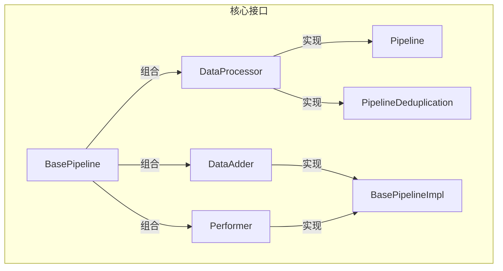
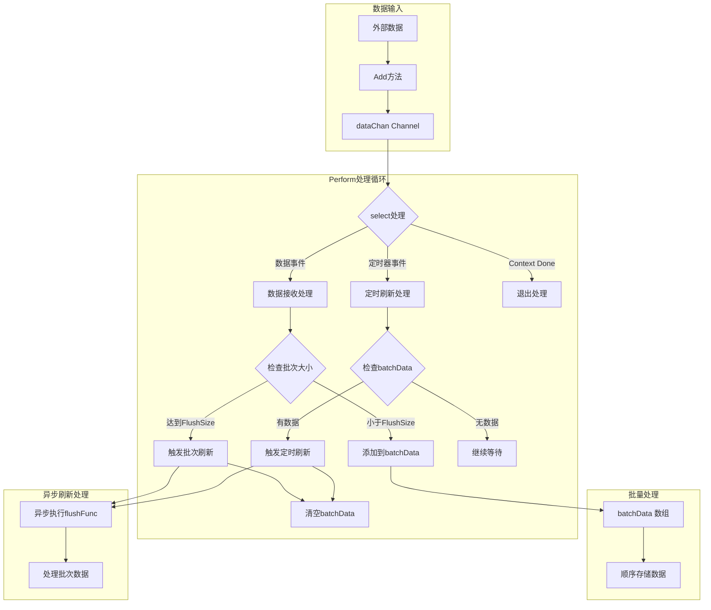
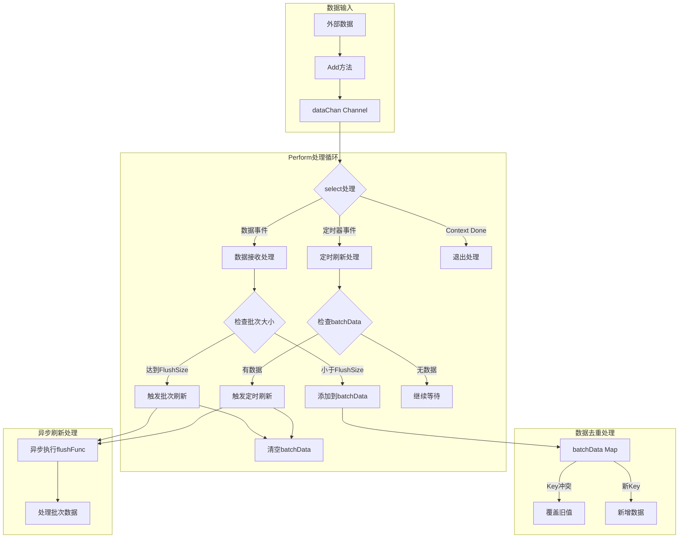

# Go Pipeline

[English](README.md) | [中文](README_cn.md)

[](https://github.com/rushairer/go-pipeline/actions/workflows/test.yml)
[](https://goreportcard.com/report/github.com/rushairer/go-pipeline)
[](https://godoc.org/github.com/rushairer/go-pipeline)
[](https://github.com/rushairer/go-pipeline/releases)
[](https://github.com/rushairer/go-pipeline/blob/main/LICENSE)

一个高性能、可配置的 Go 语言数据处理管道库，支持批量处理和数据去重功能。

## 🚀 性能指标

-   ✅ 日均处理百亿级数据，稳定可靠
-   ⚡️ 单实例每秒处理数十万条数据
-   💾 内存占用可控，支持大规模分布式部署
-   🔥 高并发、大数据量场景表现出色

## ✨ 特性

-   🎯 支持泛型，可处理任意类型数据
-   🔄 提供同步和异步处理模式
-   🎨 支持数据去重功能
-   ⚙️ 可配置的批处理大小和刷新间隔
-   🛡️ 内置错误处理和恢复机制
-   🎊 优雅的停止和资源释放

-   生产环境验证：
    -   已在日均百亿级数据处理场景稳定运行
    -   单实例支持每秒数十万条数据高效处理
    -   内存占用可控，支持大规模分布式部署
    -   在高并发、大数据量场景下表现出色

## 安装

```bash
go get github.com/rushairer/go-pipeline
```

## 快速开始

### 基础管道示例

```go
package main

import (
    "context"
    "fmt"
    "time"
    "github.com/rushairer/go-pipeline"
)

func main() {
    // 创建上下文
    ctx, cancel := context.WithTimeout(context.Background(), time.Second*10)
    defer cancel()

    // 创建管道实例
    pipeline := gopipeline.NewPipeline[string](
        gopipeline.PipelineConfig{
            FlushSize:     1000,        // 批处理大小
            BufferSize:    2000,        // 缓冲区大小
            FlushInterval: time.Second,  // 刷新间隔
        },
        func(ctx context.Context, batchData []string) error {
            // 处理批量数据
            fmt.Printf("处理批次数据，数量: %d\n", len(batchData))
            return nil
        },
    )

    // 启动异步处理
    go pipeline.AsyncPerform(ctx)

    // 添加数据
    for i := 0; i < 5000; i++ {
        if err := pipeline.Add(ctx, fmt.Sprintf("item-%d", i)); err != nil {
            fmt.Printf("添加数据失败: %v\n", err)
            return
        }
    }
}
```

### 去重管道示例

```go
package main

import (
    "context"
    "fmt"
    "time"
    "github.com/rushairer/go-pipeline"
)

// 定义支持去重的数据结构
type Item struct {
    ID   string
    Data string
}

// 实现 MapData 接口
func (i Item) GetKey() string {
    return i.ID
}

func main() {
    ctx, cancel := context.WithTimeout(context.Background(), time.Second*10)
    defer cancel()

    // 创建去重管道实例
    pipeline := gopipeline.NewPipelineDeduplication[Item](
        gopipeline.PipelineConfig{
            FlushSize:     1000,
            BufferSize:    2000,
            FlushInterval: time.Second,
        },
        func(ctx context.Context, batchData map[string]Item) error {
            fmt.Printf("处理去重后的批次数据，数量: %d\n", len(batchData))
            return nil
        },
    )

    go pipeline.AsyncPerform(ctx)

    // 添加重复数据
    items := []Item{
        {ID: "1", Data: "data1"},
        {ID: "2", Data: "data2"},
        {ID: "1", Data: "data1-new"}, // 会覆盖 ID="1" 的旧数据
    }

    for _, item := range items {
        if err := pipeline.Add(ctx, item); err != nil {
            fmt.Printf("添加数据失败: %v\n", err)
            return
        }
    }
}
```

## 接口设计



## Pipeline 普通处理流程图



## Pipeline Deduplication 去重处理流程图



## 主要特性说明

1. 接口设计

    - DataProcessor: 定义批处理数据的核心接口，包含初始化、添加、刷新和状态检查方法
    - DataAdder: 提供数据添加能力
    - Performer: 提供同步和异步执行能力
    - BasePipeline: 组合以上接口，定义完整的管道功能
    - MapData: 为去重功能提供 GetKey 接口

2. 数据存储结构

    - Pipeline: 使用数组([]T)存储数据，保持数据输入顺序
    - PipelineDeduplication: 使用 Map(map[string]T)存储数据，基于 Key 实现去重

3. 错误处理机制

    - 统一的错误类型定义（如 ErrContextIsClosed）
    - Add 方法中的 panic 恢复机制
    - performLoop 中的 defer panic 处理
    - Context 取消时的优雅退出

4. 性能优化特性
    - 可配置的批处理大小(FlushSize)
    - 可调整的缓冲区大小(BufferSize)
    - 灵活的刷新间隔(FlushInterval)
    - 支持同步和异步处理模式

## 配置参数建议

1. FlushSize 配置

    - 建议范围：1000-100000
    - 考虑因素：下游处理能力、内存使用情况
    - 默认值：100000

2. BufferSize 配置

    - 建议为 FlushSize 的 1.5-2 倍
    - 默认值：200000
    - 调整原则：
        - 生产速度快于消费速度：适当增大
        - 消费速度快于生产速度：可以减小
        - 内存受限：同比例减小 FlushSize 和 BufferSize

3. FlushInterval 配置
    - 默认值：60 秒
    - 根据实时性要求调整
    - 较小的间隔可提高实时性，但会增加处理开销

## 使用建议

1. 并发控制

    - 建议实现 goroutine 池以控制并发数量
    - 注意采取措施防止高负载下的 goroutine 泄露

2. 错误处理增强

    - 可以考虑添加错误回调机制
    - 建议实现完善的优雅关闭策略
    - 可以考虑添加批次处理状态追踪

3. 性能优化

    - 实现内存池复用 batchData
    - 添加可配置的重试机制
    - 提供性能监控指标
        - 处理延迟
        - 成功率
        - 内存使用
        - 吞吐量

4. 可观测性改进
    - 添加详细的日志记录
    - 集成监控指标导出
    - 提供调试接口

## 开源协议

本项目采用 MIT 开源协议 - 查看 [LICENSE](LICENSE) 文件了解详情。
