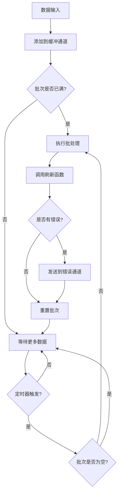
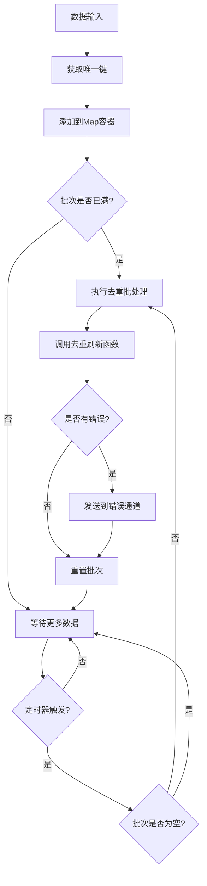

# Go Pipeline v2

[English](README.md) | [中文](README_cn.md) | [📖 官网文档](https://rushairer.github.io/go-pipeline-homepage/)

[](https://github.com/rushairer/go-pipeline/actions/workflows/test.yml)
[](https://goreportcard.com/report/github.com/rushairer/go-pipeline/v2)
[](https://godoc.org/github.com/rushairer/go-pipeline/v2)
[](https://github.com/rushairer/go-pipeline/releases)
[](https://github.com/rushairer/go-pipeline/blob/main/LICENSE)

一个高性能的Go语言批处理管道框架，支持泛型、并发安全，提供标准批处理和去重批处理两种模式。

## 📋 系统要求

- Go 1.18+ (支持泛型)
- 支持 Linux、macOS、Windows

## 📦 安装

```bash
go get github.com/rushairer/go-pipeline/v2@latest
```

## 🚀 项目特性

- **泛型支持**: 基于Go 1.18+泛型，类型安全
- **批处理机制**: 支持按大小和时间间隔自动批处理
- **并发安全**: 内置goroutine安全机制
- **灵活配置**: 可自定义缓冲区大小、批处理大小和刷新间隔
- **错误处理**: 完善的错误处理和传播机制
- **两种模式**: 标准批处理和去重批处理
- **同步/异步**: 支持同步和异步执行模式
- **遵循Go惯例**: 采用"谁写谁关闭"的通道管理原则

## 📁 项目结构

```
.
├── config.go
├── errors.go
├── interface.go
├── pipeline_impl.go
├── pipeline_standard.go
├── pipeline_deduplication.go
├── pipeline_standard_test.go
├── pipeline_standard_benchmark_test.go
├── pipeline_deduplication_test.go
├── pipeline_deduplication_benchmark_test.go
├── pipeline_cancel_drain_test.go
├── pipeline_concurrency_test.go
├── pipeline_error_chan_test.go
├── pipeline_error_handling_test.go
├── pipeline_helper_api_test.go
├── pipeline_performance_benchmark_test.go
├── README.md
├── README_cn.md
├── RELEASE_NOTES_v2.2.0-beta.md
├── go.mod
├── go.sum
├── LICENSE
├── Makefile
├── .github/
├── .vscode/
└── .codebuddy/
```

## 📦 核心组件

### 接口定义

- **`PipelineChannel[T]`**: 定义管道通道访问接口
- **`Performer`**: 定义执行管道操作的接口
- **`DataProcessor[T]`**: 定义批处理数据的核心接口
- **`Pipeline[T]`**: 组合所有管道功能的通用接口

### 实现类型

- **`StandardPipeline[T]`**: 标准批处理管道，数据按顺序批处理
- **`DeduplicationPipeline[T]`**: 去重批处理管道，基于唯一键去重
- **`PipelineImpl[T]`**: 通用管道实现，提供基础功能

## 🏗️ 架构设计

```
┌─────────────────┐    ┌──────────────────┐    ┌─────────────────┐
│   Data Input    │───▶│   Buffer Channel │───▶│  Batch Processor│
└─────────────────┘    └──────────────────┘    └─────────────────┘
                                │                        │
                                ▼                        ▼
                       ┌──────────────────┐    ┌─────────────────┐
                       │   Timer Ticker   │    │   Flush Handler │
                       └──────────────────┘    └─────────────────┘
                                │                        │
                                └────────┬───────────────┘
                                         ▼
                                ┌─────────────────┐
                                │  Error Channel  │
                                └─────────────────┘
```

## 🔄 数据流程图

### 标准管道流程



说明（Notes）:
- 在“通道关闭”路径下会进行一次最终同步 flush；若 `FinalFlushOnCloseTimeout > 0`，该 flush 会在带超时的上下文下执行。你的 flush 函数必须尊重传入的 ctx，确保能按时退出。
- 若配置了并发上限，异步 flush 的并发度受 `MaxConcurrentFlushes` 限制（0 表示不限制）。

### 测试文件说明

项目包含完整的测试套件，确保代码质量和性能：

- **`pipeline_standard_test.go`**: 标准管道的单元测试，验证基本功能
- **`pipeline_deduplication_test.go`**: 去重管道的单元测试，验证去重逻辑
- **`pipeline_standard_benchmark_test.go`**: 标准管道的性能基准测试
- **`pipeline_deduplication_benchmark_test.go`**: 去重管道的性能基准测试  
- **`pipeline_performance_benchmark_test.go`**: 综合性能基准测试

### 去重管道流程



## 📋 配置参数

```go
type PipelineConfig struct {
    BufferSize               uint32        // 缓冲通道的容量 (默认: 100)
    FlushSize                uint32        // 批处理数据的最大容量 (默认: 50)
    FlushInterval            time.Duration // 定时刷新的时间间隔 (默认: 50ms)
    DrainOnCancel            bool          // 取消时是否进行限时收尾刷新（默认 false：不 flush）
    DrainGracePeriod         time.Duration // 收尾刷新最长时间窗口（启用 DrainOnCancel 时生效）
    FinalFlushOnCloseTimeout time.Duration // 通道关闭路径的最终 flush 超时（0 表示禁用，使用 context.Background）
    MaxConcurrentFlushes     uint32        // 异步 flush 的最大并发数（0 表示不限制）
}
```

### 🎯 性能优化的默认值

基于性能基准测试，v2 版本采用了优化的默认配置：

- **BufferSize: 100** - 缓冲区大小，应该 >= FlushSize * 2 以避免阻塞
- **FlushSize: 50** - 批处理大小，性能测试显示 50 左右为最优
- **FlushInterval: 50ms** - 刷新间隔，平衡延迟和吞吐量

### FlushSize 与 BufferSize：关系与调参

- 角色：
  - FlushSize：批次大小阈值；达到该值触发一次刷新（或者由 FlushInterval 定时触发）。
  - BufferSize：输入通道容量；决定生产者在不阻塞的情况下可排队多少待处理数据。
- 推荐关系：BufferSize ≥ k × FlushSize，其中 k ∈ [4, 10]，在突发写入下更稳定。
- 不同关系对性能的影响：
  - BufferSize < FlushSize：更频繁依赖定时刷新形成小批次，吞吐降低、延迟与 GC 开销上升。
  - BufferSize ≈ 2×FlushSize：一般可用，但对生产峰值较敏感。
  - BufferSize ≥ 4–10×FlushSize：满批次比例更高、吞吐更好、生产者更少阻塞（但内存占用更大）。
- 与 FlushInterval 的协同：
  - FlushInterval 用于限定尾部延迟（未满批次时到时也会刷新）。
  - BufferSize 过小会导致更多刷新走“超时路径”，有效批次变小。

基于处理函数成本的估算方法：
- 在刷新函数中测量：
  - t_item：每个元素的平均处理时间（ns/item）
  - t_batch：每批次的固定开销（ns/batch），如 DB 往返、编码等
- 设定摊薄目标 α（如 0.1 表示每批次固定开销分摊到每个元素 ≤ 每元素成本的 10%）
- 则：
  - FlushSize ≥ ceil(t_batch / (α × t_item))  // 实务上建议夹在 [32, 128]；默认 50
  - BufferSize = k × FlushSize，k 取 [4, 10]，按并发生产者数量与突发程度调整
- 示例：
  - t_item = 2µs，t_batch = 200µs，α = 0.1 ⇒ FlushSize ≥ 200 / (0.1×2) = 1000
    - 若强调延迟，可夹到 128；若纯追求吞吐，可保留 1000
    - BufferSize 再取 4–10 × FlushSize

推荐的均衡默认值：
- FlushSize: 50
- BufferSize: 100（≈ 2×FlushSize；多生产者或突发场景可增至 4–10×）
- FlushInterval: 50ms

### 调参速查表（Cheat Sheet）

场景快速推荐：
- 高吞吐优先
  - FlushSize：64–128（默认 50 已较均衡，如纯吞吐可上调）
  - BufferSize：4–10 × FlushSize（并发/突发越强取值越大）
  - FlushInterval：50–100ms
- 低延迟优先
  - FlushSize：8–32
  - BufferSize：≥ 4 × FlushSize
  - FlushInterval：1–10ms（限制尾延迟）
- 内存受限
  - FlushSize：16–32
  - BufferSize：2–4 × FlushSize（上限由内存预算决定）
  - FlushInterval：50–200ms
- 多生产者（N 个生产者）
  - 建议：BufferSize ≥ (4–10) × FlushSize × ceil(N / CPU核数)
  - 目的：在突发流量下维持高满批次比例并减少生产者阻塞

经验公式汇总：
- FlushSize ≈ clamp( ceil(t_batch / (α × t_item)), 32, 128 )
  - t_item：每元素平均处理时间
  - t_batch：每批固定开销（如 DB 往返）
  - α：摊薄目标（如 0.1 表示批固定开销/元素 ≤ 10%）
- BufferSize = k × FlushSize，k ∈ [4, 10]，按并发与突发度调整
- FlushInterval 选取
  - 若以尾延迟为约束：FlushInterval ≈ 目标尾延迟上限
  - 若以生产速率为依据：FlushInterval ≈ p99 生产间隔 × FlushSize

验证与回归检查：
- 满批次比例 ≥ 80%（越高越好，说明大多由 FlushSize 触发，而非超时触发）
- 生产者阻塞率接近 0（避免上游背压）
- GC/内存水位平稳（观察分配与停顿）
- 端到端 99/99.9 分位延迟可达标

示例：基于成本的推荐计算
- 已测：t_item = 2µs，t_batch = 200µs，α = 0.1
- 计算：FlushSize ≥ 200 / (0.1×2) = 1000
  - 若需要平衡延迟：夹在 128；若纯吞吐：可取 512–1024 并结合更长 FlushInterval
- 取值：
  - FlushSize = 128（延迟可控）
  - BufferSize = 8 × 128 = 1024（多生产者与突发友好）
  - FlushInterval = 50ms（若需要更低尾延迟可降到 10ms，但要关注小批次比例）

提示：
- 若满批次比例偏低，优先增大 BufferSize 或缩短 FlushInterval（二选一看目标是吞吐还是延迟）
- 若上游阻塞，增大 BufferSize；若内存吃紧，降低 k 或 FlushSize，并监控小批次比例变化

### 调参测量助手（Go）

使用两组样本规模测量批处理函数的耗时，估算 t_item 与 t_batch，并给出推荐的 FlushSize/BufferSize：

```go
package main

import (
	"context"
	"fmt"
	"math"
	"time"

	gopipeline "github.com/rushairer/go-pipeline/v2"
)

// 将此函数替换为你的真实批处理逻辑（尽量减少外部副作用以降低测量噪声）
func batchFunc(ctx context.Context, items []int) error {
	// 模拟：每批固定开销 + 每元素成本
	time.Sleep(200 * time.Microsecond) // t_batch（示例）
	perItem := 2 * time.Microsecond    // t_item（示例）
	time.Sleep(time.Duration(len(items)) * perItem)
	return nil
}

// 测量一次指定批量的平均耗时（重复 rounds 次取平均）
func measureOnce(n int, rounds int) time.Duration {
	items := make([]int, n)
	var total time.Duration
	ctx := context.Background()
	for i := 0; i < rounds; i++ {
		start := time.Now()
		_ = batchFunc(ctx, items)
		total += time.Since(start)
	}
	return total / time.Duration(rounds)
}

// 线性拟合：d = t_batch + n * t_item
func estimateCosts(n1, n2, rounds int) (tItem, tBatch time.Duration) {
	d1 := measureOnce(n1, rounds)
	d2 := measureOnce(n2, rounds)
	// t_item = (d2 - d1) / (n2 - n1)
	// t_batch = d1 - n1 * t_item
	tItem = time.Duration(int64((d2 - d1) / time.Duration(n2-n1)))
	tBatch = d1 - time.Duration(n1)*tItem
	if tItem < 0 {
		tItem = 0
	}
	if tBatch < 0 {
		tBatch = 0
	}
	return
}

// 推荐值计算：FlushSize ≥ ceil(t_batch / (α × t_item))，实务上夹在 [32, 128]；BufferSize = k × FlushSize
func recommend(tItem, tBatch time.Duration, alpha float64, k int) (flush uint32, buffer uint32) {
	if tItem <= 0 || alpha <= 0 {
		return 50, 100 // 安全默认值
	}
	raw := float64(tBatch) / (alpha * float64(tItem))
	fs := int(math.Ceil(raw))
	if fs < 32 {
		fs = 32
	}
	if fs > 128 {
		// 若纯追求吞吐，可保留 >128；若需要延迟均衡，可夹到 128
		fs = 128
	}
	if k < 1 {
		k = 4
	}
	return uint32(fs), uint32(k * fs)
}

func main() {
	// 用两点测量估算成本
	n1, n2 := 64, 512
	rounds := 20
	tItem, tBatch := estimateCosts(n1, n2, rounds)
	flush, buffer := recommend(tItem, tBatch, 0.1, 8)

	fmt.Printf("估算 t_item=%v, t_batch=%v\n", tItem, tBatch)
	fmt.Printf("推荐 FlushSize=%d, BufferSize=%d (k=8, α=0.1)\n", flush, buffer)

	// 使用推荐配置的示例
	_ = gopipeline.NewStandardPipeline[int](gopipeline.PipelineConfig{
		BufferSize:    buffer,
		FlushSize:     flush,
		FlushInterval: 50 * time.Millisecond,
	}, func(ctx context.Context, batch []int) error {
		return batchFunc(ctx, batch)
	})
}
```

注意事项：
- 将 batchFunc 替换为真实处理逻辑；测量时尽量减少 IO/网络等外部副作用，以降低抖动。
- 若测得的 FlushSize 明显大于 128 且你关注延迟，可夹在 128；若纯追求吞吐，可保留较大值并按 k 等比例增大 BufferSize。
- 在不同机器/负载上重复测量；缓存、IO 与网络会显著影响 t_batch。

### 去重管道调参

要点：
- 有效批次大小：去重后实际批次大小 ≤ FlushSize。若输入重复率高（唯一性低），有效批次可能显著小于 FlushSize。
- 仍采用相同的成本估算方法，但需要考虑“唯一性比例” u ∈ (0,1]：
  - 预去重批次含 N 条，唯一比例 u，则有效条数约 u × N。
  - 计算出的 FlushSize_raw 若过大，可根据期望“有效批次”进行折中：希望有效批次≈50，则应让 u × FlushSize ≈ 50。
- Buffer 与 Interval：
  - BufferSize：依旧建议 BufferSize ≥ k × FlushSize，k ∈ [4,10]，以更好吸收突发。
  - FlushInterval：当重复率高时，稍微增大 FlushInterval 有助于在时间窗内积累到足够多的“唯一项”以达到目标有效批次；需与延迟 SLO 权衡。
- 内存注意：
  - 去重模式批内使用 map 存储唯一键，唯一键越多，map 的额外内存越高；在 flush 函数中尽量复用缓冲以减少分配。

示例（含重复）：
- 假设 t_item = 2µs，t_batch = 200µs，α = 0.1 ⇒ 成本法得 FlushSize_raw = 1000。
- 若唯一性比例 u ≈ 0.2，则在 FlushSize_raw 下有效批次约 200。若期望有效≈50：
  - 可将 FlushSize 夹到 256–512 以平衡延迟，因为 u × 256 ≈ 51；若纯吞吐可保持更大。
  - 设 BufferSize = 8 × FlushSize 以应对突发。

### 多生产者场景计算示例

对于 N 个生产者、P 个逻辑 CPU：
- 经验法则：BufferSize ≥ (4–10) × FlushSize × ceil(N / P)
- 目标：在突发下维持高“满批次比例”，并尽量减少上游阻塞。

数值示例：
- P=8 CPUs，N=16 生产者，目标 FlushSize=64，取 k=6：
  - BufferSize ≥ 6 × 64 × ceil(16/8) = 6 × 64 × 2 = 768（可向上取整到 1024 预留余量）
  - 若去重模式唯一性 u=0.5，且你需要每次“有效≈64”，则设置 FlushSize≈128，再按上式重算 BufferSize。

### 取消（ctx.Done）收尾选项

为“数据完整性 vs 立即终止”提供可配置开关：
- DrainOnCancel（bool，默认：false）
  - false：取消即刻停止（不做最终 flush）
  - true：取消时对当前未满批次进行一次“限时尽力”flush，然后退出
- DrainGracePeriod（time.Duration）
  - 当启用 DrainOnCancel 时的收尾 flush 最长时间窗口（未设置时内部采用保守默认值约 100ms）

推荐用法：
- 正常收尾（尽量不丢数据）：关闭数据通道；框架保证 flush 剩余批次并退出
- 强制中止：直接取消上下文，DrainOnCancel=false
- 尽量优雅的取消：设置 DrainOnCancel=true，并配置合理的 DrainGracePeriod（如 50–200ms）；注意你的 flush 函数应尊重新的上下文

### 使用默认值配置

你可以使用 `NewPipelineConfig()` 函数创建带有默认值的配置，然后自定义特定参数：

```go
// 创建带有默认值的配置
config := gopipeline.NewPipelineConfig()

// 直接使用默认值
pipeline := gopipeline.NewStandardPipeline(config, flushFunc)

// 或者使用链式方法自定义特定参数
config = gopipeline.NewPipelineConfig().
    WithFlushInterval(time.Millisecond * 10).
    WithBufferSize(200)

pipeline = gopipeline.NewStandardPipeline(config, flushFunc)
```

可用的配置方法：
- `NewPipelineConfig()` - 创建带有默认值的配置
- `WithBufferSize(size uint32)` - 设置缓冲区大小
- `WithFlushSize(size uint32)` - 设置批处理大小
- `WithFlushInterval(interval time.Duration)` - 设置刷新间隔
- `WithDrainOnCancel(enabled bool)` - 启用取消时的限时收尾
- `WithDrainGracePeriod(d time.Duration)` - 设置收尾刷新最长时间窗口
- `WithFinalFlushOnCloseTimeout(d time.Duration)` - 设置通道关闭路径的最终 flush 超时（0 表示禁用）
- `WithMaxConcurrentFlushes(n uint32)` - 限制异步 flush 并发（0 表示不限制）
- `ValidateOrDefault()` - 校验并回退到安全默认（构造函数内部也会应用）

### 🧩 日志与指标钩子（Logger and Metrics hooks）

Prometheus MetricsHook（示例）
```go
// go get github.com/prometheus/client_golang/prometheus
// 参见 examples/metrics_prometheus_example.go 获取完整实现
m := NewPromMetrics(nil) // 注册到默认 registry
p := gopipeline.NewDefaultStandardPipeline(func(ctx context.Context, batch []Item) error {
    // 你的 flush 逻辑
    return nil
})
p.WithMetrics(m)

// 暴露 Prometheus 指标
http.Handle("/metrics", promhttp.Handler())
_ = http.ListenAndServe(":2112", nil)
```

Grafana 面板建议（快速起步）：
- 速率计数（Rate）：
  - gopipeline_flush_success_total / gopipeline_flush_failure_total
  - gopipeline_error_count_total
  - gopipeline_dropped_error_estimate_total
  - gopipeline_final_flush_timeout_total
  - gopipeline_drain_flush_total、gopipeline_drain_flush_timeout_total
- 直方图/热力：
  - gopipeline_flush_latency_seconds（按 result 标签：ok/fail）
  - gopipeline_batch_size_observed
- 饱和度：
  - 错误通道饱和度比值（在你的采样协程中观测 len(errs)/cap(errs) 并导出为 gauge）
- 告警建议：
  - dropped_error_estimate_total 增速过高
  - flush_failure_total 持续 > 0 且 flush_latency_seconds p95 上升
  - final_flush_timeout_total 在发布/下线阶段出现尖峰

WithLogger
- 注入自定义 logger：
```go
buf := new(bytes.Buffer)
logger := log.New(buf, "pipeline ", log.LstdFlags)

p := gopipeline.NewDefaultStandardPipeline(func(ctx context.Context, batch []Item) error {
    return flush(ctx, batch)
})
p.WithLogger(logger) // 避免在热路径频繁格式化字符串
```
- 建议：避免在热路径中做重格式化或大对象分配；可预先格式化，或使用分级日志降低开销。

WithMetrics
- 接口形态（管道在关键点调用）：
```go
type MetricsHook interface {
    Flush(items int, duration time.Duration) // 每次 flush 完成后调用（无论成功/失败）
    Error(err error)                         // 当 flush 返回错误时调用（非阻塞）
    ErrorDropped()                           // 当错误通道饱和导致错误被丢弃时调用
}
```
- 语义：
  - Flush：每次 flush 调用一次；可记录批大小与耗时（直方图）
  - Error：当 flush 失败时调用；计数并打标签
  - ErrorDropped：当错误通道饱和且错误被丢弃时调用；用于估算丢弃规模
- 示例（计数/直方图）：
```go
type hook struct {
    flushOK   atomic.Int64
    flushFail atomic.Int64
}

func (h *hook) Flush(items int, d time.Duration) { /* 导出批大小与耗时直方图 */ }
func (h *hook) Error(err error)                  { h.flushFail.Add(1) /* 导出 error_count */ }
func (h *hook) ErrorDropped()                    { /* 导出 dropped_error_estimate++ */ }

// ...
p.WithMetrics(&hook{})
```
- 与“推荐指标”字段对齐：
  - error_count、dropped_error_estimate
  - flush_success / flush_failure
  - final_flush_timeout_count、drain_flush_count / drain_flush_timeout_count
  - error_chan_saturation_ratio
  - batch_size_observed_p50/p95/p99、flush_latency_p50/p95/p99

## 便捷 API：Start 与 Run

这些辅助方法用于减少样板代码，封装了 AsyncPerform/SyncPerform、Done 与 ErrorChan 的常见用法。

- 何时使用
  - Start(ctx)：推荐用于异步运行；返回 done（本次运行完成信号）与 errs（错误通道）。你按需决定如何消费 errs。
  - Run(ctx, errBuf)：推荐用于同步运行；在开始前初始化错误通道容量并阻塞到结束，返回最终错误。

- 错误通道容量
  - ErrorChan(size) 采用“首次调用决定容量”，后续调用的 size 将被忽略。
  - 若你从未显式调用，首次内部发送错误时会按默认容量初始化。

- 并发启动约束
  - 同一管道实例禁止并发发起第二次运行；二次启动会得到 ErrAlreadyRunning（Start 会将其通过错误通道送出）。

示例

异步启动（Start）
```go
done, errs := pipeline.Start(ctx)

// 建议消费错误
go func() {
    for {
        select {
        case err, ok := <-errs:
            if !ok {
                return
            }
            log.Printf("pipeline error: %v", err)
        case <-ctx.Done():
            return
        }
    }
}()

// 发送数据
ch := pipeline.DataChan()
go func() {
    defer close(ch) // writer closes
    for _, x := range items {
        select {
        case ch <- x:
        case <-ctx.Done():
            return
        }
    }
}()

<-done // 等待本次运行结束
```

同步运行（Run）
```go
// 初始化错误通道容量（例如 128）并同步运行
if err := pipeline.Run(ctx, 128); err != nil {
    if errors.Is(err, gopipeline.ErrContextIsClosed) {
        // 因上下文取消而退出
    }
}
```

注意
- Start 场景下，若误触发并发第二次启动，该错误会以 ErrAlreadyRunning 的形式出现在 errs。
- Done 语义：每次 Perform 运行都会替换内部 done 通道；并发多次启动的语义不保证。建议使用 Start 返回的 done 来等待本次运行结束。
- 你也可以不消费 errs；当缓冲区填满时，新错误将被丢弃（非阻塞、不会 panic）。
- DataChan() 遵循“谁写谁关闭”。当希望无损收尾并优雅退出时，关闭该通道。
- 若需在同一实例上多次运行，请勿在两次运行间关闭数据通道；使用 context 控制生命周期。

### 并发二次启动断言（ErrAlreadyRunning）
```go
// 尝试对同一实例并发二次启动；第二次应通过 errs 通道暴露 ErrAlreadyRunning。
ctx, cancel := context.WithCancel(context.Background())
defer cancel()

done, errs := pipeline.Start(ctx)

// 第二次启动
_, errs2 := pipeline.Start(ctx)

// 从任一错误通道收集一次错误
var got error
select {
case got = <-errs:
case got = <-errs2:
case <-time.After(200 * time.Millisecond):
    log.Fatalf("期望 ErrAlreadyRunning，但发生超时")
}

if !errors.Is(got, gopipeline.ErrAlreadyRunning) {
    log.Fatalf("希望 ErrAlreadyRunning，实际: %v", got)
}

cancel()
<-done
```

### Done 通道语义

- 定义：一次运行级别的完成信号。每次执行（Sync/Async/Start/Run）都会创建或替换内部的 done；当执行循环完全退出后关闭（通道关闭路径会做最终 flush；取消路径在启用 DrainOnCancel 时做限时收尾）。
- 首选 Start 返回的 done：调用 Start(ctx) 时，使用返回的 done 来等待/选择本次运行结束，它与本次运行绑定且稳定。
- 关于 p.Done()：
  - 仅在已启动运行之后、需要在其它位置获取“当前运行”的完成信号时使用。
  - 不要在 Start 之前缓存 p.Done() 再去等待（可能是 nil 或陈旧/已关闭的通道）。
  - 不要在“并发二次启动”的场景指望 p.Done() 具有稳定语义；二次启动会通过 errs 暴露 ErrAlreadyRunning。
- 禁止手动关闭：done 通道由管道内部负责关闭。
- 同步路径通常不需要：SyncPerform/Run 本身会阻塞到结束，通常无需 done 通道。

示例：

正确：优先使用 Start 返回的 done
```go
done, errs := p.Start(ctx)
// ... 在独立 goroutine 中消费 errs ...
<-done // 等待本次运行结束
```

反例：在 Start 前缓存 p.Done()
```go
d := p.Done()   // 可能为 nil 或陈旧
_ = d
done, _ := p.Start(ctx)
<-done          // 更推荐使用与本次运行绑定的 done
```

时序说明：
- done 在执行循环退出后关闭。通道关闭路径会同步 flush 剩余数据（可受 FinalFlushOnCloseTimeout 保护）；取消路径下若启用 DrainOnCancel，会在限时窗口内做一次尽力收尾 flush 然后退出。

## 💡 使用示例

### 标准管道示例

```go
package main

import (
    "context"
    "fmt"
    "log"
    "time"
    
    gopipeline "github.com/rushairer/go-pipeline/v2"
)

func main() {
    // 创建标准管道
    pipeline := gopipeline.NewDefaultStandardPipeline(
        func(ctx context.Context, batchData []int) error {
            fmt.Printf("处理批次数据: %v\n", batchData)
            // 这里可以执行数据库写入、API调用等操作
            return nil
        },
    )
    
    ctx, cancel := context.WithTimeout(context.Background(), time.Second*10)
    defer cancel()
    
    // 启动异步处理
    go func() {
        if err := pipeline.AsyncPerform(ctx); err != nil {
            log.Printf("管道执行错误: %v", err)
        }
    }()
    
    // 监听错误（必须消费错误通道）
    errorChan := pipeline.ErrorChan(10) // 指定错误通道缓冲区大小
    go func() {
        for {
            select {
            case err, ok := <-errorChan:
                if !ok {
                    return
                }
                log.Printf("批处理错误: %v", err)
            case <-ctx.Done():
                return
            }
        }
    }()
    
    // 使用新的 DataChan API 发送数据
    dataChan := pipeline.DataChan()
    go func() {
        defer close(dataChan) // 用户控制通道关闭
        for i := 0; i < 100; i++ {
            select {
            case dataChan <- i:
            case <-ctx.Done():
                return
            }
        }
    }()
    
    time.Sleep(time.Second * 2) // 等待处理完成
}
```

### 去重管道示例

```go
package main

import (
    "context"
    "fmt"
    "log"
    "time"
    
    gopipeline "github.com/rushairer/go-pipeline/v2"
)

// 实现UniqueKeyData接口的数据结构
type User struct {
    ID   string
    Name string
}

func (u User) GetKey() string {
    return u.ID
}

func main() {
    // 创建去重管道
    pipeline := gopipeline.NewDefaultDeduplicationPipeline(
        func(ctx context.Context, batchData map[string]User) error {
            fmt.Printf("处理去重后的用户数据: %d 个用户\n", len(batchData))
            for key, user := range batchData {
                fmt.Printf("  %s: %s\n", key, user.Name)
            }
            return nil
        },
    )
    
    ctx, cancel := context.WithTimeout(context.Background(), time.Second*10)
    defer cancel()
    
    // 启动异步处理
    go func() {
        if err := pipeline.AsyncPerform(ctx); err != nil {
            log.Printf("管道执行错误: %v", err)
        }
    }()
    
    // 监听错误
    errorChan := pipeline.ErrorChan(10)
    go func() {
        for {
            select {
            case err, ok := <-errorChan:
                if !ok {
                    return
                }
                log.Printf("批处理错误: %v", err)
            case <-ctx.Done():
                return
            }
        }
    }()
    
    // 使用新的 DataChan API 发送数据
    dataChan := pipeline.DataChan()
    go func() {
        defer close(dataChan)
        
        users := []User{
            {ID: "1", Name: "Alice"},
            {ID: "2", Name: "Bob"},
            {ID: "1", Name: "Alice Updated"}, // 会覆盖第一个Alice
            {ID: "3", Name: "Charlie"},
            {ID: "2", Name: "Bob Updated"},   // 会覆盖第一个Bob
        }
        
        for _, user := range users {
            select {
            case dataChan <- user:
            case <-ctx.Done():
                return
            }
        }
    }()
    
    time.Sleep(time.Second * 2) // 等待处理完成
}
```

### 自定义配置示例

```go
// 创建自定义配置的管道
config := gopipeline.PipelineConfig{
    BufferSize:    100,                    // 缓冲区大小为100（≈ 2×FlushSize；突发场景可增至 4–10×）
    FlushSize:     50,                     // 批次大小为50（推荐默认）
    FlushInterval: time.Millisecond * 50,  // 50ms定时刷新（延迟与吞吐的平衡）
}

pipeline := gopipeline.NewStandardPipeline(config, 
    func(ctx context.Context, batchData []string) error {
        // 自定义处理逻辑
        return nil
    },
)
```

### 取消收尾示例

两种方式结束一次运行：

1) 关闭数据通道（推荐的无损收尾）
```go
config := gopipeline.NewPipelineConfig().
    WithBufferSize(100).
    WithFlushSize(50).
    WithFlushInterval(50 * time.Millisecond)
// 此路径与 DrainOnCancel 无关；关闭通道可确保剩余数据 flush。

p := gopipeline.NewStandardPipeline(config, func(ctx context.Context, batch []string) error {
    // 你的处理逻辑
    return nil
})

ctx, cancel := context.WithTimeout(context.Background(), 10*time.Second)
defer cancel()

go func() { _ = p.AsyncPerform(ctx) }()

dataChan := p.DataChan()
go func() {
    defer close(dataChan) // writer closes：保证剩余数据被最终 flush
    for i := 0; i < 1000; i++ {
        select {
        case dataChan <- fmt.Sprintf("item-%d", i):
        case <-ctx.Done():
            return
        }
    }
}()
```

2) 通过上下文取消，并启用取消时的限时收尾
```go
config := gopipeline.NewPipelineConfig().
    WithBufferSize(100).
    WithFlushSize(50).
    WithFlushInterval(50 * time.Millisecond).
    WithDrainOnCancel(true).                   // 启用取消收尾
    WithDrainGracePeriod(150 * time.Millisecond) // 限定收尾耗时窗口

p := gopipeline.NewStandardPipeline(config, func(ctx context.Context, batch []string) error {
    // 重要：尊重 ctx；在 ctx.Done() 后尽快返回，保证在宽限窗口内完成收尾
    return nil
})

ctx, cancel := context.WithCancel(context.Background())
go func() { _ = p.AsyncPerform(ctx) }()

dataChan := p.DataChan()
// 发送一些数据...
// 需要快速停止但希望尽量不丢当前未满批次：
cancel() // 管道会在 DrainGracePeriod 内尽力 flush 一次，然后退出
```

注意：
- 关闭通道路径可确保剩余数据被 flush，不依赖取消策略。
- 取消收尾是“快速停止下尽量不丢”的折中；建议将 DrainGracePeriod 设为 50–200ms，并确保你的 flush 函数尊重新传入的上下文。

### 去重管道取消收尾示例

两种方式结束一次去重管道运行：

1) 关闭数据通道（推荐的无损收尾）
```go
config := gopipeline.NewPipelineConfig().
    WithBufferSize(100).
    WithFlushSize(50).
    WithFlushInterval(50 * time.Millisecond)

type User struct {
    ID   string
    Name string
}
func (u User) GetKey() string { return u.ID }

p := gopipeline.NewDefaultDeduplicationPipeline(func(ctx context.Context, batch map[string]User) error {
    // 你的去重批处理逻辑
    return nil
})

ctx, cancel := context.WithTimeout(context.Background(), 10*time.Second)
defer cancel()

go func() { _ = p.AsyncPerform(ctx) }()

ch := p.DataChan()
go func() {
    defer close(ch) // writer closes：确保将 map 中剩余唯一项 flush 出去
    for i := 0; i < 1000; i++ {
        select {
        case ch <- User{ID: fmt.Sprintf("%d", i%200), Name: "N"}: // 包含重复
        case <-ctx.Done():
            return
        }
    }
}()
```

2) 通过上下文取消，并启用取消时的限时收尾
```go
config := gopipeline.NewPipelineConfig().
    WithBufferSize(100).
    WithFlushSize(50).
    WithFlushInterval(50 * time.Millisecond).
    WithDrainOnCancel(true).
    WithDrainGracePeriod(150 * time.Millisecond)

p := gopipeline.NewDefaultDeduplicationPipeline(func(ctx context.Context, batch map[string]User) error {
    // 重要：尊重 ctx；在 ctx.Done() 后尽快返回，保证在宽限窗口内完成收尾
    return nil
})

ctx, cancel := context.WithCancel(context.Background())
go func() { _ = p.AsyncPerform(ctx) }()

ch := p.DataChan()
// 发送一些数据...
cancel() // 管道会在 DrainGracePeriod 内尽力 flush 当前 dedup map，然后退出
```

注意：
- 去重模式使用 map 维护当前批次；两种收尾策略都会确保剩余唯一项被 flush。
- 当输入重复率很高时，可适当增大 FlushInterval 以在时间窗内积累更多唯一项，但需与延迟目标权衡。

### 退出语义

FinalFlushOnCloseTimeout
- 在“通道关闭”路径下，若当前批次非空会执行一次最终的同步 flush。
- 当 config.FinalFlushOnCloseTimeout > 0 时，最终 flush 会在一个带超时的上下文下进行；否则使用 context.Background()。
- 你的 flush 函数应尊重传入的上下文（在超时时应尽快返回），以确保按时退出。

示例：
```go
cfg := gopipeline.NewPipelineConfig().
    WithFlushSize(50).
    WithBufferSize(100).
    WithFinalFlushOnCloseTimeout(150 * time.Millisecond)

p := gopipeline.NewStandardPipeline(cfg, func(ctx context.Context, batch []Item) error {
    // 重要：尊重 ctx；在 ctx.Done() 后尽快返回，以保证超时能够生效
    return writeBatch(ctx, batch)
})

ctx, cancel := context.WithTimeout(context.Background(), 5*time.Second)
defer cancel()

go func() { _ = p.AsyncPerform(ctx) }()

ch := p.DataChan()
go func() {
    defer close(ch) // writer closes：触发最终 flush（受超时保护）
    for _, it := range items {
        select {
        case ch <- it:
        case <-ctx.Done():
            return
        }
    }
}()
```

管道有两种退出路径：

- 通道关闭：
  - 若当前批次非空，会在 context.Background() 下同步执行一次最终 flush。
  - 循环返回 nil（优雅退出）。
- 上下文取消：
  - DrainOnCancel = false：返回 ErrContextIsClosed（不做最终 flush）。
  - DrainOnCancel = true：在独立 drainCtx 下（带超时，DrainGracePeriod，未设则内部默认约 100ms）同步执行一次最终 flush，返回 errors.Join(ErrContextIsClosed, ErrContextDrained)。

可使用 errors.Is 判断退出原因：
```go
err := pipeline.AsyncPerform(ctx)
// ...
if errors.Is(err, ErrContextIsClosed) {
    // 因上下文取消而退出
}
if errors.Is(err, ErrContextDrained) {
    // 取消时已执行一次“限时收尾”flush
}
// 通道关闭路径：err == nil（优雅退出）
```

注意：
- 最终收尾 flush 采用同步执行，避免停止阶段的竞态。
- 你的 flush 函数应尊重传入的上下文（drainCtx），在宽限窗口内尽快返回。

## 🎯 使用场景

### 1. 数据库批量写入
```go
// 批量插入数据库记录
pipeline := gopipeline.NewDefaultStandardPipeline(
    func(ctx context.Context, records []DatabaseRecord) error {
        return db.BatchInsert(ctx, records)
    },
)
```

### 2. 日志批量处理
```go
// 批量写入日志文件
pipeline := gopipeline.NewDefaultStandardPipeline(
    func(ctx context.Context, logs []LogEntry) error {
        return logWriter.WriteBatch(logs)
    },
)
```

### 3. API批量调用
```go
// 批量调用第三方API
pipeline := gopipeline.NewDefaultStandardPipeline(
    func(ctx context.Context, requests []APIRequest) error {
        return apiClient.BatchCall(ctx, requests)
    },
)
```

### 4. 用户数据去重
```go
// 用户数据去重处理
pipeline := gopipeline.NewDefaultDeduplicationPipeline(
    func(ctx context.Context, users map[string]User) error {
        return userService.BatchUpdate(ctx, users)
    },
)
```

### 5. 消息队列批量消费
```go
// 批量处理消息队列数据
pipeline := gopipeline.NewDefaultStandardPipeline(
    func(ctx context.Context, messages []Message) error {
        return messageProcessor.ProcessBatch(ctx, messages)
    },
)
```

## 🔥 高级用法

### 动态配置调整

```go
// 根据系统负载动态调整配置
func createAdaptivePipeline() *gopipeline.StandardPipeline[Task] {
    config := gopipeline.PipelineConfig{
        BufferSize:    getOptimalBufferSize(),
        FlushSize:     getOptimalFlushSize(),
        FlushInterval: getOptimalInterval(),
    }
    
    return gopipeline.NewStandardPipeline(config, processTaskBatch)
}

func getOptimalBufferSize() uint32 {
    // 根据系统内存和CPU核心数计算
    return uint32(runtime.NumCPU() * 50)
}

func getOptimalFlushSize() uint32 {
    // 基于性能测试，50左右为最优
    return 50
}
```

### 错误重试机制

```go
pipeline := gopipeline.NewDefaultStandardPipeline(
    func(ctx context.Context, batchData []Task) error {
        return retryWithBackoff(ctx, func() error {
            return processBatch(batchData)
        }, 3, time.Second)
    },
)

func retryWithBackoff(ctx context.Context, fn func() error, maxRetries int, baseDelay time.Duration) error {
    for i := 0; i < maxRetries; i++ {
        if err := fn(); err == nil {
            return nil
        }
        
        select {
        case <-ctx.Done():
            return ctx.Err()
        case <-time.After(baseDelay * time.Duration(1<<i)):
            // 指数退避
        }
    }
    return fmt.Errorf("max retries exceeded")
}
```

### 监控和指标收集

```go
type MetricsPipeline struct {
    *gopipeline.StandardPipeline[Event]
    processedCount int64
    errorCount     int64
}

func NewMetricsPipeline() *MetricsPipeline {
    mp := &MetricsPipeline{}
    
    mp.StandardPipeline = gopipeline.NewDefaultStandardPipeline(
        func(ctx context.Context, events []Event) error {
            err := processEvents(events)
            
            atomic.AddInt64(&mp.processedCount, int64(len(events)))
            if err != nil {
                atomic.AddInt64(&mp.errorCount, 1)
            }
            
            return err
        },
    )
    
    return mp
}

func (mp *MetricsPipeline) GetMetrics() (processed, errors int64) {
    return atomic.LoadInt64(&mp.processedCount), atomic.LoadInt64(&mp.errorCount)
}
```

### 优雅关闭

```go
func gracefulShutdown(pipeline *gopipeline.StandardPipeline[Task]) {
    // 创建带超时的上下文
    ctx, cancel := context.WithTimeout(context.Background(), 30*time.Second)
    defer cancel()
    
    // 停止接收新数据
    // 关闭数据通道
    dataChan := pipeline.DataChan()
    close(dataChan)
    
    // 等待处理完成
    done := make(chan struct{})
    go func() {
        defer close(done)
        // 等待错误通道关闭，表示所有数据已处理
        errorChan := pipeline.ErrorChan(10)
        for {
            select {
            case err, ok := <-errorChan:
                if !ok {
                    return
                }
                log.Printf("处理剩余错误: %v", err)
            case <-ctx.Done():
                return
            }
        }
    }()
    
    // 等待完成或超时
    select {
    case <-done:
        log.Println("管道优雅关闭完成")
    case <-ctx.Done():
        log.Println("管道关闭超时")
    }
}
```

## ⚡ 性能特点

基于最新的性能基准测试结果：

### 🚀 核心性能指标

- **数据处理吞吐量**: ~248 纳秒/项 (Apple M4)
- **内存效率**: 232 字节/操作，7 次分配/操作
- **批处理优化**: 批次大小从 1 到 50，性能提升 5 倍
- **管道开销**: 比直接处理慢约 38%（225.4 vs 162.7 ns/op）

### 📊 批次大小性能对比

```
BatchSize1:   740.5 ns/op  (最慢 - 频繁刷新)
BatchSize10:  251.5 ns/op  (显著改善)
BatchSize50:  146.5 ns/op  (最优性能) ⭐
BatchSize100: 163.4 ns/op  (略有下降)
BatchSize500: 198.6 ns/op  (批次过大)
```

### 💡 性能优化建议

1. **最优批次大小**: 50 左右
2. **缓冲区配置**: BufferSize >= FlushSize * 2
3. **刷新间隔**: 50ms 平衡延迟和吞吐量
4. **异步模式**: 推荐使用异步处理获得更好性能

## ⚠️ 重要提醒

> **异步无序语义**: 在 AsyncPerform 模式下，flush 回调可能跨批次无序执行（不同 goroutine 并发执行）。请不要依赖跨批次的严格顺序。
> **错误通道行为**: 通过 sync.Once 懒初始化。第一次调用 `ErrorChan(size int)` 决定缓冲区大小，后续调用忽略 size。即使未显式调用，内部在首次发送错误时也会按默认容量初始化并以非阻塞方式写入；若无人消费且缓冲区填满，后续错误将被丢弃（不阻塞、不 panic）。

> **推荐监听错误通道**: 如果调用了 `ErrorChan(size int)`，建议监听错误通道并使用 select 语句避免无限等待。

> **通道管理**: v2 版本遵循"谁写谁关闭"原则，用户需要控制 `DataChan()` 的关闭时机。

> **⚠️ 管道重复使用警告**: 如果需要重复使用同一个管道实例进行多次运行（多次调用 `SyncPerform()` 或 `AsyncPerform()`），**不要提前关闭 DataChan**。`DataChan()` 返回的是同一个通道实例，一旦关闭就无法再次使用。应该使用 context 取消或超时来控制管道生命周期。
> **并发启动保护**: 同一管道实例不允许并发启动多次 Perform（Sync/Async）。若误用，将返回 `ErrAlreadyRunning`。

## 🔧 最佳实践

1. **合理设置批次大小**: 根据性能测试，推荐使用 50 左右的批次大小
2. **⚠️ 必须监听错误通道**: 使用 select 语句避免阻塞，及时处理批处理过程中的错误
3. **正确关闭数据通道**: 使用 defer close(dataChan) 确保通道正确关闭
4. **上下文管理**: 使用context控制管道生命周期
5. **去重键设计**: 确保去重键的唯一性和稳定性
6. **性能调优**: 根据基准测试结果选择合适的配置参数
7. **⚠️ 管道重复使用**: 对于需要重复使用的管道，避免提前关闭 DataChan。使用 context 超时/取消而不是通道关闭来结束处理

### 管道重复使用模式

当需要多次运行同一个管道时：

```go
// ✅ 正确：使用 context 控制生命周期
pipeline := gopipeline.NewStandardPipeline(config, batchFunc)
dataChan := pipeline.DataChan() // 只获取一次通道

// 第一次运行
ctx1, cancel1 := context.WithTimeout(context.Background(), time.Second*30)
go pipeline.SyncPerform(ctx1)
// 发送数据但不关闭通道
for _, data := range firstBatch {
    select {
    case dataChan <- data:
    case <-ctx1.Done():
        break
    }
}
cancel1() // 结束第一次运行

// 第二次运行 - 重复使用同一个管道和通道
ctx2, cancel2 := context.WithTimeout(context.Background(), time.Second*30)
go pipeline.SyncPerform(ctx2)
// 再次发送数据但不关闭通道
for _, data := range secondBatch {
    select {
    case dataChan <- data:
    case <-ctx2.Done():
        break
    }
}
cancel2() // 结束第二次运行

// ❌ 错误：关闭通道会阻止重复使用
// close(dataChan) // 如果计划重复使用，不要这样做！
```

## 📊 错误处理

框架提供了完善的错误处理机制：

- `ErrContextIsClosed`: 上下文已关闭
- `ErrPerformLoopError`: 执行循环错误  
- `ErrChannelIsClosed`: 通道已关闭

### 错误通道机制

v2 版本提供了带懒初始化与非阻塞语义的错误处理机制，具有以下特点：

#### 🛡️ 安全机制

- **首次调用定参**: `ErrorChan(size int)` 使用 sync.Once；第一次调用决定缓冲区大小，后续调用的 size 将被忽略。若从未显式调用，首次内部发送错误时会按默认值创建。
- **消费可选**: 是否监听错误通道由你决定；若无人消费且缓冲区填满，为避免阻塞将丢弃后续错误。
- **非阻塞发送**: 错误采用非阻塞发送，保证主流程不被卡住。
- **缓冲区满处理**: 缓冲区满时丢弃新错误，不会阻塞或引发 panic。

#### 📋 使用方式

退出模板（避免 range）：
使用上层 context + select 停止错误读取协程（运行期间错误通道保持打开，不建议直接 range）：

```go
errs := pipeline.ErrorChan(10)
go func(ctx context.Context, errs <-chan error) {
    for {
        select {
        case err, ok := <-errs:
            if !ok {
                return
            }
            log.Printf("处理错误: %v", err)
        case <-ctx.Done():
            return
        }
    }
}(ctx, errs)
```

**方式一：监听错误（推荐）**
```go
// 创建错误通道并监听
errorChan := pipeline.ErrorChan(10) // 指定缓冲区大小
go func() {
    for {
        select {
        case err, ok := <-errorChan:
            if !ok {
                return // 通道已关闭
            }
            log.Printf("处理错误: %v", err)
            // 根据错误类型进行相应处理
        case <-ctx.Done():
            return // 上下文取消
        }
    }
}()
```

**方式二：不消费错误通道（简化）**
```go
// 你可以选择不消费错误通道。
// 管道按需初始化错误通道并以非阻塞方式写入。
// 若无人消费且缓冲区填满，后续错误将被丢弃（不阻塞/不 panic）。
pipeline := gopipeline.NewStandardPipeline(config, flushFunc)
go pipeline.AsyncPerform(ctx)
```

#### ⚡ 错误处理性能

- **近零开销**: 错误通道按需一次性初始化；发送为非阻塞，开销极小
- **异步处理**: 错误发送独立运行，尽量减少对主流程影响
- **智能丢弃**: 缓冲区满且无人消费时丢弃后续错误，防止阻塞

## 🧪 测试

项目包含完整的单元测试和基准测试：

```bash
# 运行所有测试
go test ./...

# 运行单元测试
go test -v ./... -run Test

# 运行基准测试
go test -bench=. ./...

# 运行标准管道基准测试
go test -bench=BenchmarkStandardPipeline ./...

# 运行去重管道基准测试  
go test -bench=BenchmarkDeduplicationPipeline ./...

# 运行性能基准测试
go test -bench=BenchmarkPipelineDataProcessing ./...

# 运行批次效率测试
go test -bench=BenchmarkPipelineBatchSizes ./...

# 运行内存使用测试
go test -bench=BenchmarkPipelineMemoryUsage ./...
```

## 📈 性能基准

在 Apple M4 处理器上的最新基准测试结果：

### 核心性能测试

```
BenchmarkPipelineDataProcessing-10                1000    248.2 ns/op    232 B/op    7 allocs/op
BenchmarkPipelineVsDirectProcessing/Pipeline-10   1000    225.4 ns/op
BenchmarkPipelineVsDirectProcessing/Direct-10     1000    162.7 ns/op
BenchmarkPipelineMemoryUsage-10                   1000    232.2 ns/op    510 B/op    9 allocs/op
```

### 批次大小效率测试

```
BenchmarkPipelineBatchSizes/BatchSize1-10         500     740.5 ns/op    500.0 items_processed
BenchmarkPipelineBatchSizes/BatchSize10-10        500     251.5 ns/op    500.0 items_processed
BenchmarkPipelineBatchSizes/BatchSize50-10        500     146.5 ns/op    500.0 items_processed ⭐
BenchmarkPipelineBatchSizes/BatchSize100-10       500     163.4 ns/op    500.0 items_processed
BenchmarkPipelineBatchSizes/BatchSize500-10       500     198.6 ns/op    500.0 items_processed
```

### 性能分析

- **最优批次大小**: 50 左右，性能提升 5 倍
- **管道开销**: 约 38%，换取更好的架构和可维护性
- **内存效率**: 每个数据项约 232-510 字节内存使用
- **处理能力**: 每秒可处理数百万条记录

### 去重管道性能特点

去重管道在标准管道的基础上增加了以下性能特征：

- **内存使用**: 使用 map 结构存储数据，内存使用略高于标准管道
- **处理延迟**: 去重逻辑增加约 10-15% 的处理时间
- **键生成开销**: 需要为每个数据项生成唯一键
- **批次效率**: 去重后的批次大小可能小于配置的 FlushSize

**性能对比**:
- 标准管道: ~225 ns/op
- 去重管道: ~260 ns/op (增加约 15% 开销)

## ❓ 常见问题 (FAQ)

### Q: 如果并发地对同一管道实例发起第二次启动，会发生什么？
**A:** 同一实例不允许并发启动第二次运行。第二次尝试会得到 `ErrAlreadyRunning`。
- 使用 Start(ctx) 时：该错误通过返回的 errs 通道送出。
- 使用 AsyncPerform/SyncPerform：方法会立即返回 `ErrAlreadyRunning`。

### Q: 错误通道（ErrorChan）的缓冲大小如何决定？
**A:** `ErrorChan(size)` 采用“首次调用决定容量”策略：第一次调用决定缓冲大小，后续调用的 size 将被忽略。最佳实践是在启动运行前先调用 `ErrorChan(期望容量)`。如果从未显式调用，框架会在首次内部发送错误时按默认容量初始化；若无人消费且缓冲区填满，后续错误将被丢弃（非阻塞、不 panic）。

### Q: 如何观测被丢弃的错误或做打点？
**A:** 由于错误以非阻塞方式发送，且当缓冲区已满且无人消费时后续错误会被丢弃，建议：
- 消费端打点：统计已消费错误数，按类型聚合并导出指标。
- 饱和度采样：若你能够持有错误通道变量（errs := ErrorChan(n)），可周期性采样 len(errs) 与容量；频繁出现 len(errs) == cap(errs) 说明通道饱和、可能发生丢弃。
- 生产端计数：你的批处理函数返回了多少错误（或失败批次），与消费端计数对比，可粗略估算丢弃规模。
- 降低丢弃：增大错误通道容量、或在独立 goroutine 中持续消费错误。

示例（基础指标）：
```go
errs := pipeline.ErrorChan(128) // 已知容量
var processed atomic.Int64
go func() {
    t := time.NewTicker(time.Second)
    defer t.Stop()
    for {
        select {
        case err, ok := <-errs:
            if !ok { return }
            processed.Add(1)
            // 在此打点错误类型、批大小、耗时等维度
            _ = err
        case <-t.C:
            // 采样饱和度（需要持有 errs 变量）
            _ = len(errs)
        case <-ctx.Done():
            return
        }
    }
}()
```

推荐指标（Recommended metrics）：
- error_count：从 errs 通道成功消费到的错误总数
- dropped_error_estimate：生产端错误数（或失败批次数）减去消费端 error_count 的差值（若可观测）；或通过持续饱和的采样做估算
- flush_success：flush 成功次数
- flush_failure：flush 失败次数
- final_flush_timeout_count：通道关闭路径的最终 flush 发生超时的次数
- drain_flush_count：取消（cancel）时执行的“尽力收尾”flush 次数
- drain_flush_timeout_count：取消收尾时 flush 超时的次数
- error_chan_saturation_ratio：周期性采样 len(errs)/cap(errs) 的饱和度比值
- batch_size_observed_p50/p95/p99：实际处理批次大小的分布
- flush_latency_p50/p95/p99：flush 处理耗时的分布

### Q: 为什么在异步模式下更推荐使用 initBatchData 而不是 ResetBatchData？
**A:** 在 AsyncPerform 模式下，每次 flush 都在独立 goroutine 中执行。如果复用同一底层缓冲并对批容器做 Reset（如对切片使用 slice[:0]）的同时，上一轮 flush 的 goroutine 仍然持有该容器的引用，就会因为共享底层存储而产生数据错乱或丢失。
- 异步（并发 flush）：请将“当前批容器”移交给 flush 的 goroutine，并为后续累计“新建一个容器”（initBatchData 或从对象池获取）。这样可确保两个 goroutine 不会共享同一底层数组/映射。
- 同步（串行 flush）：flush 在当前 goroutine 内完成，使用 ResetBatchData 复用同一容器是安全的。
- 实践建议：异步场景优先采用“偷换容器”（steal-and-replace）策略——旧容器短暂逃逸到 flush goroutine，新的容器立即开始累积。可结合 sync.Pool 等手段降低分配抖动。
- 去重模式（map）：同理，不要清空仍被 flush goroutine 读取的 map；应将 map 直接移交，并为新的累计创建一个新 map。

### Q: 如何选择合适的配置参数？

**A:** 基于性能测试的配置建议：

- **高吞吐量场景**: FlushSize=50, BufferSize=100, FlushInterval=50ms
- **低延迟场景**: FlushSize=10, BufferSize=50, FlushInterval=10ms
- **内存受限场景**: FlushSize=20, BufferSize=40, FlushInterval=100ms
- **CPU密集型处理**: 使用异步模式，适当增大缓冲区

### Q: v2 版本与 v1 版本的主要区别？

**A:** v2 版本的重要改进：

1. **移除 Add() 方法**: 改用 DataChan() API，遵循"谁写谁关闭"原则
2. **错误通道改进**: `ErrorChan(size int)` 懒初始化；首次调用决定缓冲区大小（后续忽略 size）。若从未调用，首次内部发送错误时使用默认大小。
3. **性能优化**: 基于基准测试优化的默认配置
4. **更好的生命周期管理**: 用户控制数据通道的关闭时机

### Q: 为什么要移除 Add() 方法？

**A:** 

- **违背Go原则**: Add() 方法违背了"谁写谁关闭"的Go语言原则
- **更好的控制**: DataChan() 让用户完全控制数据发送和通道关闭
- **更符合惯例**: 这是标准的Go通道使用模式

### Q: 如何从 v1 迁移到 v2？

**A:** 迁移步骤：

```go
// v1 方式
pipeline.Add(ctx, data)

// v2 方式
dataChan := pipeline.DataChan()
go func() {
    defer close(dataChan)
    for _, data := range dataList {
        select {
        case dataChan <- data:
        case <-ctx.Done():
            return
        }
    }
}()
```

### Q: 如何处理批处理函数中的 panic？

**A:** 框架内部已经处理了 panic，但建议在批处理函数中添加 recover：

```go
func(ctx context.Context, batchData []Task) error {
    defer func() {
        if r := recover(); r != nil {
            log.Printf("批处理 panic: %v", r)
        }
    }()
    
    // 处理逻辑
    return nil
}
```

## 🔧 故障排除

### 常见误配置自查清单
- flush 函数不尊重 ctx：超时（FinalFlushOnCloseTimeout）与取消收尾窗口将被忽略；应在 <-ctx.Done() 后尽快返回。
- 错误通道容量过小且未消费：容易导致大量丢弃；增大容量、在独立 goroutine 中消费，或依赖 MetricsHook.ErrorDropped 触发告警。
- BufferSize 相对 FlushSize 过小：更多刷新走“超时路径”，吞吐下降且尾延迟上升。突发场景建议 BufferSize ≥ 4–10 × FlushSize。
- 计划复用管道却提前关闭 DataChan：会导致无法复用；多次运行应使用 context 控制生命周期。
- 并发二次启动同一实例：不支持；Start 通过 errs 暴露 ErrAlreadyRunning，Sync/Async 直接返回该错误。
- flush 内部做了无界并行：削弱 MaxConcurrentFlushes 的上限控制；请限制内部并行度或尊重 ctx。
- 热路径过度打日志：建议使用结构化/分级日志，避免逐项/逐次重格式化。
- 直方图桶不合理：请依据延迟 SLO 选择合理的桶（如 1ms..10s 指数桶），否则热力图与 p95 无参考意义。

### 内存泄漏

**症状**: 内存使用持续增长
**原因**: 
- 错误通道未被消费
- 数据通道未正确关闭
- 批处理函数中存在内存泄漏

**解决方案**:
```go
// 确保错误通道被消费
errorChan := pipeline.ErrorChan(10)
go func() {
    for {
        select {
        case err, ok := <-errorChan:
            if !ok {
                return
            }
            // 处理错误
        case <-ctx.Done():
            return
        }
    }
}()

// 确保数据通道被关闭
dataChan := pipeline.DataChan()
defer close(dataChan)
```

### 性能问题

**症状**: 处理速度慢于预期
**排查步骤**:
1. 检查批次大小是否为 50 左右
2. 确保 BufferSize >= FlushSize * 2
3. 使用异步模式
4. 检查批处理函数的执行时间

**优化建议**:
```go
// 使用性能优化的配置
config := gopipeline.PipelineConfig{
    BufferSize:    100,                   // >= FlushSize * 2
    FlushSize:     50,                    // 最优批次大小
    FlushInterval: time.Millisecond * 50, // 平衡延迟和吞吐量
}
```

### 数据丢失

**症状**: 部分数据未被处理
**原因**:
- 上下文被过早取消
- 数据通道被过早关闭
- 批处理函数返回错误但未处理

**解决方案**:
```go
// 使用足够的超时时间
ctx, cancel := context.WithTimeout(context.Background(), time.Minute*5)
defer cancel()

// 确保所有数据发送完成后再关闭通道
dataChan := pipeline.DataChan()
go func() {
    defer close(dataChan) // 在所有数据发送完成后关闭
    for _, data := range allData {
        select {
        case dataChan <- data:
        case <-ctx.Done():
            return
        }
    }
}()
```

## 📄 许可证

本项目采用MIT许可证，详见LICENSE文件。

## 🤝 贡献

欢迎提交Issue和Pull Request来改进这个项目！