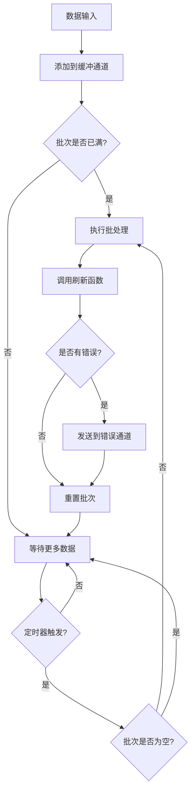
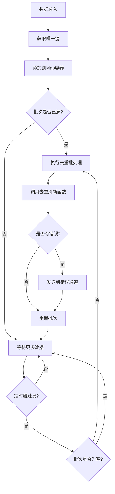

# Go Pipeline v2

一个高性能的Go语言批处理管道框架，支持泛型、并发安全，提供标准批处理和去重批处理两种模式。

## 📋 系统要求

- Go 1.18+ (支持泛型)
- 支持 Linux、macOS、Windows

## 📦 安装

```bash
go get github.com/rushairer/go-pipeline/v2
```

## 🚀 项目特性

- **泛型支持**: 基于Go 1.18+泛型，类型安全
- **批处理机制**: 支持按大小和时间间隔自动批处理
- **并发安全**: 内置goroutine安全机制
- **灵活配置**: 可自定义缓冲区大小、批处理大小和刷新间隔
- **错误处理**: 完善的错误处理和传播机制
- **两种模式**: 标准批处理和去重批处理
- **同步/异步**: 支持同步和异步执行模式
- **遵循Go惯例**: 采用"谁写谁关闭"的通道管理原则

## 📁 项目结构

```
v2/
├── config.go                           # 配置定义
├── errors.go                           # 错误定义
├── interface.go                        # 接口定义
├── pipeline_impl.go                    # 通用管道实现
├── pipeline_standard.go                # 标准管道实现
├── pipeline_deduplication.go           # 去重管道实现
├── pipeline_standard_test.go           # 标准管道单元测试
├── pipeline_standard_benchmark_test.go # 标准管道基准测试
├── pipeline_deduplication_test.go      # 去重管道单元测试
├── pipeline_deduplication_benchmark_test.go # 去重管道基准测试
└── pipeline_performance_benchmark_test.go # 性能基准测试
```

## 📦 核心组件

### 接口定义

- **`PipelineChannel[T]`**: 定义管道通道访问接口
- **`Performer`**: 定义执行管道操作的接口
- **`DataProcessor[T]`**: 定义批处理数据的核心接口
- **`Pipeline[T]`**: 组合所有管道功能的通用接口

### 实现类型

- **`StandardPipeline[T]`**: 标准批处理管道，数据按顺序批处理
- **`DeduplicationPipeline[T]`**: 去重批处理管道，基于唯一键去重
- **`PipelineImpl[T]`**: 通用管道实现，提供基础功能

## 🏗️ 架构设计

```
┌─────────────────┐    ┌──────────────────┐    ┌─────────────────┐
│   Data Input    │───▶│   Buffer Channel │───▶│  Batch Processor│
└─────────────────┘    └──────────────────┘    └─────────────────┘
                                │                        │
                                ▼                        ▼
                       ┌──────────────────┐    ┌─────────────────┐
                       │   Timer Ticker   │    │   Flush Handler │
                       └──────────────────┘    └─────────────────┘
                                │                        │
                                └────────┬───────────────┘
                                         ▼
                                ┌─────────────────┐
                                │  Error Channel  │
                                └─────────────────┘
```

## 🔄 数据流程图

### 标准管道流程



### 测试文件说明

项目包含完整的测试套件，确保代码质量和性能：

- **`pipeline_standard_test.go`**: 标准管道的单元测试，验证基本功能
- **`pipeline_deduplication_test.go`**: 去重管道的单元测试，验证去重逻辑
- **`pipeline_standard_benchmark_test.go`**: 标准管道的性能基准测试
- **`pipeline_deduplication_benchmark_test.go`**: 去重管道的性能基准测试  
- **`pipeline_performance_benchmark_test.go`**: 综合性能基准测试

### 去重管道流程



## 📋 配置参数

```go
type PipelineConfig struct {
    BufferSize    uint32        // 缓冲通道的容量 (默认: 100)
    FlushSize     uint32        // 批处理数据的最大容量 (默认: 50)
    FlushInterval time.Duration // 定时刷新的时间间隔 (默认: 50ms)
}
```

### 🎯 性能优化的默认值

基于性能基准测试，v2 版本采用了优化的默认配置：

- **BufferSize: 100** - 缓冲区大小，应该 >= FlushSize * 2 以避免阻塞
- **FlushSize: 50** - 批处理大小，性能测试显示 50 左右为最优
- **FlushInterval: 50ms** - 刷新间隔，平衡延迟和吞吐量

## 💡 使用示例

### 标准管道示例

```go
package main

import (
    "context"
    "fmt"
    "log"
    "time"
    
    gopipeline "github.com/rushairer/go-pipeline/v2"
)

func main() {
    // 创建标准管道
    pipeline := gopipeline.NewDefaultStandardPipeline(
        func(ctx context.Context, batchData []int) error {
            fmt.Printf("处理批次数据: %v\n", batchData)
            // 这里可以执行数据库写入、API调用等操作
            return nil
        },
    )
    
    ctx, cancel := context.WithTimeout(context.Background(), time.Second*10)
    defer cancel()
    
    // 启动异步处理
    go func() {
        if err := pipeline.AsyncPerform(ctx); err != nil {
            log.Printf("管道执行错误: %v", err)
        }
    }()
    
    // 监听错误（必须消费错误通道）
    errorChan := pipeline.ErrorChan(10) // 指定错误通道缓冲区大小
    go func() {
        for {
            select {
            case err, ok := <-errorChan:
                if !ok {
                    return
                }
                log.Printf("批处理错误: %v", err)
            case <-ctx.Done():
                return
            }
        }
    }()
    
    // 使用新的 DataChan API 发送数据
    dataChan := pipeline.DataChan()
    go func() {
        defer close(dataChan) // 用户控制通道关闭
        for i := 0; i < 100; i++ {
            select {
            case dataChan <- i:
            case <-ctx.Done():
                return
            }
        }
    }()
    
    time.Sleep(time.Second * 2) // 等待处理完成
}
```

### 去重管道示例

```go
package main

import (
    "context"
    "fmt"
    "log"
    "time"
    
    gopipeline "github.com/rushairer/go-pipeline/v2"
)

// 实现UniqueKeyData接口的数据结构
type User struct {
    ID   string
    Name string
}

func (u User) GetKey() string {
    return u.ID
}

func main() {
    // 创建去重管道
    pipeline := gopipeline.NewDefaultDeduplicationPipeline(
        func(ctx context.Context, batchData map[string]User) error {
            fmt.Printf("处理去重后的用户数据: %d 个用户\n", len(batchData))
            for key, user := range batchData {
                fmt.Printf("  %s: %s\n", key, user.Name)
            }
            return nil
        },
    )
    
    ctx, cancel := context.WithTimeout(context.Background(), time.Second*10)
    defer cancel()
    
    // 启动异步处理
    go func() {
        if err := pipeline.AsyncPerform(ctx); err != nil {
            log.Printf("管道执行错误: %v", err)
        }
    }()
    
    // 监听错误
    errorChan := pipeline.ErrorChan(10)
    go func() {
        for {
            select {
            case err, ok := <-errorChan:
                if !ok {
                    return
                }
                log.Printf("批处理错误: %v", err)
            case <-ctx.Done():
                return
            }
        }
    }()
    
    // 使用新的 DataChan API 发送数据
    dataChan := pipeline.DataChan()
    go func() {
        defer close(dataChan)
        
        users := []User{
            {ID: "1", Name: "Alice"},
            {ID: "2", Name: "Bob"},
            {ID: "1", Name: "Alice Updated"}, // 会覆盖第一个Alice
            {ID: "3", Name: "Charlie"},
            {ID: "2", Name: "Bob Updated"},   // 会覆盖第一个Bob
        }
        
        for _, user := range users {
            select {
            case dataChan <- user:
            case <-ctx.Done():
                return
            }
        }
    }()
    
    time.Sleep(time.Second * 2) // 等待处理完成
}
```

### 自定义配置示例

```go
// 创建自定义配置的管道
config := gopipeline.PipelineConfig{
    BufferSize:    200,                    // 缓冲区大小为200
    FlushSize:     100,                    // 批次大小为100
    FlushInterval: time.Millisecond * 100, // 100ms定时刷新
}

pipeline := gopipeline.NewStandardPipeline(config, 
    func(ctx context.Context, batchData []string) error {
        // 自定义处理逻辑
        return nil
    },
)
```

## 🎯 使用场景

### 1. 数据库批量写入
```go
// 批量插入数据库记录
pipeline := gopipeline.NewDefaultStandardPipeline(
    func(ctx context.Context, records []DatabaseRecord) error {
        return db.BatchInsert(ctx, records)
    },
)
```

### 2. 日志批量处理
```go
// 批量写入日志文件
pipeline := gopipeline.NewDefaultStandardPipeline(
    func(ctx context.Context, logs []LogEntry) error {
        return logWriter.WriteBatch(logs)
    },
)
```

### 3. API批量调用
```go
// 批量调用第三方API
pipeline := gopipeline.NewDefaultStandardPipeline(
    func(ctx context.Context, requests []APIRequest) error {
        return apiClient.BatchCall(ctx, requests)
    },
)
```

### 4. 用户数据去重
```go
// 用户数据去重处理
pipeline := gopipeline.NewDefaultDeduplicationPipeline(
    func(ctx context.Context, users map[string]User) error {
        return userService.BatchUpdate(ctx, users)
    },
)
```

### 5. 消息队列批量消费
```go
// 批量处理消息队列数据
pipeline := gopipeline.NewDefaultStandardPipeline(
    func(ctx context.Context, messages []Message) error {
        return messageProcessor.ProcessBatch(ctx, messages)
    },
)
```

## 🔥 高级用法

### 动态配置调整

```go
// 根据系统负载动态调整配置
func createAdaptivePipeline() *gopipeline.StandardPipeline[Task] {
    config := gopipeline.PipelineConfig{
        BufferSize:    getOptimalBufferSize(),
        FlushSize:     getOptimalFlushSize(),
        FlushInterval: getOptimalInterval(),
    }
    
    return gopipeline.NewStandardPipeline(config, processTaskBatch)
}

func getOptimalBufferSize() uint32 {
    // 根据系统内存和CPU核心数计算
    return uint32(runtime.NumCPU() * 50)
}

func getOptimalFlushSize() uint32 {
    // 基于性能测试，50左右为最优
    return 50
}
```

### 错误重试机制

```go
pipeline := gopipeline.NewDefaultStandardPipeline(
    func(ctx context.Context, batchData []Task) error {
        return retryWithBackoff(ctx, func() error {
            return processBatch(batchData)
        }, 3, time.Second)
    },
)

func retryWithBackoff(ctx context.Context, fn func() error, maxRetries int, baseDelay time.Duration) error {
    for i := 0; i < maxRetries; i++ {
        if err := fn(); err == nil {
            return nil
        }
        
        select {
        case <-ctx.Done():
            return ctx.Err()
        case <-time.After(baseDelay * time.Duration(1<<i)):
            // 指数退避
        }
    }
    return fmt.Errorf("max retries exceeded")
}
```

### 监控和指标收集

```go
type MetricsPipeline struct {
    *gopipeline.StandardPipeline[Event]
    processedCount int64
    errorCount     int64
}

func NewMetricsPipeline() *MetricsPipeline {
    mp := &MetricsPipeline{}
    
    mp.StandardPipeline = gopipeline.NewDefaultStandardPipeline(
        func(ctx context.Context, events []Event) error {
            err := processEvents(events)
            
            atomic.AddInt64(&mp.processedCount, int64(len(events)))
            if err != nil {
                atomic.AddInt64(&mp.errorCount, 1)
            }
            
            return err
        },
    )
    
    return mp
}

func (mp *MetricsPipeline) GetMetrics() (processed, errors int64) {
    return atomic.LoadInt64(&mp.processedCount), atomic.LoadInt64(&mp.errorCount)
}
```

### 优雅关闭

```go
func gracefulShutdown(pipeline *gopipeline.StandardPipeline[Task]) {
    // 创建带超时的上下文
    ctx, cancel := context.WithTimeout(context.Background(), 30*time.Second)
    defer cancel()
    
    // 停止接收新数据
    // 关闭数据通道
    dataChan := pipeline.DataChan()
    close(dataChan)
    
    // 等待处理完成
    done := make(chan struct{})
    go func() {
        defer close(done)
        // 等待错误通道关闭，表示所有数据已处理
        errorChan := pipeline.ErrorChan(10)
        for {
            select {
            case err, ok := <-errorChan:
                if !ok {
                    return
                }
                log.Printf("处理剩余错误: %v", err)
            case <-ctx.Done():
                return
            }
        }
    }()
    
    // 等待完成或超时
    select {
    case <-done:
        log.Println("管道优雅关闭完成")
    case <-ctx.Done():
        log.Println("管道关闭超时")
    }
}
```

## ⚡ 性能特点

基于最新的性能基准测试结果：

### 🚀 核心性能指标

- **数据处理吞吐量**: ~248 纳秒/项 (Apple M4)
- **内存效率**: 232 字节/操作，7 次分配/操作
- **批处理优化**: 批次大小从 1 到 50，性能提升 5 倍
- **管道开销**: 比直接处理慢约 38%（225.4 vs 162.7 ns/op）

### 📊 批次大小性能对比

```
BatchSize1:   740.5 ns/op  (最慢 - 频繁刷新)
BatchSize10:  251.5 ns/op  (显著改善)
BatchSize50:  146.5 ns/op  (最优性能) ⭐
BatchSize100: 163.4 ns/op  (略有下降)
BatchSize500: 198.6 ns/op  (批次过大)
```

### 💡 性能优化建议

1. **最优批次大小**: 50 左右
2. **缓冲区配置**: BufferSize >= FlushSize * 2
3. **刷新间隔**: 50ms 平衡延迟和吞吐量
4. **异步模式**: 推荐使用异步处理获得更好性能

## ⚠️ 重要提醒

> **错误通道是可选的**: v2 版本支持可选的错误处理机制。如果不调用 `ErrorChan(size int)`，管道会安全地跳过错误处理，不会导致 panic。

> **推荐监听错误通道**: 如果调用了 `ErrorChan(size int)`，建议监听错误通道并使用 select 语句避免无限等待。

> **通道管理**: v2 版本遵循"谁写谁关闭"原则，用户需要控制 `DataChan()` 的关闭时机。

## 🔧 最佳实践

1. **合理设置批次大小**: 根据性能测试，推荐使用 50 左右的批次大小
2. **⚠️ 必须监听错误通道**: 使用 select 语句避免阻塞，及时处理批处理过程中的错误
3. **正确关闭数据通道**: 使用 defer close(dataChan) 确保通道正确关闭
4. **上下文管理**: 使用context控制管道生命周期
5. **去重键设计**: 确保去重键的唯一性和稳定性
6. **性能调优**: 根据基准测试结果选择合适的配置参数

## 📊 错误处理

框架提供了完善的错误处理机制：

- `ErrContextIsClosed`: 上下文已关闭
- `ErrPerformLoopError`: 执行循环错误  
- `ErrChannelIsClosed`: 通道已关闭

### 错误通道机制

v2 版本提供了**可选的错误处理机制**，具有以下特点：

#### 🛡️ 安全机制

- **可选调用**: `ErrorChan(size int)` 方法是可选的，不调用不会导致 panic
- **安全跳过**: 如果未调用 `ErrorChan()`，错误会被安全地忽略
- **非阻塞发送**: 使用非阻塞机制发送错误，避免管道阻塞
- **缓冲区满处理**: 当错误通道缓冲区满时，新错误会被丢弃而不是阻塞

#### 📋 使用方式

**方式一：监听错误（推荐）**
```go
// 创建错误通道并监听
errorChan := pipeline.ErrorChan(10) // 指定缓冲区大小
go func() {
    for {
        select {
        case err, ok := <-errorChan:
            if !ok {
                return // 通道已关闭
            }
            log.Printf("处理错误: %v", err)
            // 根据错误类型进行相应处理
        case <-ctx.Done():
            return // 上下文取消
        }
    }
}()
```

**方式二：忽略错误（简化使用）**
```go
// 不调用 ErrorChan()，错误会被安全地忽略
pipeline := gopipeline.NewStandardPipeline(config, flushFunc)
go pipeline.AsyncPerform(ctx)
// 管道正常运行，错误被安全跳过，不会 panic
```

#### ⚡ 错误处理性能

- **零开销**: 不调用 `ErrorChan()` 时，错误处理几乎无性能开销
- **异步处理**: 错误发送在独立 goroutine 中进行，不影响主流程
- **智能丢弃**: 缓冲区满时自动丢弃错误，保证管道不被阻塞

## 🧪 测试

项目包含完整的单元测试和基准测试：

```bash
# 运行所有测试
go test ./...

# 运行单元测试
go test -v ./... -run Test

# 运行基准测试
go test -bench=. ./...

# 运行标准管道基准测试
go test -bench=BenchmarkStandardPipeline ./...

# 运行去重管道基准测试  
go test -bench=BenchmarkDeduplicationPipeline ./...

# 运行性能基准测试
go test -bench=BenchmarkPipelineDataProcessing ./...

# 运行批次效率测试
go test -bench=BenchmarkPipelineBatchSizes ./...

# 运行内存使用测试
go test -bench=BenchmarkPipelineMemoryUsage ./...
```

## 📈 性能基准

在 Apple M4 处理器上的最新基准测试结果：

### 核心性能测试

```
BenchmarkPipelineDataProcessing-10                1000    248.2 ns/op    232 B/op    7 allocs/op
BenchmarkPipelineVsDirectProcessing/Pipeline-10   1000    225.4 ns/op
BenchmarkPipelineVsDirectProcessing/Direct-10     1000    162.7 ns/op
BenchmarkPipelineMemoryUsage-10                   1000    232.2 ns/op    510 B/op    9 allocs/op
```

### 批次大小效率测试

```
BenchmarkPipelineBatchSizes/BatchSize1-10         500     740.5 ns/op    500.0 items_processed
BenchmarkPipelineBatchSizes/BatchSize10-10        500     251.5 ns/op    500.0 items_processed
BenchmarkPipelineBatchSizes/BatchSize50-10        500     146.5 ns/op    500.0 items_processed ⭐
BenchmarkPipelineBatchSizes/BatchSize100-10       500     163.4 ns/op    500.0 items_processed
BenchmarkPipelineBatchSizes/BatchSize500-10       500     198.6 ns/op    500.0 items_processed
```

### 性能分析

- **最优批次大小**: 50 左右，性能提升 5 倍
- **管道开销**: 约 38%，换取更好的架构和可维护性
- **内存效率**: 每个数据项约 232-510 字节内存使用
- **处理能力**: 每秒可处理数百万条记录

### 去重管道性能特点

去重管道在标准管道的基础上增加了以下性能特征：

- **内存使用**: 使用 map 结构存储数据，内存使用略高于标准管道
- **处理延迟**: 去重逻辑增加约 10-15% 的处理时间
- **键生成开销**: 需要为每个数据项生成唯一键
- **批次效率**: 去重后的批次大小可能小于配置的 FlushSize

**性能对比**:
- 标准管道: ~225 ns/op
- 去重管道: ~260 ns/op (增加约 15% 开销)

## ❓ 常见问题 (FAQ)

### Q: 如何选择合适的配置参数？

**A:** 基于性能测试的配置建议：

- **高吞吐量场景**: FlushSize=50, BufferSize=100, FlushInterval=50ms
- **低延迟场景**: FlushSize=10, BufferSize=50, FlushInterval=10ms
- **内存受限场景**: FlushSize=20, BufferSize=40, FlushInterval=100ms
- **CPU密集型处理**: 使用异步模式，适当增大缓冲区

### Q: v2 版本与 v1 版本的主要区别？

**A:** v2 版本的重要改进：

1. **移除 Add() 方法**: 改用 DataChan() API，遵循"谁写谁关闭"原则
2. **错误通道改进**: ErrorChan(size int) 需要指定缓冲区大小
3. **性能优化**: 基于基准测试优化的默认配置
4. **更好的生命周期管理**: 用户控制数据通道的关闭时机

### Q: 为什么要移除 Add() 方法？

**A:** 

- **违背Go原则**: Add() 方法违背了"谁写谁关闭"的Go语言原则
- **更好的控制**: DataChan() 让用户完全控制数据发送和通道关闭
- **更符合惯例**: 这是标准的Go通道使用模式

### Q: 如何从 v1 迁移到 v2？

**A:** 迁移步骤：

```go
// v1 方式
pipeline.Add(ctx, data)

// v2 方式
dataChan := pipeline.DataChan()
go func() {
    defer close(dataChan)
    for _, data := range dataList {
        select {
        case dataChan <- data:
        case <-ctx.Done():
            return
        }
    }
}()
```

### Q: 如何处理批处理函数中的 panic？

**A:** 框架内部已经处理了 panic，但建议在批处理函数中添加 recover：

```go
func(ctx context.Context, batchData []Task) error {
    defer func() {
        if r := recover(); r != nil {
            log.Printf("批处理 panic: %v", r)
        }
    }()
    
    // 处理逻辑
    return nil
}
```

## 🔧 故障排除

### 内存泄漏

**症状**: 内存使用持续增长
**原因**: 
- 错误通道未被消费
- 数据通道未正确关闭
- 批处理函数中存在内存泄漏

**解决方案**:
```go
// 确保错误通道被消费
errorChan := pipeline.ErrorChan(10)
go func() {
    for {
        select {
        case err, ok := <-errorChan:
            if !ok {
                return
            }
            // 处理错误
        case <-ctx.Done():
            return
        }
    }
}()

// 确保数据通道被关闭
dataChan := pipeline.DataChan()
defer close(dataChan)
```

### 性能问题

**症状**: 处理速度慢于预期
**排查步骤**:
1. 检查批次大小是否为 50 左右
2. 确保 BufferSize >= FlushSize * 2
3. 使用异步模式
4. 检查批处理函数的执行时间

**优化建议**:
```go
// 使用性能优化的配置
config := gopipeline.PipelineConfig{
    BufferSize:    100,                   // >= FlushSize * 2
    FlushSize:     50,                    // 最优批次大小
    FlushInterval: time.Millisecond * 50, // 平衡延迟和吞吐量
}
```

### 数据丢失

**症状**: 部分数据未被处理
**原因**:
- 上下文被过早取消
- 数据通道被过早关闭
- 批处理函数返回错误但未处理

**解决方案**:
```go
// 使用足够的超时时间
ctx, cancel := context.WithTimeout(context.Background(), time.Minute*5)
defer cancel()

// 确保所有数据发送完成后再关闭通道
dataChan := pipeline.DataChan()
go func() {
    defer close(dataChan) // 在所有数据发送完成后关闭
    for _, data := range allData {
        select {
        case dataChan <- data:
        case <-ctx.Done():
            return
        }
    }
}()
```

## 📄 许可证

本项目采用MIT许可证，详见LICENSE文件。

## 🤝 贡献

欢迎提交Issue和Pull Request来改进这个项目！