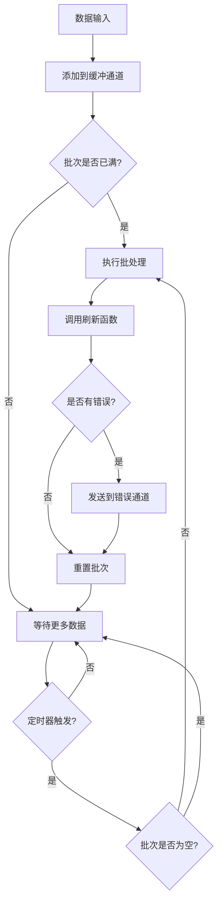
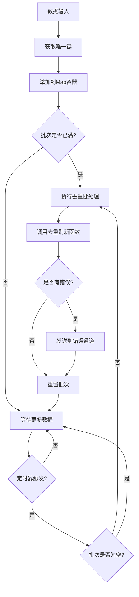

# Go Pipeline v2

一个高性能的Go语言批处理管道框架，支持泛型、并发安全，提供标准批处理和去重批处理两种模式。

## 📋 系统要求

- Go 1.18+ (支持泛型)
- 支持 Linux、macOS、Windows

## 📦 安装

```bash
go get github.com/rushairer/go-pipeline/v2
```

## 🚀 项目特性

- **泛型支持**: 基于Go 1.18+泛型，类型安全
- **批处理机制**: 支持按大小和时间间隔自动批处理
- **并发安全**: 内置goroutine安全机制
- **灵活配置**: 可自定义缓冲区大小、批处理大小和刷新间隔
- **错误处理**: 完善的错误处理和传播机制
- **两种模式**: 标准批处理和去重批处理
- **同步/异步**: 支持同步和异步执行模式

## 📁 项目结构

```
v2/
├── config.go                    # 配置定义
├── errors.go                    # 错误定义
├── interface.go                 # 接口定义
├── pipeline_impl.go             # 通用管道实现
├── pipeline_standard.go         # 标准管道实现
├── pipeline_deduplication.go    # 去重管道实现
├── pipeline_standard_test.go    # 单元测试
└── pipeline_standard_benchmark_test.go  # 基准测试
```

## 📦 核心组件

### 接口定义

- **`DataProcessor[T]`**: 定义批处理数据的核心接口
- **`DataAdder[T]`**: 定义向管道添加数据的接口  
- **`Performer[T]`**: 定义执行管道操作的接口
- **`Pipeline[T]`**: 组合所有管道功能的通用接口

### 实现类型

- **`StandardPipeline[T]`**: 标准批处理管道，数据按顺序批处理
- **`DeduplicationPipeline[T]`**: 去重批处理管道，基于唯一键去重
- **`PipelineImpl[T]`**: 通用管道实现，提供基础功能

## 🏗️ 架构设计

```
┌─────────────────┐    ┌──────────────────┐    ┌─────────────────┐
│   Data Input    │───▶│   Buffer Channel │───▶│  Batch Processor│
└─────────────────┘    └──────────────────┘    └─────────────────┘
                                │                        │
                                ▼                        ▼
                       ┌──────────────────┐    ┌─────────────────┐
                       │   Timer Ticker   │    │   Flush Handler │
                       └──────────────────┘    └─────────────────┘
                                │                        │
                                └────────┬───────────────┘
                                         ▼
                                ┌─────────────────┐
                                │  Error Channel  │
                                └─────────────────┘
```

## 🔄 数据流程图

### 标准管道流程



### 去重管道流程



## 📋 配置参数

```go
type PipelineConfig struct {
    BufferSize    uint32        // 缓冲通道的容量 (默认: 64)
    FlushSize     uint32        // 批处理数据的最大容量 (默认: 32)
    FlushInterval time.Duration // 定时刷新的时间间隔 (默认: 200μs)
}
```

## 💡 使用示例

### 标准管道示例

```go
package main

import (
    "context"
    "fmt"
    "log"
    "time"
    
    gopipeline "github.com/rushairer/go-pipeline/v2"
)

func main() {
    // 创建标准管道
    pipeline := gopipeline.NewDefaultStandardPipeline(
        func(ctx context.Context, batchData []int) error {
            fmt.Printf("处理批次数据: %v\n", batchData)
            // 这里可以执行数据库写入、API调用等操作
            return nil
        },
    )
    defer pipeline.Close()
    
    ctx, cancel := context.WithTimeout(context.Background(), time.Second*10)
    defer cancel()
    
    // 启动异步处理
    go func() {
        if err := pipeline.AsyncPerform(ctx); err != nil {
            log.Printf("管道执行错误: %v", err)
        }
    }()
    
    // 监听错误
    go func() {
        for err := range pipeline.ErrorChan() {
            log.Printf("批处理错误: %v", err)
        }
    }()
    
    // 添加数据
    for i := 0; i < 100; i++ {
        if err := pipeline.Add(ctx, i); err != nil {
            log.Printf("添加数据失败: %v", err)
            break
        }
    }
    
    time.Sleep(time.Second) // 等待处理完成
}
```

### 去重管道示例

```go
package main

import (
    "context"
    "fmt"
    "log"
    "time"
    
    gopipeline "github.com/rushairer/go-pipeline/v2"
)

// 实现UniqueKeyData接口的数据结构
type User struct {
    ID   string
    Name string
}

func (u User) GetKey() string {
    return u.ID
}

func main() {
    // 创建去重管道
    pipeline := gopipeline.NewDefaultDeduplicationPipeline(
        func(ctx context.Context, batchData map[string]User) error {
            fmt.Printf("处理去重后的用户数据: %d 个用户\n", len(batchData))
            for key, user := range batchData {
                fmt.Printf("  %s: %s\n", key, user.Name)
            }
            return nil
        },
    )
    defer pipeline.Close()
    
    ctx, cancel := context.WithTimeout(context.Background(), time.Second*10)
    defer cancel()
    
    // 启动异步处理
    go func() {
        if err := pipeline.AsyncPerform(ctx); err != nil {
            log.Printf("管道执行错误: %v", err)
        }
    }()
    
    // 添加重复数据（会被自动去重）
    users := []User{
        {ID: "1", Name: "Alice"},
        {ID: "2", Name: "Bob"},
        {ID: "1", Name: "Alice Updated"}, // 会覆盖第一个Alice
        {ID: "3", Name: "Charlie"},
        {ID: "2", Name: "Bob Updated"},   // 会覆盖第一个Bob
    }
    
    for _, user := range users {
        if err := pipeline.Add(ctx, user); err != nil {
            log.Printf("添加用户失败: %v", err)
            break
        }
    }
    
    time.Sleep(time.Second) // 等待处理完成
}
```

### 自定义配置示例

```go
// 创建自定义配置的管道
config := gopipeline.PipelineConfig{
    BufferSize:    100,                    // 缓冲区大小为100
    FlushSize:     200,                    // 批次大小为200
    FlushInterval: time.Millisecond * 500, // 500ms定时刷新
}

pipeline := gopipeline.NewStandardPipeline(config, 
    func(ctx context.Context, batchData []string) error {
        // 自定义处理逻辑
        return nil
    },
)
```

## 🎯 使用场景

### 1. 数据库批量写入
```go
// 批量插入数据库记录
pipeline := gopipeline.NewDefaultStandardPipeline(
    func(ctx context.Context, records []DatabaseRecord) error {
        return db.BatchInsert(ctx, records)
    },
)
```

### 2. 日志批量处理
```go
// 批量写入日志文件
pipeline := gopipeline.NewDefaultStandardPipeline(
    func(ctx context.Context, logs []LogEntry) error {
        return logWriter.WriteBatch(logs)
    },
)
```

### 3. API批量调用
```go
// 批量调用第三方API
pipeline := gopipeline.NewDefaultStandardPipeline(
    func(ctx context.Context, requests []APIRequest) error {
        return apiClient.BatchCall(ctx, requests)
    },
)
```

### 4. 用户数据去重
```go
// 用户数据去重处理
pipeline := gopipeline.NewDefaultDeduplicationPipeline(
    func(ctx context.Context, users map[string]User) error {
        return userService.BatchUpdate(ctx, users)
    },
)
```

### 5. 消息队列批量消费
```go
// 批量处理消息队列数据
pipeline := gopipeline.NewDefaultStandardPipeline(
    func(ctx context.Context, messages []Message) error {
        return messageProcessor.ProcessBatch(ctx, messages)
    },
)
```

## 🔥 高级用法

### 动态配置调整

```go
// 根据系统负载动态调整配置
func createAdaptivePipeline() *gopipeline.StandardPipeline[Task] {
    config := gopipeline.PipelineConfig{
        BufferSize:    getOptimalBufferSize(),
        FlushSize:     getOptimalFlushSize(),
        FlushInterval: getOptimalInterval(),
    }
    
    return gopipeline.NewStandardPipeline(config, processTaskBatch)
}

func getOptimalBufferSize() uint32 {
    // 根据系统内存和CPU核心数计算
    return uint32(runtime.NumCPU() * 32)
}
```

### 错误重试机制

```go
pipeline := gopipeline.NewDefaultStandardPipeline(
    func(ctx context.Context, batchData []Task) error {
        return retryWithBackoff(ctx, func() error {
            return processBatch(batchData)
        }, 3, time.Second)
    },
)

func retryWithBackoff(ctx context.Context, fn func() error, maxRetries int, baseDelay time.Duration) error {
    for i := 0; i < maxRetries; i++ {
        if err := fn(); err == nil {
            return nil
        }
        
        select {
        case <-ctx.Done():
            return ctx.Err()
        case <-time.After(baseDelay * time.Duration(1<<i)):
            // 指数退避
        }
    }
    return fmt.Errorf("max retries exceeded")
}
```

### 监控和指标收集

```go
type MetricsPipeline struct {
    *gopipeline.StandardPipeline[Event]
    processedCount int64
    errorCount     int64
}

func NewMetricsPipeline() *MetricsPipeline {
    mp := &MetricsPipeline{}
    
    mp.StandardPipeline = gopipeline.NewDefaultStandardPipeline(
        func(ctx context.Context, events []Event) error {
            err := processEvents(events)
            
            atomic.AddInt64(&mp.processedCount, int64(len(events)))
            if err != nil {
                atomic.AddInt64(&mp.errorCount, 1)
            }
            
            return err
        },
    )
    
    return mp
}

func (mp *MetricsPipeline) GetMetrics() (processed, errors int64) {
    return atomic.LoadInt64(&mp.processedCount), atomic.LoadInt64(&mp.errorCount)
}
```

### 优雅关闭

```go
func gracefulShutdown(pipeline *gopipeline.StandardPipeline[Task]) {
    // 创建带超时的上下文
    ctx, cancel := context.WithTimeout(context.Background(), 30*time.Second)
    defer cancel()
    
    // 停止接收新数据
    // ... 停止数据生产者
    
    // 等待处理完成
    done := make(chan struct{})
    go func() {
        defer close(done)
        // 等待错误通道关闭，表示所有数据已处理
        for range pipeline.ErrorChan() {
            // 处理剩余错误
        }
    }()
    
    // 关闭管道
    pipeline.Close()
    
    // 等待完成或超时
    select {
    case <-done:
        log.Println("管道优雅关闭完成")
    case <-ctx.Done():
        log.Println("管道关闭超时")
    }
}
```

## ⚡ 性能特点

- **高吞吐量**: 批处理机制减少系统调用次数
- **低延迟**: 可配置的定时刷新确保数据及时处理
- **内存高效**: 固定大小的缓冲区避免内存泄漏
- **并发安全**: 内置锁机制保证线程安全
- **错误隔离**: 单个批次错误不影响整体处理流程

## ⚠️ 重要提醒

> **必须消费错误通道**: 务必监听 `ErrorChan()` 返回的错误通道，否则可能导致 goroutine 阻塞和内存泄漏。框架内部使用非阻塞发送机制，当错误通道满时会丢弃错误并记录日志。

## 🔧 最佳实践

1. **合理设置批次大小**: 根据业务场景平衡吞吐量和延迟
2. **⚠️ 必须监听错误通道**: 及时处理批处理过程中的错误，避免 goroutine 阻塞
3. **正确关闭管道**: 使用defer确保资源正确释放，`Close()` 方法无需参数
4. **上下文管理**: 使用context控制管道生命周期
5. **去重键设计**: 确保去重键的唯一性和稳定性
6. **性能调优**: 根据基准测试结果选择合适的配置参数

## 📊 错误处理

框架提供了完善的错误处理机制：

- `ErrContextIsClosed`: 上下文已关闭
- `ErrPerformLoopError`: 执行循环错误  
- `ErrChannelIsClosed`: 通道已关闭

### 错误通道机制

- 通过`ErrorChan()`方法可以监听所有批处理过程中的错误
- 错误通道使用非阻塞发送，避免 goroutine 阻塞
- 当错误通道满时，新错误会被丢弃并记录日志
- **重要**: 必须有 goroutine 消费错误通道，否则可能导致内存泄漏

```go
// 正确的错误处理方式
go func() {
    for err := range pipeline.ErrorChan() {
        log.Printf("处理错误: %v", err)
        // 根据错误类型进行相应处理
    }
}()
```

## 🧪 测试

项目包含完整的单元测试和基准测试：

```bash
# 运行所有测试
go test ./...

# 运行基准测试
go test -bench=. ./...

# 运行特定基准测试
go test -bench=BenchmarkPipelineComparison ./...
```

## 📈 性能基准

在 Apple M4 处理器上的基准测试结果：

```
BenchmarkDefaultStandardPipelineAsyncPerform-10    	 2479370	       208.1 ns/op
BenchmarkCustomStandardPipelineAsyncPerform-10     	 1204576	       201.7 ns/op
BenchmarkDefaultStandardPipelineSyncPerform-10     	    2352	    167757 ns/op
BenchmarkCustomStandardPipelineSyncPerform-10      	   21385	     11640 ns/op

BenchmarkPipelineComparison/Small-10               	  931314	       229.7 ns/op
BenchmarkPipelineComparison/Medium-10              	 1244037	       177.5 ns/op
BenchmarkPipelineComparison/Large-10               	 1355678	       190.1 ns/op
```

### 性能分析

- **异步模式** 比同步模式快约 50-80 倍
- **自定义配置** 在同步模式下可显著提升性能
- **Large 配置** 在异步模式下表现最佳
- **批处理效率** 随配置优化可达到每秒处理数百万条记录

## ❓ 常见问题 (FAQ)

### Q: 如何选择合适的配置参数？

**A:** 配置选择取决于具体场景：

- **高吞吐量场景**: 增大 `FlushSize` 和 `BufferSize`
- **低延迟场景**: 减小 `FlushInterval`
- **内存受限场景**: 减小 `BufferSize`
- **CPU密集型处理**: 使用异步模式，适当增大缓冲区

### Q: 为什么会出现 "pipeline error channel is full discard error" 日志？

**A:** 这表示错误通道已满，新错误被丢弃。解决方案：

1. 确保有 goroutine 在消费错误通道
2. 增加错误通道的缓冲区大小（通过调整配置参数）
3. 优化错误处理逻辑，减少错误产生

### Q: 同步模式和异步模式有什么区别？

**A:** 

- **异步模式** (`AsyncPerform`): 批处理在独立的 goroutine 中执行，不阻塞主流程
- **同步模式** (`SyncPerform`): 批处理在当前 goroutine 中执行，会阻塞后续操作

一般推荐使用异步模式以获得更好的性能。

### Q: 如何处理批处理函数中的 panic？

**A:** 框架内部已经处理了 panic，但建议在批处理函数中添加 recover：

```go
func(ctx context.Context, batchData []Task) error {
    defer func() {
        if r := recover(); r != nil {
            log.Printf("批处理 panic: %v", r)
        }
    }()
    
    // 处理逻辑
    return nil
}
```

### Q: 可以在运行时动态修改配置吗？

**A:** 当前版本不支持运行时修改配置。如需动态调整，建议：

1. 创建新的管道实例
2. 优雅关闭旧管道
3. 切换到新管道

## 🔧 故障排除

### 内存泄漏

**症状**: 内存使用持续增长
**原因**: 
- 错误通道未被消费
- 管道未正确关闭
- 批处理函数中存在内存泄漏

**解决方案**:
```go
// 确保错误通道被消费
go func() {
    for err := range pipeline.ErrorChan() {
        // 处理错误
    }
}()

// 确保管道被关闭
defer pipeline.Close()
```

### 性能问题

**症状**: 处理速度慢于预期
**排查步骤**:
1. 检查配置参数是否合理
2. 使用基准测试对比不同配置
3. 检查批处理函数的执行时间
4. 考虑使用异步模式

**优化建议**:
```go
// 使用更大的批次和缓冲区
config := gopipeline.PipelineConfig{
    BufferSize:    512,
    FlushSize:     1024,
    FlushInterval: time.Millisecond * 100,
}
```

### 数据丢失

**症状**: 部分数据未被处理
**原因**:
- 上下文被过早取消
- 管道被过早关闭
- 批处理函数返回错误但未处理

**解决方案**:
```go
// 使用足够的超时时间
ctx, cancel := context.WithTimeout(context.Background(), time.Minute*5)
defer cancel()

// 实现优雅关闭
gracefulShutdown(pipeline)
```

## 📄 许可证

本项目采用MIT许可证，详见LICENSE文件。

## 🤝 贡献

欢迎提交Issue和Pull Request来改进这个项目！